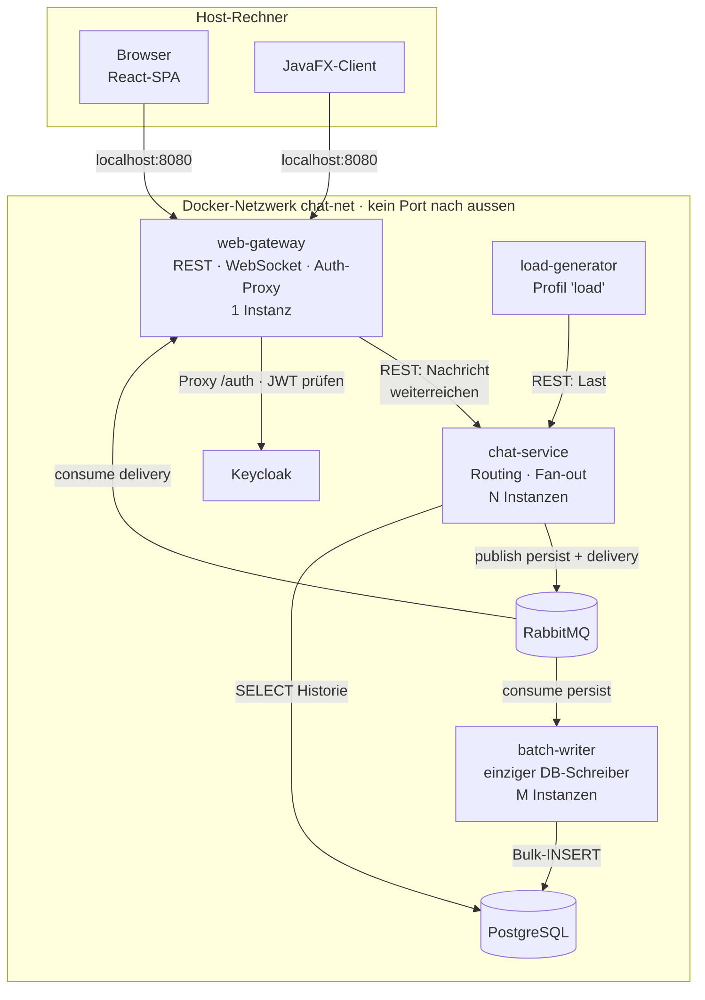
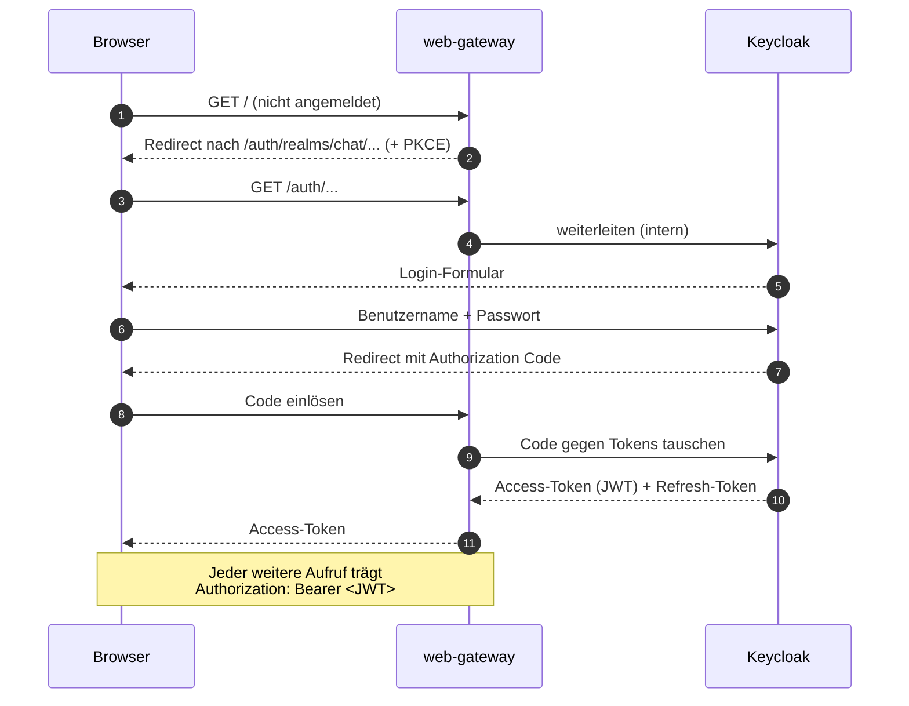
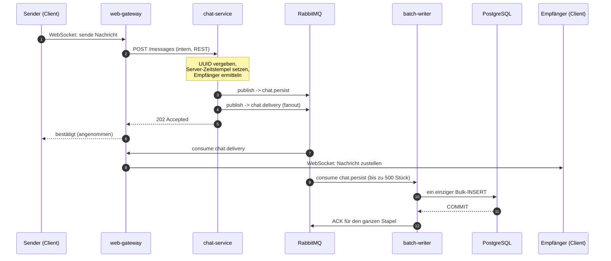
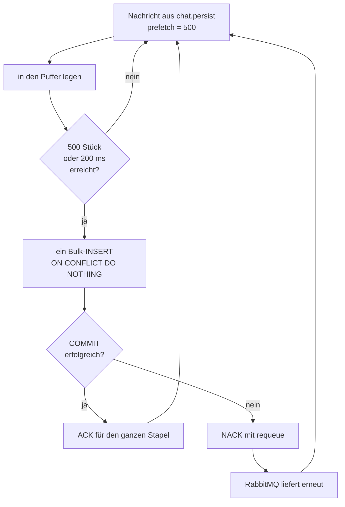
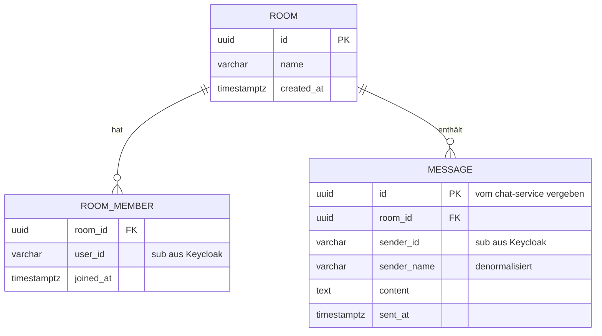

# Chat-App — Planung

**Modul M321 · Klasse IT3c · 28.08.2026**

Verteilte Chat-Anwendung als Microservice-Architektur. Vollständig in `docker-compose`
abgebildet, Kommunikation über ein internes Docker-Netzwerk, nur die Web-App ist über
`localhost` erreichbar.

Grundlage: das Flipchart aus der Lektion (`docs/flipchart-chat-app.png`).

---

## 1. Auftrag und Rahmenbedingungen

Diese Punkte sind vorgegeben und stehen nicht zur Diskussion:

| Vorgabe | Konsequenz für den Entwurf |
|---|---|
| Java 21 | Spring Boot 3.5 auf allen Java-Diensten |
| Keycloak als Login-Dienst | Kein selbstgebautes Login, kein eigenes Passwort-Handling |
| Message Queues | RabbitMQ als Rückgrat, nicht als Beiwerk |
| Alles in `docker-compose` | Jeder Dienst ist ein Container, ein einziges `up` startet das System |
| Internes Docker-Netzwerk | Dienste sprechen sich über Service-Namen an, nicht über `localhost` |
| **Nur die Web-App über localhost** | Genau **ein** Port-Mapping im ganzen `docker-compose.yml` |

Zusätzliches Ziel aus der Planungsrunde: Die Anwendung soll ein **skaliertes System mit
100'000+ Nachrichten pro Minute** zeigen. Das ist die eigentliche Begründung für die
Queue und für den Batch-Writer — ohne dieses Ziel wäre beides überflüssig.

---

## 2. Stack

### 2.1 Backend

| Baustein | Wahl | Begründung |
|---|---|---|
| Sprache | Java 21 | Vorgabe |
| Framework | Spring Boot 3.5 | Starter für AMQP, WebSocket, OAuth2 Resource Server, JDBC |
| Message Broker | **RabbitMQ 3.13** | Queues und Exchanges sind am Whiteboard erklärbar, startet in Sekunden |
| Datenbank | **PostgreSQL 16** | Beherrscht Bulk-Inserts und `ON CONFLICT` sauber |
| IDP | **Keycloak 26** | Vorgabe, Realm wird als JSON importiert |
| DB-Zugriff | Spring `JdbcTemplate` | Bewusst **kein** JPA im Batch-Writer: `batchUpdate` ist genau das, was wir zeigen wollen |
| Build | Maven Multi-Modul | Ein `mvn package` baut alle Dienste |
| Tests | JUnit 5 + Testcontainers | Echte RabbitMQ- und Postgres-Container im Test |

### 2.2 Clients

| Client | Technologie | Zweck |
|---|---|---|
| Web | **React 19 + TypeScript + Vite** | Der Hauptclient. Zeigt die saubere Trennung Client / Server |
| Desktop | **JavaFX 21** | Zweiter Client an derselben API. Beweist, dass das Backend clientneutral ist |

Beide Clients sprechen **dieselbe** REST- und WebSocket-Schnittstelle des Gateways.
Es gibt keine Client-spezifische Sonderlogik im Backend.

---

## 3. Architektur

### 3.1 Container-Übersicht



**Der einzige offene Port ist `8080` am `web-gateway`.** Kein anderer Container hat im
`docker-compose.yml` einen `ports:`-Eintrag.

**Bewusste Vereinfachung:** Das Token wird **nur am Gateway** geprüft. Die inneren Dienste
vertrauen dem internen Netz, weil sie von aussen ohnehin nicht erreichbar sind. Das ist ein
gängiges Muster („Gateway als einziger Wachposten"), aber es ist eine Entscheidung und kein
Naturgesetz: sobald ein Dienst einen eigenen Zugang bekäme, müsste er selbst prüfen. Der
Ausbauweg wäre, `chat-service` ebenfalls als OAuth2 Resource Server zu konfigurieren — der
JWKS-Endpunkt von Keycloak ist im internen Netz erreichbar.

Keycloak bringt seine eigene Datenhaltung mit und benutzt unsere `chat`-Datenbank nicht.

### 3.2 Warum Keycloak hinter dem Gateway liegt

Beim OpenID-Connect-Login wird der **Browser** zu Keycloak umgeleitet. Der Browser läuft
aber auf dem Host und erreicht das interne Netz nicht. Damit stehen zwei Wege offen:

1. Keycloak einen eigenen Port geben — verletzt die Vorgabe.
2. Keycloak vom Gateway durchreichen lassen unter `localhost:8080/auth` — ein Port,
   echter Authorization Code Flow mit PKCE.

**Gewählt: Weg 2.** Keycloak läuft mit `KC_HTTP_RELATIVE_PATH=/auth` und
`KC_PROXY_HEADERS=xforwarded`, das Gateway leitet `/auth/**` intern weiter.

> Verworfen wurde der Resource-Owner-Password-Grant. Er käme ohne Proxy aus, weil kein
> Browser-Redirect nötig ist — dafür müsste unsere Anwendung das Passwort des Benutzers
> entgegennehmen. Genau das soll ein IDP verhindern.

### 3.3 Login-Ablauf



Das Gateway prüft den JWT als **OAuth2 Resource Server** gegen den öffentlichen
Schlüssel von Keycloak (JWKS). Das passiert lokal im Speicher — kein Netzwerkaufruf pro
Anfrage.

### 3.4 Nachrichtenfluss

Der Kern des ganzen Projekts: **Zustellung und Speicherung sind entkoppelt.** Die
Nachricht ist beim Empfänger, bevor sie in der Datenbank steht.

**Das Gateway spricht auf dem Sendeweg nicht mit RabbitMQ.** Es nimmt die Nachricht über
WebSocket entgegen und reicht sie intern per REST an den `chat-service` weiter. Erst der
`chat-service` legt etwas in eine Queue. Damit gibt es genau **eine** Stelle im System, die
Nachrichten annimmt und die Regeln kennt — das Gateway bleibt reiner Übersetzer zwischen
WebSocket und interner API.

Auf dem *Rückweg* ist das Gateway sehr wohl an RabbitMQ: es konsumiert `chat.delivery`, um
seine verbundenen Clients zu bedienen. Das Gateway ist also **Consumer, aber kein Producer**.



### 3.5 Queues und Exchanges

Der einzige Erzeuger ist der `chat-service`. Es gibt **keine** Eingangs-Queue — der
Sendeweg läuft per REST ins `chat-service`, nicht über den Broker.

| Name | Typ | Erzeuger | Verbraucher | Zweck |
|---|---|---|---|---|
| `chat.persist` | Queue | chat-service | batch-writer (M) | Schreibpfad in die DB, Competing Consumers |
| `chat.delivery` | Exchange (fanout) | chat-service | web-gateway | Zustellpfad an die Clients |
| `chat.dlq` | Queue | RabbitMQ | — | Dead Letter, nach 3 fehlgeschlagenen Versuchen |

Jede `web-gateway`-Instanz bindet eine **eigene, exklusive** Queue an
`chat.delivery`. Grund: eine WebSocket-Verbindung hängt an genau einer Instanz, also
muss jede Instanz jede Nachricht sehen und selbst entscheiden, ob einer ihrer
verbundenen Clients sie braucht.

An `chat.persist` hängen dagegen **alle** `batch-writer`-Instanzen an derselben Queue —
jede Nachricht geht an genau einen von ihnen. Das ist das Muster **Competing Consumers**
und die Stelle, an der Skalierung im Unterricht messbar wird.

### 3.6 Batch-Writer und At-least-once



Das ist **At-least-once**: bestätigt wird erst nach dem COMMIT. Stürzt der Writer
mitten im Stapel ab, liefert RabbitMQ alles erneut — es geht nichts verloren, aber es
können Duplikate entstehen.

Dagegen hilft die UUID, die der `chat-service` vergibt: die Spalte `message.id` ist
Primärschlüssel, `ON CONFLICT DO NOTHING` verwirft das Duplikat beim Einfügen. Wir
behaupten damit **kein** Exactly-once — wir stellen nur sicher, dass Duplikate keinen
Schaden anrichten.

### 3.7 Datenmodell



Benutzer werden **nicht** in unserer Datenbank verwaltet — dafür ist Keycloak da. Wir
speichern nur die `sub`-Kennung und den Anzeigenamen, damit die Chat-Historie lesbar
bleibt, auch wenn ein Konto später gelöscht wird.

Index: `message(room_id, sent_at DESC)` — das ist die einzige Abfrage im Lesepfad
(„die letzten 50 Nachrichten eines Raums").

---

## 4. Mengengerüst und Skalierung

### 4.1 Die Rechnung

| Grösse | Wert |
|---|---|
| Zielrate | 100'000 Nachrichten / Minute |
| entspricht | **1'667 Nachrichten / Sekunde** |
| Stapelgrösse | 500 Nachrichten oder 200 ms |
| daraus folgt | **~3,3 Bulk-Inserts / Sekunde** statt 1'667 Einzel-Inserts |
| Ersparnis | Faktor **500** weniger Datenbank-Transaktionen |
| Datenvolumen | ~200 Byte/Nachricht → ~20 MB/min → **~1,2 GB/Stunde** |

Der letzte Wert ist der unangenehme: die Datenbank wächst schnell. Das ist ein offener
Punkt (siehe Abschnitt 7), kein gelöstes Problem.

### 4.2 Skalierung im Unterricht sichtbar machen

```bash
# Grundsystem starten
docker compose up -d

# Last erzeugen (eigenes Profil, damit es nicht immer mitläuft)
docker compose --profile load up -d load-generator

# und jetzt live dazuschalten
docker compose up -d --scale chat-service=3 --scale batch-writer=2
```

Die beiden Dienste skalieren dabei auf **unterschiedlichen Wegen**, und dieser Unterschied
ist selbst Lehrstoff:

- **`batch-writer`** hängt an der Queue `chat.persist`. Alle Instanzen teilen sich dieselbe
  Queue, RabbitMQ verteilt reihum, jede Nachricht geht an genau einen Verbraucher. Das ist
  **Competing Consumers** — Lastverteilung durch den Broker, exakt und ohne Zutun.
- **`chat-service`** wird per REST aufgerufen. Die Lastverteilung übernimmt hier das
  DNS von Docker Compose: der Name `chat-service` löst auf mehrere Container-Adressen auf.
  Das funktioniert, ist aber **ungenauer** — ein HTTP-Client mit Verbindungspool merkt sich
  gern die erste Adresse und schickt dann alles dorthin. Gegenmittel: Keep-Alive im Client
  begrenzen oder die Auflösung pro Anfrage erzwingen (siehe offener Punkt 8).

Genau das ist der Preis der Entscheidung, den Sendeweg per REST zu führen statt über eine
Eingangs-Queue: Der saubere, im Betrieb sichtbare Skalierungseffekt bleibt am
`batch-writer` — und der ist für die 100k/min-Geschichte ohnehin die interessantere Stelle.

Damit man den Effekt *sieht*, holt das Gateway die Queue-Tiefe intern über die
RabbitMQ-Management-API und zeigt sie in der React-App als Balken an. Schaltet man eine
Instanz dazu, sinkt der Balken vor der Klasse. Die Management-Oberfläche selbst bleibt
geschlossen — die Vorgabe „nur die Web-App" gilt auch für bequeme Werkzeuge.

---

## 5. Projektstruktur

```
it3c-m321/
├── docker-compose.yml          # alle Container, genau EIN ports:-Eintrag
├── .env.example                # Beispielwerte, echte Secrets nur lokal
├── CLAUDE.md                   # Projektregeln (Sprache, Code-Stil)
├── PLANUNG.md                  # dieses Dokument
├── pom.xml                     # Maven-Elternprojekt
├── .github/workflows/          # Build, Tests und Rauchtest bei jedem Push; Messreihe
├── scripts/                    # Rauchtest gegen das ganze System, Messreihe
├── docs/
│   ├── flipchart-chat-app.png
│   ├── plan-*.md               # Umsetzungspläne pro Schritt
│   ├── messreihe.md            # Ergebnisse von Schritt 6
│   └── design/                 # HTML-Fassung dieses Dokuments
├── keycloak/
│   └── realm-chat.json         # Realm, Clients und Testbenutzer als Import
├── postgres/
│   └── init/                   # Datenbanken, Benutzer und Chat-Schema beim ersten Start
├── web-gateway/                # Spring Boot: REST, WebSocket, Auth, Proxy
├── chat-service/               # Spring Boot: Routing, Fan-out, Historie
├── batch-writer/               # Spring Boot: einziger DB-Schreiber
├── load-generator/             # Spring Boot: Lasterzeuger
├── desktop-client/             # JavaFX
└── web-ui/                     # React + TypeScript + Vite
```

Das React-Projekt wird im Docker-Build des Gateways gebaut (mehrstufiges Dockerfile) und
in dessen statische Ressourcen kopiert. So bleibt es bei einem einzigen Container mit
einem einzigen Port.

---

## 6. Umsetzungsreihenfolge

| # | Schritt | Ergebnis | Warum in dieser Reihenfolge |
|---|---|---|---|
| 1 | Gerüst | `docker-compose.yml` mit RabbitMQ, Postgres, Keycloak; Maven-Elternprojekt | Ohne laufende Infrastruktur kann niemand etwas testen |
| 2 | Login | Keycloak-Realm, Gateway mit Proxy und JWT-Prüfung, React zeigt den Benutzernamen | Auth zuerst, sonst wird es später nachträglich eingebaut und ist dann falsch |
| 3 | Ein Weg durch | Nachricht vom Browser bis zum zweiten Browser, ohne Datenbank | Der kürzeste Weg zu etwas Sichtbarem |
| 4 | Persistenz | `batch-writer` mit Bulk-Insert, Historie beim Öffnen eines Raums | Jetzt ist der Nutzen der Entkopplung erklärbar |
| 5 | Last | `load-generator`, Queue-Tiefe in der Oberfläche | Erst jetzt gibt es etwas zu messen |
| 6 | Skalieren | `--scale`, Competing Consumers, Messreihe | Der eigentliche Lernstoff von M321 |
| 7 | Desktop | JavaFX-Client an derselben API | Kür — beweist die Clientneutralität |

Schritt 3 ist der wichtigste Meilenstein. Alles davor ist Vorbereitung, alles danach ist
Ausbau.

---

## 7. Offene Punkte

Ehrlich benannt, nicht weggeschwiegen:

| # | Punkt | Stand | Möglicher Weg |
|---|---|---|---|
| 1 | **Gateway skaliert nicht** | Eine WebSocket-Verbindung klebt an einer Instanz. Bei `--scale web-gateway=2` landen zwei Clients auf zwei Instanzen und der Port ist mehrfach vergeben | nginx als Lastverteiler davor, mit Sticky Sessions. Wäre ein achter Container — bewusst zurückgestellt |
| 2 | **Datenbank wächst um 1,2 GB/Stunde** | Ungelöst | Partitionierung nach Tag, oder ein Aufräum-Job, der Nachrichten älter als X löscht |
| 3 | **Reihenfolge der Nachrichten** | Bei N `chat-service`-Instanzen ist die Reihenfolge innerhalb eines Raums nicht garantiert. **Umgesetzt (Schritt 3/4):** die Clients sortieren nach dem Server-Zeitstempel `sentAt` und verwerfen Doppelte über die ID | Entweder über den `room_id`-Hash konsistent auf eine Instanz routen, oder im Client nach `sent_at` sortieren. Zweiteres ist einfacher und für einen Chat gut genug |
| 4 | **Login im JavaFX-Client** | Konzept steht, nicht erprobt | System-Browser öffnen, Rückleitung auf `http://127.0.0.1:<zufälliger Port>/callback` (RFC 8252). Der Client speichert kein Passwort |
| 5 | **Keycloak-Admin-Oberfläche** | Nicht erreichbar, das ist so gewollt | Realm kommt als JSON-Import. Für Änderungen im Unterricht: `docker compose exec` oder eine dokumentierte `docker-compose.override.yml`, die den Port nur temporär öffnet |
| 6 | **Rechte und Rollen** | **Entschieden (Schritt 5):** wie vorgeschlagen. Keycloak schreibt die Realm-Rollen als Claim `roles` ins Token, das Gateway prüft `admin` selbst (`/api/admin/queue`, sonst 403) | Vorschlag: Keycloak-Rollen `user` und `admin`; nur `admin` sieht die Queue-Tiefe |
| 7 | **Wirklich 100k/min auf einem Laptop?** | **Gemessen (Schritt 6, `docs/messreihe.md`)** auf einer Maschine mit 4 Kernen: alle 99'960 Nachrichten ohne Verlust, aber mit 83k–93k/min statt 100k. Engpass ist der Sendeweg (load-generator, chat-service, RabbitMQ); der batch-writer schafft allein ~1 Mio./min | Muss gemessen werden. Realistischer Engpass ist RabbitMQ mit persistenten Nachrichten, nicht die Datenbank. Fällt die Messung schlecht aus, ist das ein Ergebnis und kein Misserfolg |
| 8 | **Lastverteilung auf `chat-service`** | Neu, durch den REST-Sendeweg entstanden. **Gemessen (Schritt 6):** bei 3 Instanzen arbeitet zu jedem Zeitpunkt nur eine, auch ohne DNS-Cache — die Verbindungen des Clients bleiben offen. Weiterhin offen | Docker-DNS verteilt auf mehrere Instanzen, aber ein HTTP-Client mit Verbindungspool umgeht das. Keep-Alive begrenzen oder pro Anfrage neu auflösen. Muss gemessen werden, sonst glaubt man an eine Verteilung, die nicht stattfindet |
| 9 | **Kein Puffer auf dem Sendeweg** | Neu, bewusst in Kauf genommen | Ist der `chat-service` überlastet oder unten, schlägt das Senden sofort fehl — es gibt keine Queue, die das auffängt. Der Client muss das sichtbar machen („Nachricht nicht gesendet") statt sie stillschweigend zu verlieren. Ausbauweg wäre eine Eingangs-Queue, also genau die Variante, die wir verworfen haben |

---

## 8. Verlauf

*Dieser Abschnitt ist von der KI geschrieben und hält fest, wie die Planung tatsächlich
zustande kam — inklusive der Stellen, an denen ich falsch lag.*

### Was ich vorgefunden habe

Ein leeres Projektverzeichnis, ein Foto des Flipcharts und der Aufgabentext. Aus dem
Flipchart waren Stack (Java 21, UI Web/Desktop, Login, Message Queues) und die Kästen
WEB, MQ, Backend, IDP, DB sowie ein gestrichelter Kasten „Batches" ablesbar. Der
gestrichelte Rahmen hat mich in die Irre geführt — ich habe ihn als *optional*
gelesen.

### Fragen, die ich gestellt habe

**Runde 1 — vier Fragen, die den Entwurf wirklich verzweigen:**

1. **UI-Umfang: nur Web oder Web und Desktop?**
   Ich habe „nur Web" empfohlen und dabei einen echten Widerspruch aufgezeigt: ein
   Desktop-Client auf dem Host kann kein Backend erreichen, wenn nur die Web-App einen
   Port hat.
   → **Entscheidung: Web *und* Desktop über dieselbe API.** Der Widerspruch löst sich,
   weil der Desktop-Client denselben Port `8080` benutzt wie der Browser. Meine Sorge
   war unbegründet, die Empfehlung damit hinfällig.

2. **Web-Frontend: Thymeleaf, React oder Vaadin?**
   Ich habe Thymeleaf empfohlen, mit dem Argument „alles in einer Sprache, weniger
   Werkzeuge für die Klasse".
   → **Entscheidung: React.** Begründung: *„M321 dreht sich um verteilte Systeme und
   Microservices."* Das ist der stärkere Punkt. Ein servergerendertes Frontend
   verwischt genau die Client/Server-Grenze, die das Modul sichtbar machen soll. Meine
   Empfehlung hat auf Unterrichtsaufwand optimiert statt auf Lernziel.

3. **Service-Schnitt.**
   Ich hatte drei Varianten angeboten, alle mit dem Batch-Service als *optionalem*
   Zusatz für Archivierung und Statistik.
   → **Alle drei verworfen.** Korrektur: *„Batch Service ist fürs Schreiben auf die DB
   (die Applikation soll ein skaliertes System mit 100k+ Nachrichten pro Minute
   zeigen)."*

4. **Message Queue: RabbitMQ, Kafka oder Artemis?**
   → **RabbitMQ**, wie empfohlen.

**Der Wendepunkt.** Antwort 3 hat die Planung neu ausgerichtet. Bis dahin war die Queue
in meinem Entwurf ein Transportweg und der Batch-Service ein nettes Extra. Danach war
klar: die Queue ist ein **Puffer**, dessen Aufgabe es ist, 1'667 Einzelnachrichten pro
Sekunde in rund 3 Bulk-Inserts pro Sekunde zu verwandeln. Der Batch-Writer ist damit
kein Zusatz, sondern der einzige Weg in die Datenbank. Das Mengengerüst in Abschnitt 4
gibt es nur wegen dieser einen Korrektur.

**Runde 2 — vier Folgefragen auf der neuen Grundlage:**

1. **Service-Schnitt, neu gestellt** → drei eigene Dienste: `web-gateway`,
   `chat-service`, `batch-writer`. Die CQRS-Variante mit getrenntem Lesedienst wurde
   verworfen: ein Container mehr für einen Lesepfad, der bei „letzte 50 Nachrichten"
   nie der Engpass ist.
2. **Lasterzeugung** → eigener Container im internen Netz. Ein externes Werkzeug wie
   k6 wurde verworfen, weil es über den einen offenen Port ginge und wir dann das
   Gateway messen statt die Architektur.
3. **Skalierung** → Competing Consumers per `--scale`. Feste Instanzzahlen wurden
   verworfen, weil der Aha-Effekt (im Betrieb dazuschalten) genau der Lernmoment ist.
4. **Zustellgarantie** → At-least-once. At-most-once wäre schneller, aber der
   Trade-off gehört benannt, nicht wegoptimiert. Exactly-once wurde als *Anspruch*
   verworfen — die UUID mit `ON CONFLICT DO NOTHING` macht Duplikate harmlos, ohne
   dass wir eine Garantie behaupten, die verteilte Systeme so nicht geben.

### Runde 3 — Korrektur nach der ersten Fassung

Nach dem Lesen des ersten Entwurfs kam der Einwand, das Gateway dürfe nicht selbst auf
RabbitMQ schreiben — die Nachricht solle der `chat-service` vom Benutzer entgegennehmen.

Zur Genauigkeit gehört: In diesem Gespräch hatte ich das nicht abgeraten. Ich hatte in
Runde 1 sogar ausdrücklich „Web schickt Nachricht in die Queue" als Empfehlung
beschrieben. Abgeraten hatte ich von der **Zwei-Service-Variante** („web-gateway routet
selbst in die Queue, kein chat-service — das Gateway macht dann zu viel auf einmal").
Das liegt nah beieinander und wurde vermutlich verwechselt, oder es kam aus der
mündlichen Diskussion mit der Klasse.

**Geändert wurde es trotzdem, und der Einwand hat einen guten Kern:** Es gibt jetzt genau
eine Stelle, die Nachrichten annimmt und die Regeln kennt. Das Gateway ist reiner
Übersetzer zwischen WebSocket und interner API — Consumer am Broker, aber kein Producer.

**Was die Änderung gekostet hat**, offen benannt, weil es zwei neue offene Punkte erzeugt
hat (8 und 9):

- Die Queue `chat.incoming` ist **weggefallen**. Damit fehlt auf dem Sendeweg der Puffer:
  ist der `chat-service` unten, schlägt das Senden sofort fehl, statt in einer Queue zu
  warten.
- Der schöne Skalierungs-Versuch `--scale chat-service=3` läuft nicht mehr über Competing
  Consumers, sondern über Docker-DNS — ungenauer und schwerer zu zeigen. Der saubere
  Queue-Effekt bleibt am `batch-writer`.

Beides ist verkraftbar; für ein Unterrichtsprojekt wiegt die klare Zuständigkeit schwerer
als der zusätzliche Puffer. Aber es ist ein Tausch und kein Gratis-Gewinn.

### Was ich selbst entschieden und offengelegt habe

**Keycloak hinter dem Gateway.** Das war keine Frage, sondern meine Entscheidung, die
ich als solche gekennzeichnet und zur Bestätigung vorgelegt habe. Der Konflikt ist
echt: OIDC braucht einen Browser-Redirect zum IDP, die Vorgabe erlaubt aber nur einen
offenen Port. Verworfen habe ich den Resource-Owner-Password-Grant — er löst das
Problem ohne Proxy, aber unsere Anwendung müsste das Passwort des Benutzers anfassen.
In einem Modul, in dem wir erklären, *wozu* ein IDP da ist, wäre das das falsche
Vorbild.

**Ohne Rückfrage gesetzt** (jederzeit änderbar): PostgreSQL als Datenbank, Spring Boot
als Framework, `JdbcTemplate` statt JPA im Batch-Writer, Stapelgrösse 500 / 200 ms,
Maven-Multi-Modul-Struktur, React-Build in das Gateway hinein statt als eigener
nginx-Container.

### Was ich falsch hatte

Drei Dinge, offen benannt:

1. Der gestrichelte Kasten „Batches" wurde als optionales Extra gelesen. Er ist der
   Kern des Schreibpfads.
2. Ich habe Thymeleaf empfohlen und dabei den Unterrichtsaufwand über das Lernziel
   gestellt.
3. Ich habe den Desktop-Client für architektonisch unvereinbar mit der
   Ein-Port-Vorgabe gehalten. Er ist es nicht — er benutzt einfach denselben Port.

Zwei davon hatten dieselbe Ursache: Ich habe auf *möglichst wenig Reibung* optimiert,
während das Modul auf *möglichst viel sichtbare Verteilung* zielt. Das ist die
Kalibrierung, die für den Rest des Projekts gilt.

### Noch nicht besprochen

Die sieben offenen Punkte aus Abschnitt 7 sind nicht entschieden. Am dringendsten sind
Punkt 3 (Reihenfolge der Nachrichten) und Punkt 7 (ob 100k/min auf einem Laptop
überhaupt erreichbar sind). Punkt 7 lässt sich nicht am Whiteboard klären, sondern erst
nach Schritt 5 der Umsetzungsreihenfolge messen.

### Runde 4 — Umsetzung der Schritte 4 bis 6 (23.09.2026)

*Ebenfalls von der KI geschrieben. Festgehalten ist, wo die Umsetzung von der Planung abweicht
oder etwas entscheiden musste, das die Planung offen liess. Die Schritt-Pläne stehen in
`docs/plan-schritt-4-persistenz.md` und `docs/plan-schritt-5-last.md`, die Messung in
`docs/messreihe.md`.*

**Geprüft wird auf GitHub.** Auf dem Rechner, auf dem gearbeitet wurde, gab es weder Java noch
Docker. Deshalb läuft bei jedem Push `.github/workflows/build.yml`: alle Tests mit
Testcontainers, der Bau aller Images und ein Rauchtest gegen das ganze System
(`scripts/smoke-test.py`: echter Login bei Keycloak, WebSocket, Zustellung, Verlauf, Rollen,
kurzer Lastlauf). "Läuft" heisst in diesem Abschnitt: dort gelaufen.

**Feste Räume statt Raumverwaltung.** `message.room_id` ist ein Fremdschlüssel; ohne Raum
scheitert jeder INSERT. `postgres/init/03-rooms.sql` legt Lobby, M321 und Lasttest an. Eine
Oberfläche zum Anlegen von Räumen wäre Aufwand ohne Bezug zum Lernziel. `room_member` bleibt
ungenutzt: jeder angemeldete Benutzer sieht jeden Raum.

**Zustellung nach Raum.** Der Browser nennt beim Verbindungsaufbau seinen Raum
(`/ws/chat?roomId=…`), das Gateway stellt nur dort zu. Spätestens mit dem load-generator ist
das nötig: 1'667 Nachrichten pro Sekunde im Raum Lasttest dürfen die Lobby nicht fluten.

**Dead Letter nach Art des Fehlers, nicht nach 3 Versuchen.** Abschnitt 3.5 sieht "nach 3
fehlgeschlagenen Versuchen" vor. Eine klassische RabbitMQ-Queue zählt aber keine Versuche; das
könnte erst eine Quorum-Queue, und die hätte die Queue-Definition im chat-service geändert. Der
batch-writer unterscheidet stattdessen: eine *kaputte Nachricht* (kein JSON, Raum existiert
nicht) geht sofort nach `chat.dlq`, weil ein zweiter Versuch genauso scheitern würde; eine
*fehlende Datenbank* gibt den Stapel mit Wiederholung zurück. Scheitert ein Stapel an einer
einzelnen Nachricht, wird er einzeln wiederholt.

**Stapel: 500 Stück oder 200 ms Ruhe.** Das Sammeln macht Spring AMQP selbst
(`consumerBatchEnabled`). "200 ms" bedeutet dabei: kommt 200 ms lang nichts Neues, geht der
angefangene Stapel los — nicht "spätestens 200 ms nach der ersten Nachricht". Unter Last füllt
sich der Stapel ohnehin in rund 0,3 Sekunden.

**Offener Punkt 6 entschieden** wie vorgeschlagen (Rolle `admin` sieht die Queue-Tiefe). Die
Claims liest an genau einer Stelle `LoggedInUser`; vorher stand das in jedem Controller.

**Messbar gemacht, was Punkt 8 verlangt.** Der chat-service schreibt seinen Container-Namen in
den Antwort-Header `X-Chat-Service-Instance`, der load-generator zählt mit. Die Ergebnisse stehen
in `docs/messreihe.md`.

**Ein Fehler in der ersten Messung, offen benannt.** Der erste Lauf "3 chat-service" lief in
Wirklichkeit mit einem einzigen: `docker compose run` hat die Dienste, von denen der
load-generator abhängt, still auf eine Instanz zurückgesetzt. Aufgefallen ist es nur, weil
`docker stats` nur einen chat-service-Container zeigte. Das Messskript startet den
load-generator seither mit `--no-deps` und schreibt die Zahl der laufenden Instanzen in jede
Tabellenzeile.
