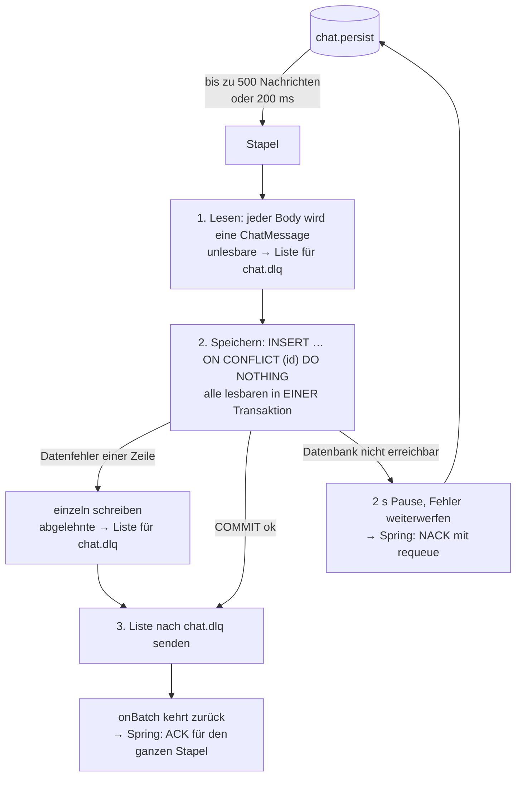

# batch-writer — Spezifikation

**Modul M321 · Klasse IT3c · Bewertung 1 · Omer Hamdiu · Stand 30.09.2026**

Der `batch-writer` ist der einzige Dienst, der Chat-Nachrichten in die Datenbank schreibt. Er
holt die Nachrichten aus der Queue `chat.persist` in Stapeln von bis zu 500 Stück, schreibt jeden
Stapel in **einer** Transaktion mit `INSERT … ON CONFLICT (id) DO NOTHING` in die Tabelle
`message`. Bestätigt werden die Nachrichten erst **nach** dem COMMIT. Das ACK schickt Spring AMQP,
sobald der Listener ohne Fehler fertig ist.

Grundlagen: [`PLANUNG.md`](../PLANUNG.md) (Abschnitte 3.4 bis 3.7 und 4.1), [`CLAUDE.md`](../CLAUDE.md),
der Auftrag «Bewertung 1» und der Code des `chat-service` im Stand `f8ea557e`.

---

## 1. Zweck und Abgrenzung

### 1.1 Warum es diesen Dienst gibt

Der `chat-service` legt jede angenommene Nachricht in die Queue `chat.persist`. Bisher holt sie
dort niemand ab. Startet RabbitMQ neu oder läuft die Queue voll, ist der Chat weg.

Einfach jede Nachricht einzeln zu speichern, reicht nicht: PLANUNG.md 4.1 rechnet mit
100'000 Nachrichten pro Minute, also **1'667 pro Sekunde**. Einzeln wären das 1'667
Datenbank-Transaktionen pro Sekunde. In Stapeln zu 500 sind es **rund 3,3**. Der batch-writer ist
damit die Stelle, an der die Queue als Puffer ihren Zweck erfüllt.

### 1.2 Was der batch-writer tut

1. Er hängt als Verbraucher an `chat.persist`. Mehrere Instanzen teilen sich die Queue
   (Competing Consumers, PLANUNG.md 3.5).
2. Er liest aus jeder Nachricht nur den JSON-Body und macht daraus eine eigene `ChatMessage`.
3. Er schreibt einen ganzen Stapel in einer einzigen Transaktion in die Tabelle `message`.
4. Bestätigt (ACK) wird der Stapel erst nach dem COMMIT. Das ACK schickt Spring AMQP für ihn, sobald
   der Listener ohne Fehler zurückkehrt (Bestätigungsmodus `AUTO`).
5. Nachrichten, die sich nicht lesen oder nicht speichern lassen, legt er am Ende ihres Stapels
   selbst unverändert nach `chat.dlq`.
6. Ist die Datenbank nicht erreichbar, wartet er kurz und wirft den Fehler weiter. Spring AMQP gibt
   den Stapel dann an RabbitMQ zurück (NACK mit requeue). Das wiederholt sich, bis die Datenbank
   antwortet.

### 1.3 Was er bewusst nicht tut

| Nicht Teil des batch-writer | Warum |
|---|---|
| Chat-Historie lesen | Der Lesepfad gehört laut PLANUNG.md 3.1 dem `chat-service` und ist nicht Teil dieser Aufgabe. Der batch-writer schreibt nur |
| Räume und Mitgliedschaften | Nicht Teil der Aufgabe. Deshalb gibt es auch **keinen Fremdschlüssel** von `message.room_id` auf eine Raumtabelle (Begründung in 4.1) |
| Nachrichten annehmen, IDs oder Zeitstempel vergeben | Das macht allein der `chat-service` (`MessageService.java:38-39`). Der batch-writer übernimmt beides unverändert |
| Zustellweg `chat.delivery` | Gehört dem `web-gateway`, nicht Teil der Aufgabe |
| Login, Token prüfen | Der Dienst hat keinen Port und nimmt keine Anfragen an. Das Gateway ist der einzige Wachposten (PLANUNG.md 3.1) |
| Exactly-once | Wir garantieren At-least-once und machen Duplikate harmlos (PLANUNG.md 3.6), siehe 3.2 |
| Alte Nachrichten löschen | Offener Punkt 2 in PLANUNG.md, nicht Teil dieses Schritts |
| Eigener Datenbank-Benutzer mit minimalen Rechten | Bewusst zurückgestellt. Der batch-writer meldet sich mit `POSTGRES_USER` an, wie im Auftrag vorgegeben. Der nächste Schritt wäre ein Benutzer, der nur `INSERT` auf `message` darf |
| Webserver, Port, Health-Endpunkt | Niemand ruft den batch-writer auf. Ohne Webserver belegt er keinen Port und startet schneller |

---

## 2. Vertrag: was auf der Queue ankommt

### 2.1 Die Queue

| Eigenschaft | `chat.persist` | `chat.dlq` |
|---|---|---|
| Typ | classic | classic |
| `durable` | ja | ja |
| `auto_delete` / `exclusive` | nein / nein | nein / nein |
| Argumente | `x-dead-letter-exchange` = `""` (Standard-Exchange), `x-dead-letter-routing-key` = `chat.dlq` | keine |
| Wer schreibt | `chat-service`, über den Standard-Exchange `""` mit Routing-Key `chat.persist` | der batch-writer, über den Standard-Exchange mit Routing-Key `chat.dlq` (3.3, F8 und F9). RabbitMQ selbst nur, wenn Spring einen ganzen Stapel ohne requeue ablehnt. Das geschieht nur bei «fatalen» Fehlern (3.3, F10), die Argumente sind ein Sicherheitsnetz |

**Regel für den batch-writer:** Er deklariert beide Queues selbst, und zwar mit **genau denselben**
Eigenschaften und Argumenten wie der `chat-service`. `chat.dlq` braucht er schon deshalb, weil er
selbst hineinschreibt. Gäbe es die Queue nicht, verwürfe RabbitMQ diese Nachrichten still.
- Wer zuerst startet, legt die Queues an. Der `chat-service` tut das erst beim ersten Senden. Ohne
  eigene Deklaration würde der Verbraucher des batch-writer an einer fehlenden Queue scheitern.
- Weicht eine Deklaration auch nur in einem Argument ab, lehnt RabbitMQ sie mit `406
  PRECONDITION_FAILED` ab und der Verbraucher startet nicht.

### 2.2 Die Nachricht

**Body:** JSON in UTF-8, ein Objekt mit genau diesen Feldern:

| Feld | JSON-Typ | Format | Bedeutung | Spalte |
|---|---|---|---|---|
| `id` | string | UUID | Vom `chat-service` vergeben, weltweit eindeutig | `id` |
| `roomId` | string | UUID | Raum der Nachricht. Wird **nicht** gegen eine Raumtabelle geprüft | `room_id` |
| `senderId` | string | beliebig (die `sub`-Kennung aus Keycloak) | Absender | `sender_id` |
| `senderName` | string | beliebig | Anzeigename, bewusst mitgespeichert (PLANUNG.md 3.7) | `sender_name` |
| `content` | string | beliebig | Text der Nachricht | `content` |
| `sentAt` | string | ISO-8601 in UTC mit `Z`, bis zu 9 Nachkommastellen | Server-Zeit des `chat-service` | `sent_at` |

- Alle sechs Felder sind Pflicht. Fehlt eines oder ist es `null`, ist die Nachricht unlesbar (3.3, F8).
- Zusätzliche, unbekannte Felder werden ignoriert. So bricht der batch-writer nicht, wenn der
  `chat-service` später ein Feld ergänzt.

**Properties**, wie sie der `chat-service` setzt (beobachtet, siehe 2.4):

| Property | Wert |
|---|---|
| `content_type` | `application/json` |
| `content_encoding` | `UTF-8` |
| `delivery_mode` | `2` (persistent: die Nachricht überlebt einen Neustart von RabbitMQ) |
| `priority` | `0` |
| Header `__TypeId__` | `ch.benedict.m321.chatservice.dto.ChatMessage` |

### 2.3 Worauf wir uns verlassen, und worauf nicht

**Der batch-writer liest nur den Body.** Kein Header und keine Property wird ausgewertet, auch
`content_type` nicht. Drei Gründe:

1. Der Vertrag ist das JSON und nicht eine Java-Klasse. So steht es im `chat-service` selbst
   (Kommentar in `ChatMessage.java`). Der batch-writer hat seine eigene Kopie der Klasse.
2. Der Header `__TypeId__` nennt eine Klasse des `chat-service`, die es im batch-writer nicht gibt.
   Ein `Jackson2JsonMessageConverter`, der diesem Header folgt, würde scheitern. Deshalb benutzt
   der batch-writer **keinen** Message-Converter, sondern liest die rohen Bytes selbst mit dem
   `ObjectMapper` von Spring Boot.
3. Von Hand in die Queue gelegte Nachrichten (Szenario S5) haben nur `content_type` und keinen
   `__TypeId__`. Sie müssen genauso funktionieren.

Nicht geprüft werden:
- *ob der Raum existiert und wie lang die Texte sind.* Das prüft niemand. Räume gehören nicht zu
  dieser Aufgabe, und der Vertrag kennt keine Höchstlänge (4.1).
- *ob ein Text leer ist oder nur aus Leerzeichen besteht.* Das prüft schon der `chat-service` beim
  Annehmen, mit `@NotNull` für den Raum und `@NotBlank` für die drei Texte
  (`SendMessageRequest.java:21-24`). Liegt eine Nachricht mit leerem Text direkt in der Queue (wie
  in S5), speichert der batch-writer sie trotzdem.

Der batch-writer prüft nur, was die Datenbank sonst ablehnen würde: dass kein Feld fehlt.

### 2.4 Woher wir das wissen

**1. Aus dem Code des `chat-service`** (Stand `f8ea557e`):

| Stelle | Was sie belegt |
|---|---|
| `chat-service/.../service/MessagePublisher.java:35` | `convertAndSend(QueueNames.PERSIST_QUEUE, message)`: Standard-Exchange, Routing-Key `chat.persist` |
| `chat-service/.../config/RabbitConfig.java:28-30` | Queue `durable` mit `deadLetterExchange("")` und `deadLetterRoutingKey("chat.dlq")` |
| `chat-service/.../config/RabbitConfig.java:37` | `chat.dlq` ist `durable`, ohne Argumente |
| `chat-service/.../config/RabbitConfig.java:61` | `Jackson2JsonMessageConverter` mit dem `ObjectMapper` von Spring Boot: JSON, Zeiten als ISO-8601-Text, Header `__TypeId__` |
| `chat-service/.../dto/ChatMessage.java:14-20` | Die sechs Felder und ihre Java-Typen (`UUID`, `String`, `Instant`) |
| `chat-service/.../service/MessageService.java:38-39` | `UUID.randomUUID()` und `Instant.now()`: ID und Zeit vergibt der Server |
| `chat-service/.../config/QueueNames.java:13-19` | Die Namen `chat.persist`, `chat.delivery`, `chat.dlq` |

**2. Aus einem Mitschnitt am laufenden System** vom 29.09.2026. Dafür lief in GitHub Actions
(Run [36576460894](https://github.com/omerhamdiu17-web/it3c-m321/actions/runs/36576460894)) der
unveränderte Stand des Lehrers: eine Nachricht über `POST /messages`, danach wurde sie über die
Management-API von RabbitMQ gelesen, ohne sie zu entfernen (`ack_requeue_true`).

Antwort des `chat-service`:
```
HTTP/1.1 202
{"id":"9813b68e-d290-44b1-b217-e43fa7a544db","sentAt":"2026-09-29T13:38:12.974043374Z"}
```

Die Nachricht in `chat.persist` (Ausgabe der Management-API, gekürzt auf die relevanten Felder):
```json
{
  "exchange": "",
  "routing_key": "chat.persist",
  "payload_bytes": 206,
  "properties": {
    "priority": 0,
    "delivery_mode": 2,
    "headers": { "__TypeId__": "ch.benedict.m321.chatservice.dto.ChatMessage" },
    "content_encoding": "UTF-8",
    "content_type": "application/json"
  },
  "payload": "{\"id\":\"9813b68e-d290-44b1-b217-e43fa7a544db\",\"roomId\":\"3f2b1c4e-0000-0000-0000-000000000001\",\"senderId\":\"anna\",\"senderName\":\"Anna Muster\",\"content\":\"Hallo Vertrag\",\"sentAt\":\"2026-09-29T13:38:12.974043374Z\"}"
}
```

Die Queues (`rabbitmqctl list_queues name durable auto_delete exclusive arguments messages`):
```
chat.dlq      true  false  false  []                                                                        0
chat.persist  true  false  false  [{"x-dead-letter-exchange",[]},{"x-dead-letter-routing-key","chat.dlq"}]  1
```
(`[]` ist die Darstellung von RabbitMQ für den leeren Namen `""`, also den Standard-Exchange.)
Eingesetzte Version: RabbitMQ 3.13.7.

Auffällig und wichtig: `sentAt` hat **9 Nachkommastellen** (Nanosekunden). PostgreSQL speichert
nur Mikrosekunden. Siehe 4.1.

**3. So lässt sich der Mitschnitt nachstellen** (im Wurzelverzeichnis, Stand des Lehrers):
```bash
cp .env.example .env
docker compose up -d --build
docker run --rm --network chat-net curlimages/curl -s -i -X POST http://chat-service:8080/messages \
  -H 'Content-Type: application/json' \
  -d '{"roomId":"3f2b1c4e-0000-0000-0000-000000000001","senderId":"anna","senderName":"Anna Muster","content":"Hallo Vertrag"}'
docker run --rm --network chat-net curlimages/curl -s -u chat:bitte-lokal-aendern \
  -H 'content-type: application/json' -X POST http://rabbitmq:15672/api/queues/%2F/chat.persist/get \
  -d '{"count":1,"ackmode":"ack_requeue_true","encoding":"auto"}'
docker compose exec rabbitmq rabbitmqctl list_queues name durable auto_delete exclusive arguments messages
```
Der `chat-service` braucht nach `up` einige Sekunden, bis er HTTP beantwortet. Antwortet `curl` mit
Exit-Code 7 (Verbindung abgelehnt), kurz warten und wiederholen.

---

## 3. Verhalten

### 3.1 Normalfall



1. **Verbraucher.** Jede Instanz hat genau **einen** Verbraucher an `chat.persist`. Skaliert wird
   über Instanzen (`--scale`), nicht über Threads (PLANUNG.md 4.2). `prefetch` ist 500: RabbitMQ
   schickt einer Instanz höchstens 500 unbestätigte Nachrichten, also genau einen Stapel.
2. **Stapel bilden.** Spring AMQP sammelt die Nachrichten. Ein Stapel ist fertig, sobald eines davon
   eintritt:
   - 500 Nachrichten sind da (`batchSize`);
   - seit Beginn des Sammelns sind 200 ms vergangen (`batchReceiveTimeout`, PLANUNG.md 3.6);
   - 200 ms lang kam keine neue Nachricht (`receiveTimeout`).

   Im ungünstigsten Fall steht ein Stapel also rund 0,4 s nach seinem Beginn.
3. **Lesen.** Jeder Body wird mit dem `ObjectMapper` von Spring Boot in eine `ChatMessage`
   umgewandelt. Ist er nicht lesbar, kommt die Nachricht in die Liste für `chat.dlq` (F8).
4. **Schreiben.** Alle lesbaren Nachrichten des Stapels gehen mit `JdbcTemplate.batchUpdate` und
   `INSERT INTO message (…) VALUES (?, ?, ?, ?, ?, ?) ON CONFLICT (id) DO NOTHING` in **einer**
   Transaktion (`@Transactional`) in die Datenbank. Mit `reWriteBatchedInserts=true` fasst der
   Treiber die Zeilen zu mehrzeiligen INSERTs zusammen, bis zu 128 Zeilen je Anweisung (500 Zeilen
   ergeben 7 Anweisungen). Am Ende steht genau ein COMMIT.
5. **Aussortiertes nach `chat.dlq`.** Erst jetzt, nach dem Speichern, legt der batch-writer die
   Nachrichten aus der Liste unverändert und persistent nach `chat.dlq` (F8, F9).
6. **Bestätigen.** Das macht nicht unser Code, sondern Spring AMQP (Bestätigungsmodus `AUTO`, 4.5).
   Kehrt `onBatch` ohne Fehler zurück, also nach dem COMMIT und nach dem Senden an `chat.dlq`,
   schickt Spring **ein** ACK für den ganzen Stapel: `basicAck` mit dem höchsten Tag und
   `multiple = true` (`BlockingQueueConsumer.commitIfNecessary`, Spring AMQP 3.2.12). Unser Code
   kennt weder Channel noch Liefernummern (F12).
7. **Protokoll.** Pro Stapel, der in einer Transaktion gespeichert wurde, eine Zeile
   `Stored batch of N messages`. So zeigt `docker compose logs batch-writer` bei zwei Instanzen,
   dass beide arbeiten. Beim Einzelschreiben (F9) fehlt diese Zeile. Dort steht stattdessen je
   abgelehnte Nachricht eine Warnung.

**Mengengerüst:** 1'000 wartende Nachrichten ergeben 2 Stapel, also 2 schreibende Transaktionen.
Bei 1'667 Nachrichten pro Sekunde sind es rund 3,3 Stapel pro Sekunde.

### 3.2 Zustellgarantie

**At-least-once.** Bestätigt wird erst nach dem COMMIT, denn Spring schickt das ACK erst, wenn
`onBatch` fertig ist. Stürzt der batch-writer vorher ab, liefert RabbitMQ den Stapel erneut. Es geht
nichts verloren, aber eine Nachricht kann zweimal ankommen.

**Duplikate sind harmlos.** `id` ist der Primärschlüssel und kommt vom `chat-service`.
`ON CONFLICT (id) DO NOTHING` verwirft die zweite Zeile ohne Fehler. Wir behaupten damit **kein**
Exactly-once. Wir stellen nur sicher, dass eine doppelte Zustellung keine doppelte Zeile erzeugt.

### 3.3 Fehlerfälle

Jeder Fehler gehört in eine von zwei Klassen. Danach richtet sich die Reaktion:

| Klasse | Erkennbar an | Reaktion | Grund |
|---|---|---|---|
| **Die Nachricht ist schuld** | Body nicht lesbar, Feld fehlt, oder die Datenbank lehnt genau diese Zeile ab (`DataIntegrityViolationException`) | kommt in die Liste für `chat.dlq`. Am Ende des Stapels legt der batch-writer sie dorthin, das Original bestätigt Spring mit dem Stapel | Ein zweiter Versuch scheitert genauso |
| **Die Umgebung ist schuld** | jede andere Exception, z. B. keine Verbindung zur Datenbank | 2 s Pause, dann den Fehler weiterwerfen. Spring schickt `basicNack` mit requeue für den ganzen Stapel | Die Nachricht ist in Ordnung. Sie muss nur warten, bis die Datenbank wieder da ist. Sie gehört **nie** in die DLQ |

**F1 – Der batch-writer läuft nicht** (Szenario S4)
- *Was passiert:* Die Nachrichten bleiben in `chat.persist`. Die Queue ist `durable` und die
  Nachrichten sind persistent (`delivery_mode 2`), sie überleben sogar einen Neustart von RabbitMQ.
  Startet der batch-writer, arbeitet er den Rückstau in vollen Stapeln ab: 1'000 Nachrichten
  ergeben 2 schreibende Transaktionen.
- *Dazu kommen wenige Transaktionen für den Verbindungsaufbau.* Der Pool öffnet höchstens
  2 Verbindungen, und die Prüfung einer Verbindung zählt in PostgreSQL ebenfalls als Transaktion.
  Die Grenze von 100 Transaktionen wird damit weit unterschritten.
- *Warum so:* Genau dafür gibt es die Queue als Puffer.

**F2 – Dieselbe Nachricht kommt zweimal** (Szenario S5)
- *Was passiert:* Beide werden gelesen, Header spielen keine Rolle (2.3). Die zweite Zeile verletzt
  den Primärschlüssel, `ON CONFLICT (id) DO NOTHING` verwirft sie ohne Fehler. Es bleibt eine Zeile,
  keine Nachricht geht in die DLQ.
- *Das gilt auch, wenn beide im selben Stapel landen:* PostgreSQL überspringt bei `DO NOTHING` auch
  eine doppelte Zeile innerhalb derselben Anweisung.
- *Warum so:* Duplikate entstehen im Normalbetrieb, z. B. nach F5. Sie dürfen weder stören noch
  als Fehler zählen.

**F3 – Zwei oder mehr Instanzen** (Szenario S6)
- *Was passiert:* Alle Instanzen hängen an derselben Queue. RabbitMQ gibt jede Nachricht jeweils nur
  einem Verbraucher. Stirbt eine Instanz vor ihrem ACK, liefert RabbitMQ deren offene Nachrichten
  an eine andere aus. Waren sie schon geschrieben, greift F2.
- *Absprache nötig?* Nein. Die Instanzen müssen sich nicht absprechen. Die Deklaration der Queues
  ist bei allen gleich und darf sich deshalb beliebig oft wiederholen.
- *Warum so:* Competing Consumers aus PLANUNG.md 3.5. Mehr Durchsatz heisst: eine Instanz mehr.

**F4 – Die Datenbank ist nicht erreichbar** (Szenario S7)
- *Was passiert:* Das Schreiben scheitert. Typisch sind:
  - `CannotCreateTransactionException`, wenn der Pool 5 s lang keine Verbindung bekommt;
  - `DataAccessResourceFailureException`, wenn PostgreSQL eine Verbindung beim Herunterfahren
    trennt.

  Der batch-writer protokolliert eine Warnung, wartet 2 s und wirft den Fehler weiter. Spring AMQP
  antwortet darauf mit `basicNack(höchster Tag, multiple = true, requeue = true)`
  (`BlockingQueueConsumer.rollbackOnExceptionIfNecessary`). `requeue` ist wahr wegen
  `defaultRequeueRejected = true` (4.5). RabbitMQ stellt den Stapel wieder vorne in die Queue und
  liefert ihn erneut. Spring schreibt dazu pro Fehlversuch eine Warnung mit Stacktrace
  («Execution of Rabbit message listener failed.»). Die Zeile `Caused by:` darin nennt den Grund,
  z. B. `UnknownHostException: postgres`, wenn der Container gestoppt ist. Das wiederholt sich etwa alle 7 s (5 s Verbindungs-Timeout plus
  2 s Pause), bis die Datenbank wieder antwortet. **Nichts geht in die DLQ, der Prozess läuft
  weiter**, niemand muss ihn neu starten.
- *Wie schnell nach der Rückkehr:* Der nächste Versuch nach höchstens rund 7 s. Dazu kommt der
  DNS-Zwischenspeicher der JVM: Sie merkt sich eine fehlgeschlagene Namensauflösung 10 s lang, eine
  erfolgreiche 30 s. Im ungünstigsten Fall stehen die Nachrichten also rund 40 s nach dem Neustart
  von PostgreSQL in der Tabelle, sicher unter den 90 s.
- *Warum nicht «nach 3 Versuchen in die DLQ»* (PLANUNG.md 3.5):
  - Schuld ist hier nicht die Nachricht, sondern die Datenbank. Eine feste Zahl von Versuchen
    begrenzt nur, wie lange ein Ausfall dauern darf. Drei Versuche à rund 7 s decken rund 21 s ab.
    In S7 fehlt die Datenbank für den batch-writer aber 15 s lang und danach im ungünstigsten Fall
    noch rund 40 s (siehe oben), zusammen also bis gegen 55 s. Bei einem Wartungsfenster sind es
    Minuten.
  - Die Nachrichten landeten dann in der DLQ, obwohl mit ihnen nichts falsch ist, und müssten von
    Hand zurückgeholt werden.
  - Eine klassische Queue zählt ausserdem keine Zustellversuche.
- *Warum die Pause:* Ohne Pause liefert RabbitMQ den Stapel sofort wieder. Das ergäbe eine
  Schleife, die CPU und Protokoll flutet.
- *Warum NACK und nicht im Listener warten, bis die Datenbank zurück ist:*
  - PLANUNG.md 3.6 sieht genau «NACK mit requeue» vor.
  - Ein Listener, der nach höchstens 7 s zurückkehrt, lässt sich sauber beenden. Spring AMQP
    unterbricht Verbraucher-Threads 5 s nach dem Stopp-Signal, eine Warteschleife würde das
    Herunterfahren blockieren.
  - Nachrichten bleiben nie lange unbestätigt. Den `consumer_timeout` von RabbitMQ (30 min)
    erreicht der batch-writer so nie.

**F5 – Absturz zwischen COMMIT und ACK**
- *Was passiert:* Die Zeilen stehen in der Tabelle, das ACK fehlt. RabbitMQ liefert die Nachrichten
  erneut, F2 verwirft sie. Es entsteht keine doppelte Zeile.
- *Warum so:* Genau deshalb ist die `id` des `chat-service` der Primärschlüssel und nicht eine
  Nummer, die die Datenbank vergibt. Eine neue Nummer bei jeder Wiederholung erzeugte Duplikate.

**F6 – Absturz vor dem COMMIT**
- *Was passiert:* PostgreSQL rollt die offene Transaktion zurück. Die Nachrichten sind nicht
  bestätigt und kommen erneut. Es geht nichts verloren, und es gibt nie einen halb geschriebenen
  Stapel.

**F7 – RabbitMQ ist weg oder startet neu**
- *Was passiert:* Spring AMQP baut die Verbindung alle 5 s neu auf. Unbestätigte Nachrichten gehen
  zurück in die Queue. Queue und Nachrichten sind dauerhaft und überleben den Neustart.
- *Beim ersten Start:* Der Healthcheck `rabbitmq-diagnostics ping` meldet «gesund», bevor Port 5672
  Verbindungen annimmt. Der batch-writer versucht es dann nach 5 s wieder, statt abzustürzen.

**F8 – Die Nachricht ist nicht lesbar**
- *Beispiele:* kein JSON, JSON ohne Pflichtfeld, ein Feld mit falschem Typ.
- *Was passiert:* Die Nachricht kommt in die Liste für `chat.dlq`, der Rest des Stapels wird
  normal geschrieben. Danach legt der batch-writer sie unverändert (gleicher Body, gleiche Header)
  und persistent nach `chat.dlq`. Das Original in `chat.persist` bestätigt Spring mit dem Stapel.
- *Warum beim ersten Versuch:* Ein zweiter Versuch mit denselben Bytes scheitert genauso.
- *Warum erst nach dem Speichern:* Fällt vorher die Datenbank aus (F4), kommt der ganze Stapel
  wieder. Läge die Kopie dann schon in `chat.dlq`, käme bei jedem Versuch eine weitere dazu.
- *Warum `PERSISTENT` von Hand:* Beim Empfang merkt sich Spring nur, wie die Nachricht kam
  (`receivedDeliveryMode`), und leert `deliveryMode` (`DefaultMessagePropertiesConverter`, Spring
  AMQP 3.2.12). Ohne `setDeliveryMode(PERSISTENT)` wäre die Kopie nicht persistent, und ein
  Neustart von RabbitMQ löschte sie aus `chat.dlq`.
- *Warum nicht über die Argumente der Queue (DLX):* Spring lehnt immer den **ganzen** Stapel ab,
  nie eine einzelne Nachricht darin. Eine Ablehnung ohne requeue schickte also mit der kaputten
  auch 499 gute Nachrichten in die DLQ.
- *Grenze:* Stürzt der batch-writer zwischen dem Senden an `chat.dlq` und dem ACK ab, kann eine
  Kopie zweimal in `chat.dlq` liegen (At-least-once wie 3.2). Die Kopien tragen keinen Header
  `x-death`.

**F9 – Die Datenbank lehnt eine einzelne Nachricht ab**
- *Beispiele:*
  - Ein Text mit dem Zeichen NUL (`\u0000`): JSON erlaubt es, PostgreSQL kann es in `text` nicht
    speichern.
  - Ein Datum ausserhalb des Bereichs von PostgreSQL.
- *Was passiert:* Die Transaktion des Stapels scheitert mit `DataIntegrityViolationException` und
  wird zurückgerollt. Der batch-writer schreibt die Nachrichten dieses Stapels danach **einzeln**,
  jede in ihrer eigenen Transaktion:
  - gute Nachrichten werden gespeichert;
  - die abgelehnte kommt in die Liste für `chat.dlq` und landet am Ende des Stapels dort (wie F8).

  Fällt dabei die Datenbank aus (F4), wirft der batch-writer den Fehler weiter, und der ganze Stapel
  kommt wieder. Schon gespeicherte Zeilen verwirft die Datenbank beim nächsten Mal (F2).
- *Warum so:* Eine kaputte Nachricht darf nicht 499 gute mit in die DLQ reissen. Sie darf aber auch
  nicht ewig neu geliefert werden.

**F10 – Unerwarteter Fehler** (Programmierfehler)
- Wird wie F4 behandelt: Pause, NACK, erneuter Versuch. So geht nichts verloren. Der Fehler steht
  bei jedem Durchlauf als Warnung im Protokoll. Das gilt auch, wenn das Senden an `chat.dlq`
  scheitert: Der Stapel kommt wieder, schon gespeicherte Zeilen verwirft die Datenbank (F2).
- *Ausnahme, «fatale» Fehler:*
  - Einige Fehler stuft Spring als «fatal» ein, weil ein neuer Versuch sicher wieder scheitert:
    `ClassCastException`, `MessageConversionException`, `MethodArgumentResolutionException` und
    `NoSuchMethodException` (`ConditionalRejectingErrorHandler`, Spring AMQP 3.2.12).
  - Dann lehnt Spring den ganzen Stapel **ohne** requeue ab, und die Argumente der Queue (2.1)
    legen ihn nach `chat.dlq`. Dort ist er wenigstens nicht verloren.
  - Unser Listener löst solche Fehler praktisch nicht aus: Er bekommt rohe Bytes, benutzt keinen
    Message-Converter und castet nichts.

**F11 – Sehr langer Datenbank-Ausfall**
- Wie F4, nur länger. Weil der Stapel alle rund 7 s zurückgegeben wird, stauen sich die Nachrichten
  in der Queue und nicht unbestätigt beim batch-writer.

**F12 – Bestätigt wird an genau einer Stelle**
- Das ACK und das NACK schickt nur Spring, jeweils einmal für den ganzen Stapel, wenn `onBatch`
  fertig ist. Unser Code ruft `basicAck`, `basicNack` oder `basicReject` nie selbst auf und kennt
  keine Liefernummern.
- *Warum das wichtig ist:* Ein eigenes ACK zusätzlich zum ACK von Spring wäre ein doppeltes ACK.
  RabbitMQ antwortete mit `406 PRECONDITION_FAILED` und schlösse den Channel.
- Bis zum 29.09.2026 hat der Listener selbst bestätigt (`MANUAL`). Warum wir das vereinfacht haben,
  steht in 7.

### 3.4 Start und Stopp

- **Start ohne Datenbank:** Die erste Verbindung entsteht erst beim ersten Stapel. Der batch-writer
  startet also auch, wenn PostgreSQL noch nicht bereit ist, und fängt dann bei F4 an.
- **Start ohne RabbitMQ:** siehe F7.
- **Stopp** (`docker compose stop batch-writer`): Spring beendet den Verbraucher. Ein laufender
  Stapel wird fertig geschrieben und bestätigt, oder er bleibt unbestätigt und kommt erneut (F5/F6).
  Nachrichten, die nach dem Stopp-Signal noch ankommen, gibt Spring ungelesen zurück, immer mit
  requeue.
- **`restart: unless-stopped`** ist nur ein Sicherheitsnetz für unerwartete Abstürze. Keines der
  Szenarien braucht es: der Dienst stürzt bei F4 und F7 nicht ab.

---

## 4. Datenmodell und Konfiguration

### 4.1 Tabelle `message`

```sql
CREATE TABLE message (
    id           uuid         PRIMARY KEY,
    room_id      uuid         NOT NULL,
    sender_id    varchar      NOT NULL,
    sender_name  varchar      NOT NULL,
    content      text         NOT NULL,
    sent_at      timestamptz  NOT NULL
);

CREATE INDEX message_room_id_sent_at_idx ON message (room_id, sent_at DESC);
```

Die Spalten entsprechen genau PLANUNG.md 3.7. Es gibt keine zusätzlichen Spalten.

| Spalte | Entscheidung | Warum |
|---|---|---|
| `id` | `uuid`, Primärschlüssel, Wert vom `chat-service` | Sie ist der Schlüssel, an dem Duplikate erkannt werden (F2, F5). Eine Nummer der Datenbank wäre bei jeder erneuten Zustellung neu und machte aus einer Wiederholung ein Duplikat |
| `room_id` | `uuid NOT NULL`, **ohne Fremdschlüssel** | Räume sind nicht Teil dieser Aufgabe, es gibt keine Raumtabelle. Mit Fremdschlüssel scheiterte jede Nachricht an einen Raum, den die Datenbank nicht kennt, und sie landete in der DLQ. Das träfe genau die Nachrichten der Abnahme mit beliebiger `roomId` |
| `sender_id`, `sender_name` | `varchar` ohne Längenangabe | Der Vertrag kennt keine Höchstlänge. Eine Grenze nur in der Datenbank würde Nachrichten ablehnen, die der `chat-service` angenommen hat. In PostgreSQL ist `varchar` ohne Länge unbegrenzt und nicht langsamer als `varchar(n)` |
| `content` | `text` | wie in PLANUNG.md 3.7, unbegrenzt |
| `sent_at` | `timestamptz` | Ein Zeitpunkt, keine Uhrzeit ohne Zone. PostgreSQL speichert Mikrosekunden und rundet die Nanosekunden des `chat-service` (`…12.974043374Z` wird zu `…12.974043Z`). In Java ist das Feld ein `OffsetDateTime`: der PostgreSQL-Treiber kann `OffsetDateTime` an `timestamptz` binden, `Instant` aber nicht |
| alle | `NOT NULL` | Jedes Feld ist im Vertrag Pflicht. Eine unvollständige Nachricht fängt schon das Lesen ab (F8) |

**Index `(room_id, sent_at DESC)`:** Er dient der einzigen Abfrage des späteren Lesepfads, «die
letzten 50 Nachrichten eines Raums» (PLANUNG.md 3.7). Jeder INSERT pflegt ihn mit. Das kostet bei
rund 3 Transaktionen pro Sekunde kaum etwas. Wir legen ihn jetzt an, damit das Datenmodell der
Planung entspricht und die Tabelle später nicht umgebaut werden muss.

### 4.2 Wo das Schema entsteht

- **Datei:** `postgres/init/01-schema.sql`. Sie wird schreibgeschützt nach
  `/docker-entrypoint-initdb.d` in den Postgres-Container eingebunden.
- **Wann:** Das Postgres-Image führt sie **genau einmal** aus, beim ersten Start mit leerem
  Datenverzeichnis, in der Datenbank `POSTGRES_DB` als `POSTGRES_USER`.
- **Folge:** Eine Änderung am Schema braucht `docker compose down -v`, und das löscht die Daten.
  Für diese Ausbaustufe ist das in Ordnung.
- **Tests:** Sie kopieren **dieselbe** Datei in ihren Test-Container. Es gibt keine zweite Kopie
  des Schemas.

Verworfene Alternativen:
- **Flyway:** versionierte Migrationen mit eigener Verlaufstabelle und Sperre. Ein Werkzeug mehr,
  und seine Transaktionen bei jedem Start zählten in S4 mit.
- **`schema.sql` im batch-writer (`spring.sql.init`):** Zwei gleichzeitig startende Instanzen
  könnten sich beim `CREATE TABLE` in die Quere kommen. Ausserdem soll der batch-writer
  Nachrichten schreiben und keine Tabellen verwalten.
- **JPA mit `ddl-auto`:** Wir benutzen bewusst kein JPA (PLANUNG.md 2.1).

### 4.3 Wo die Daten liegen

- **Volume:** Die Datenbankdateien liegen im benannten Volume `chat-history` (Pfad im Container:
  `/var/lib/postgresql/data`).
- **Lebensdauer:** Sie überleben `docker compose stop`/`start` und auch `docker compose down`. Erst
  `docker compose down -v` löscht sie.
- **Warum ein eigener Name:** Hiesse das Volume wie üblich `postgres-data`, könnte ein
  gleichnamiges Volume aus einem anderen Projekt im gleichnamigen Ordner übernommen werden. Dann
  liefe das Init-Skript nicht, und es läge ein fremdes Schema in der Datenbank.

### 4.4 Umgebungsvariablen

Die echten Werte stehen in `.env` (in `.gitignore`), im Repository steht nur `.env.example`.

| Variable | gesetzt in | gelesen von | Wert in `.env.example` | Vorgabe im batch-writer | Bedeutung |
|---|---|---|---|---|---|
| `RABBITMQ_USER` | `.env` | rabbitmq, chat-service, batch-writer | `chat` | `guest` | Benutzer am Broker |
| `RABBITMQ_PASSWORD` | `.env` | rabbitmq, chat-service, batch-writer | `bitte-lokal-aendern` | `guest` | Passwort am Broker |
| `RABBITMQ_HOST` | `docker-compose.yml` | chat-service, batch-writer | — (steht nicht dort; `docker-compose.yml` setzt `rabbitmq`) | `localhost` | Name des Brokers im Netz `chat-net` |
| `POSTGRES_DB` | `.env` | postgres (legt die Datenbank an), batch-writer | `chat` | `chat` | Name der Datenbank |
| `POSTGRES_USER` | `.env` | postgres (legt den Benutzer an), batch-writer | `chat` | `chat` | Benutzer der Datenbank |
| `POSTGRES_PASSWORD` | `.env` | postgres, batch-writer | `bitte-lokal-aendern` | `chat` | Passwort der Datenbank |
| `POSTGRES_HOST` | `docker-compose.yml` | batch-writer | — (steht nicht dort; `docker-compose.yml` setzt `postgres`) | `localhost` | Name der Datenbank im Netz `chat-net` |

Die Vorgaben greifen nur, wenn der batch-writer ausserhalb von Docker startet (wie beim
`chat-service`). Weil `POSTGRES_USER` und `POSTGRES_DB` beide `chat` heissen, klappt auch ein
kurzes `psql -U chat`: ohne Datenbankname nimmt `psql` den Benutzernamen.

### 4.5 Feste Einstellungen

Diese Werte ändern sich nicht pro Umgebung. Deshalb sind sie keine Umgebungsvariablen.

| Einstellung | Wert | Ort | Warum |
|---|---|---|---|
| Stapelgrösse `batchSize` | 500 | Listener-Konfiguration | PLANUNG.md 3.6 |
| `prefetch` | 500 | Listener-Konfiguration | RabbitMQ schickt einer Instanz genau einen Stapel auf Vorrat |
| `batchReceiveTimeout` | 200 ms | Listener-Konfiguration | «500 Stück oder 200 ms» aus PLANUNG.md 3.6 |
| `receiveTimeout` | 200 ms | Listener-Konfiguration | Kommt so lange nichts, geht der angefangene Stapel sofort los |
| Verbraucher pro Instanz | 1 | Listener-Konfiguration | Skaliert wird über Instanzen (PLANUNG.md 4.2) |
| Bestätigung | `AUTO` | Listener-Konfiguration | Spring schickt das ACK, wenn `onBatch` ohne Fehler zurückkehrt (also nach dem COMMIT), und ein NACK, wenn es einen Fehler wirft. Dafür braucht unser Code keine eigene Zeile (F12) |
| `defaultRequeueRejected` | `true` | Listener-Konfiguration | Das NACK heisst «zurück in die Queue» und nicht «in die DLQ». `true` ist auch die Vorgabe von Spring. Es steht trotzdem da, weil der Datenbank-Ausfall (S7) genau davon abhängt |
| Pause vor dem Weiterwerfen | 2'000 ms | Listener | Verhindert eine heisse Schleife bei Datenbank-Ausfall (F4) |
| JDBC-URL | `jdbc:postgresql://${POSTGRES_HOST}:5432/${POSTGRES_DB}?reWriteBatchedInserts=true&socketTimeout=30` | `application.yml` | mehrzeilige INSERTs; eine hängende Verbindung blockiert einen Stapel höchstens 30 s |
| Pool `maximum-pool-size` / `minimum-idle` | 2 / 1 | `application.yml` | Ein Verbraucher braucht eine Verbindung. Die Vorgabe von 10 Verbindungen je Instanz kostete beim Start rund 30 Transaktionen, weil jede neue Verbindung ein paar Einstellungsbefehle schickt (S4) |
| Pool `connection-timeout` | 5'000 ms | `application.yml` | Ein Ausfall wird nach 5 s erkannt statt nach 30 s |
| Webserver | keiner (`web-application-type: none`) | `application.yml` | kein Port, schnellerer Start |
| Protokoll | `DEBUG` für `ch.benedict.m321` | `application.yml` | wie beim `chat-service`: im Unterricht jeden Schritt sehen |

### 4.6 docker-compose

**`postgres`** (neu):
- Image `postgres:16`; `POSTGRES_DB`, `POSTGRES_USER` und `POSTGRES_PASSWORD` aus `.env`.
- Volume `chat-history` und `./postgres/init` schreibgeschützt eingebunden.
- Healthcheck `pg_isready -h localhost -U "$$POSTGRES_USER" -d "$$POSTGRES_DB"`. Das `-h localhost`
  ist Absicht: Beim ersten Start läuft kurz ein Hilfsserver, der nur über den Unix-Socket erreichbar
  ist, und ohne `-h` wäre der Healthcheck schon dann grün.
- **Kein** `ports:`.

**`batch-writer`** (neu):
- Gebaut aus `batch-writer/Dockerfile`, bekommt die Variablen aus 4.4.
- `depends_on` auf `rabbitmq` und `postgres` mit `condition: service_healthy`.
- `restart: unless-stopped`.
- **Kein** `container_name`: `--scale` braucht automatisch vergebene Namen.
- **Kein** `ports:`.

**`rabbitmq`, `chat-service`, Netz `chat-net`:** unverändert.
- Der `chat-service` bekommt insbesondere **kein** `depends_on` auf `postgres`. Er muss auch ohne
  Datenbank Nachrichten annehmen (S7).
- Einzige Änderung am `chat-service` ist eine Zeile in seinem `Dockerfile`, siehe 4.7.

### 4.7 Maven und Docker-Build

- `batch-writer` wird als zweites Modul im Eltern-POM eingetragen. Abhängigkeiten:
  - Betrieb: `spring-boot-starter-amqp`, `spring-boot-starter-jdbc`, `postgresql`,
    `spring-boot-starter-json`, `lombok`;
  - Tests: `spring-boot-starter-test`, `spring-boot-testcontainers` und die
    Testcontainers-Module `junit-jupiter`, `rabbitmq`, `postgresql`.
- `batch-writer/Dockerfile` ist zweistufig wie beim `chat-service`: bauen mit
  `maven:3.9-eclipse-temurin-21`, laufen mit `eclipse-temurin:21-jre`.
- **Beide Dockerfiles kopieren das POM des jeweils anderen Moduls mit.** Maven liest beim Bauen
  alle Module aus dem Eltern-POM und bricht ab, wenn eines fehlt. Ohne diese Zeile im
  `chat-service`-Dockerfile scheiterte `docker compose up --build` am `chat-service`.

---

## 5. Abweichungen von PLANUNG.md

| Stelle in PLANUNG.md | Dort steht | Wir machen | Warum |
|---|---|---|---|
| 3.7 Datenmodell | `room_id` ist Fremdschlüssel auf `room` | kein Fremdschlüssel | Keine Räume in dieser Aufgabe. Ein Fremdschlüssel schickte gültige Nachrichten in die DLQ (4.1) |
| 3.5 Queues | `chat.dlq`: «nach 3 fehlgeschlagenen Versuchen» | Unlesbare oder abgelehnte Nachricht **beim ersten Versuch** in die DLQ (am Ende ihres Stapels); bei Datenbank-Ausfall **nie** | Die Zahl 3 unterscheidet nicht nach Ursache. Klassische Queues zählen keine Versuche (3.3, F4, F8) |
| 3.5 Queues | Erzeuger von `chat.dlq` ist «RabbitMQ» (Dead Letter) | der batch-writer legt die Nachricht selbst hinein, über den Standard-Exchange | Nur so trifft es genau die eine Nachricht. Spring lehnt immer den ganzen Stapel ab (F8) |
| 3.6 Ablauf | «NACK mit requeue» | NACK mit requeue **nach 2 s Pause**; das NACK schickt Spring, wenn der Listener den Fehler weiterwirft | ohne Pause eine heisse Schleife (F4) |
| 3.4 / 3.6 | «ein Bulk-INSERT» | ein Stapel = **eine Transaktion**; der Treiber schreibt ihn als mehrzeilige INSERTs zu höchstens 128 Zeilen | Die Garantie, dass ein Stapel ganz oder gar nicht geschrieben wird, gibt die Transaktion, nicht die Zahl der Anweisungen |

---

## 6. Abnahmekriterien

Alle Befehle laufen in `bash` im Wurzelverzeichnis des Repositorys. Voraussetzungen: Java 21,
Maven, Docker mit Compose v2, `.env` als Kopie von `.env.example`. Gemessen wird wie im Auftrag
von innen, mit `psql` im Postgres-Container und `rabbitmqctl` im RabbitMQ-Container. Gesendet wird
wie im Plan des `chat-service` über einen curl-Container im Netz `chat-net`. Zeitangaben sind
Obergrenzen.

**Hilfsbefehle**, von den Kriterien unten benutzt:
```bash
set -a; . ./.env; set +a
sql()    { docker compose exec -T postgres psql -U "$POSTGRES_USER" -d "$POSTGRES_DB" -tAc "$1"; }
queues() { docker compose exec -T rabbitmq rabbitmqctl list_queues -q name messages consumers; }
# send ANZAHL MARKIERUNG: schickt ANZAHL Nachrichten mit dem Text "MARKIERUNG 1", "MARKIERUNG 2", ...
send() {
  docker run --rm --network chat-net curlimages/curl sh -c "
    i=1
    while [ \$i -le $1 ]; do
      curl -s -o /dev/null -w '%{http_code}\n' -X POST http://chat-service:8080/messages \
        -H 'Content-Type: application/json' \
        -d \"{\\\"roomId\\\":\\\"3f2b1c4e-0000-0000-0000-000000000001\\\",\\\"senderId\\\":\\\"abnahme\\\",\\\"senderName\\\":\\\"Abnahme\\\",\\\"content\\\":\\\"$2 \$i\\\"}\"
      i=\$((i + 1))
    done" | sort | uniq -c
}
```
Die Markierung im Text (`S3 1`, `S3 2`, …) hält die Zählung je Szenario eindeutig, obwohl der
Stack zwischen den Szenarien nicht aufgeräumt wird.

| Nr | Kriterium (messbar) | Befehl, der es misst |
|---|---|---|
| S1 | Ein Lauf, `BUILD SUCCESS`, 0 Failures, 0 Errors, echte Container | `mvn clean test` |
| S2 | 4 Dienste `running` (rabbitmq, chat-service, postgres, batch-writer); **keine** Zeile mit `->` in den Ports | `docker compose up -d --build`, dann `docker compose ps` und `docker compose ps --format '{{.Service}} {{.Ports}}' \| grep -- '->'` (keine Ausgabe) |
| S3 | Höchstens 60 s nach dem Senden: `S3`-Zeilen = 1000 und `chat.persist` = 0 | `send 1000 S3` (erwartet `1000 202`), dann `sql "SELECT count(*) FROM message WHERE content LIKE 'S3 %'"` und `queues` |
| S4 | Keine Nachricht verloren: `S4`-Zeilen = 1000. **Höchstens 100 Transaktionen** (Differenz von `xact_commit + xact_rollback`). Erwartet: 2 schreibende Transaktionen | `docker compose stop batch-writer`; `X0=$(sql "SELECT xact_commit + xact_rollback FROM pg_stat_database WHERE datname = current_database()")`; `send 1000 S4`; `docker compose start batch-writer`; `queues` wiederholen, bis `chat.persist 0` (in dieser Zeit **kein** `psql`, jede Abfrage wäre selbst eine Transaktion); 12 s warten (PostgreSQL führt die Statistik verzögert nach); `X1` wie `X0`; Differenz `X1 - X0` ≤ 100; `sql "SELECT count(*), count(DISTINCT xmin::text) FROM message WHERE content LIKE 'S4 %'"` → `1000\|2`. `xmin` ist die Transaktion, die eine Zeile geschrieben hat |
| S5 | Dieselbe Nachricht 2× nur mit `content_type`: genau 1 Zeile, `chat.dlq` = 0 | `ID=$(sql "SELECT gen_random_uuid()")`; zweimal `docker compose exec -T rabbitmq rabbitmqadmin -u "$RABBITMQ_USER" -p "$RABBITMQ_PASSWORD" publish exchange=amq.default routing_key=chat.persist properties='{"content_type":"application/json"}' payload="{\"id\":\"$ID\",\"roomId\":\"3f2b1c4e-0000-0000-0000-000000000001\",\"senderId\":\"abnahme\",\"senderName\":\"Abnahme\",\"content\":\"S5 Duplikat\",\"sentAt\":\"2026-09-29T13:38:12.974043374Z\"}"`; nach wenigen Sekunden `sql "SELECT count(*) FROM message WHERE id = '$ID'"` → `1` und `queues` → `chat.dlq 0` |
| S6 | Beide Instanzen hängen an der Queue (`consumers` = 2) und schreiben Stapel. Höchstens 60 s nach dem Senden: `S6`-Zeilen = 1000, keine `id` doppelt | `docker compose up -d --scale batch-writer=2`; `queues` → `chat.persist 0 2`; warten, bis der `chat-service` wieder antwortet (das erste `up` ohne `--build` erstellt die gebauten Dienste neu, auch ihn); `send 1000 S6`; `sql "SELECT count(*), count(DISTINCT id) FROM message WHERE content LIKE 'S6 %'"` → `1000\|1000`; `docker compose logs --since <Zeitpunkt des Sendens> batch-writer \| grep 'Stored batch'` zeigt beide Instanzen |
| S7 | Höchstens 90 s nach dem Neustart: `S7`-Zeilen = 300, `chat.dlq` = 0. batch-writer läuft ohne Neustart von Hand | `docker compose stop postgres`; `send 300 S7`; `sleep 15`; `docker compose start postgres`; alle paar Sekunden `sql "SELECT count(*) FROM message WHERE content LIKE 'S7 %'"` → `300`; `docker inspect -f '{{.Name}} {{.State.Status}} RestartCount={{.RestartCount}}' $(docker compose ps -q batch-writer)` → `running`, `RestartCount=0`; `queues` → `chat.dlq 0` |
| S8 | Kein «stream» im Quelltext. Kommentar über jeder Klasse und Methode. `.env` nie im Repository | `grep -rin --exclude-dir=target stream batch-writer/` (keine Ausgabe; `target/` ist der Build-Ordner, kein Quelltext); `bash scripts/kommentare.sh batch-writer/src` (keine Ausgabe, Exit-Code 0; je fehlender Kommentar eine Zeile `Datei:Zeile: Deklaration` und Exit-Code 1); `git ls-files .env` und `git log --all --format=%h -- .env` (beide ohne Ausgabe) |

**Tests, die einzelne Kriterien schon beim Bauen belegen** (Teil von S1, Details im Umsetzungsplan):

| Kriterium | Test |
|---|---|
| S5, Duplikat | `MessageBatchListenerIntegrationTest`: dieselbe Nachricht 2× direkt in `chat.persist`, nur mit `content_type` → 1 Zeile, `chat.dlq` leer. Zusätzlich `MessageRepositoryIntegrationTest`: Duplikat über und innerhalb eines Stapels |
| S7, Datenbank-Ausfall | `DatabaseOutageIntegrationTest`: Datenbank für Verbindungen sperren, bestehende Verbindungen trennen, 50 gültige und mitten darin eine unlesbare Nachricht senden, freigeben → alle 50 gespeichert, in `chat.dlq` genau die unlesbare und nur **einmal**, Verbraucher läuft noch. *Warum sperren statt stoppen:* Ein gestoppter Test-Container käme mit einem anderen Port zurück, und der batch-writer fände ihn nicht mehr. Den echten Stopp, bei dem sogar der Name `postgres` nicht mehr auflösbar ist, prüft S7 im Abnahmeskript |
| S4, Stapel | `MessageBatchListenerIntegrationTest`: 1000 wartende Nachrichten → alle gespeichert, höchstens 20 verschiedene `xmin` (erwartet 2) |
| F8 und F9, DLQ | `MessageBatchListenerIntegrationTest`: eine unlesbare bzw. eine von der Datenbank abgelehnte Nachricht landet in `chat.dlq`, und zwar persistent; die übrigen des Stapels sind gespeichert |
| Vertrag (2.2) | `MessageBatchListenerIntegrationTest`: Umlaute und Emoji kommen unverändert in `content` an; ein unbekanntes Zusatzfeld stört nicht. Dieser Test läuft mit dem `ObjectMapper` von Spring Boot, wie im Betrieb |
| Schema | `SchemaIntegrationTest`: Spalten und Typen wie 4.1, Primärschlüssel, Index, **kein** Fremdschlüssel |

Alle Kriterien S2 bis S8 prüft zusätzlich das Skript `scripts/abnahme.sh` automatisch, in dieser
Reihenfolge und auf demselben Stack wie die Abnahme. Es läuft bei jedem Push in GitHub Actions
(siehe Umsetzungsplan).

### Abnahmeprotokoll vom 30.09.2026

Gemessen in GitHub Actions in der Reihenfolge des Prüfskripts, Lauf
[36695032988](https://github.com/omerhamdiu17-web/it3c-m321/actions/runs/36695032988):
1. frischer Checkout, zuerst `mvn -B clean test` (S1);
2. danach im selben Ordner `.env` aus `.env.example` und `scripts/abnahme.sh` (S2 bis S8).

Der Code in diesem Lauf ist derselbe wie beim Tag `bewertung-1`. Danach kamen nur noch
Doku-Commits. Derselbe Stand lief auch im normalen CI auf `main` grün
([36695028771](https://github.com/omerhamdiu17-web/it3c-m321/actions/runs/36695028771)).

| Nr | Ergebnis | gemessen |
|---|---|---|
| S1 | bestanden | chat-service 14 Tests, batch-writer 29 Tests, 0 Fehler, in einem Lauf |
| S2 | bestanden | 4 Dienste laufen, 0 veröffentlichte Ports |
| S3 | bestanden | 1000 × `202`, 1000 Zeilen, `chat.persist` leer schon bei der ersten Messung nach dem Senden |
| S4 | bestanden | 1000 Zeilen, **17 Transaktionen**, davon 2 schreibend |
| S5 | bestanden | 1 Zeile mit dieser `id`, `chat.dlq` leer |
| S6 | bestanden | 2 Verbraucher, beide schreiben Stapel, 1000 Zeilen, 1000 verschiedene `id` |
| S7 | bestanden | alle 300 Zeilen **7 s** nach dem Neustart von PostgreSQL, `chat.dlq` leer, 0 Neustarts |
| S8 | bestanden | 0 × «stream» in `batch-writer/`, auch in `target/` nach S1; `bash scripts/kommentare.sh batch-writer/src`: 0 fehlende Kommentare; `.env` weder im Repository noch in einem der 97 Commits |

---

## 7. Verlauf

*Hält fest, wie diese Spezifikation entstanden ist, auch wo die KI danebenlag.*

**Vorarbeit vor der Ausgabe.** Am 23.09.2026, einen Tag vor der Ausgabe von Bewertung 1, habe ich
mit Claude (KI) die Schritte 4 bis 7 aus PLANUNG.md schon einmal durchgespielt, darunter einen
batch-writer, aber ohne Spezifikation. Dieser Stand ist vollständig erhalten im Branch
[`archiv/vorarbeit-2026-09-23`](https://github.com/omerhamdiu17-web/it3c-m321/tree/archiv/vorarbeit-2026-09-23).

**Warum neu angefangen.** Eine Prüfung dieses Stands gegen die acht Szenarien am 29.09.2026 ergab:
- `web-gateway` veröffentlicht Port 8080 → S2 scheitert.
- `message.room_id` hat einen Fremdschlüssel auf drei feste Räume → Nachrichten mit anderer
  `roomId` landen in der DLQ, S3 und S5 scheitern.
- `.env.example` enthält weder `POSTGRES_USER` noch `POSTGRES_DB`.
- Testmethoden und `main` haben keinen Kommentar → S8 ist gefährdet.
- Die Spezifikation fehlte, der Code war zuerst da.

Ich habe deshalb entschieden, `main` auf den Stand des Lehrers (`f8ea557e`) zurückzusetzen und in
der Reihenfolge Spezifikation, Plan, Code neu aufzubauen. Der alte Stand ist nicht gelöscht,
sondern archiviert. Das Zurücksetzen war ein Force-Push auf `main` und ist in der Aktivität des
Repositorys sichtbar.

**Was aus der Vorarbeit blieb und was diese Spezifikation geändert hat** (Vergleich des
Archiv-Branchs mit dem heutigen Stand):

| Thema | Vorarbeit (23.09.) | Heute | Grund |
|---|---|---|---|
| Aufbau | `MessageBatchListener`, `ReceivedMessage`, `MessageRepository`, `RabbitConfig`, `QueueNames`, `record ChatMessage` | dieselben Klassen, dazu neu `ChatMessageReader` | Schichtung wie im `chat-service`, sie hat sich bewährt. Das Lesen des Bodys hat eine eigene Klasse, damit es sich ohne Container testen lässt |
| Duplikate | `ON CONFLICT (id) DO NOTHING` | gleich | F2 |
| Fremdschlüssel `room_id` | ja, auf eine Tabelle `room` | **keiner** | Sonst landen gültige Nachrichten in der DLQ (4.1, 5) |
| `sent_at` in Java | `Instant`, im Repository in `Timestamp` umgewandelt | `OffsetDateTime`, direkt gebunden | Eine Umwandlung weniger, der Treiber bindet `OffsetDateTime` an `timestamptz` (4.1) |
| Stapel fertig | 200 ms lang keine neue Nachricht (`receiveTimeout`) | 500 Stück **oder** 200 ms ab Beginn (dazu `batchReceiveTimeout`) | PLANUNG.md 3.6 meint «spätestens nach 200 ms» (3.1) |
| Fehler beim Schreiben | nur `DataAccessException` führte zum NACK, bei anderen blieb der Stapel hängen | jede Exception, die kein Datenfehler ist: Pause und NACK | F4, F10 (Punkt 2 unten) |
| Pause vor dem NACK | 1 s | 2 s | F4 |
| Bestätigen | von Hand (`MANUAL`) | Spring (`AUTO`), seit 30.09. | F12, Vereinfachung unten |
| Unlesbare Nachricht | `basicReject`, weiter über die Argumente der Queue | am Ende des Stapels selbst nach `chat.dlq`, persistent | F8 |
| Tests | 3 Testklassen mit 7 Tests, kein Test für einen Datenbank-Ausfall | 7 Testklassen mit 29 Tests, darunter S5 und S7 | 6 |
| Abnahme | – | `scripts/abnahme.sh` für S2 bis S8, bei jedem Push | 6 |

Im `git log` liegen die Commits der Tasks 1 bis 12 nur Minuten auseinander. Der Umsetzungsplan
enthielt wie sein Vorbild `docs/plan-chat-service.md` schon den ganzen Code. Umsetzen hiess deshalb:
- den Test übernehmen und rot sehen;
- den Code übernehmen und grün sehen;
- erst nach einem grünen Lauf in GitHub Actions auf `main` pushen.

Die Läufe stehen im Umsetzungsplan (Commit-Übersicht).

**KI-Vorschläge, die korrigiert wurden** (jeweils mit Beleg):
1. *Fremdschlüssel `room_id` (Vorarbeit):* entfernt, siehe 4.1 und 5.
2. *Fehlerbehandlung (Vorarbeit):* Sie fing nur `DataAccessException`. Kommt der Pool 30 s lang an
   keine Verbindung, wirft `@Transactional` aber eine `CannotCreateTransactionException`, und die
   ist keine `DataAccessException`. Die Exception verliess den Listener. Im Modus `MANUAL` schickt
   Spring AMQP dann kein NACK (`BlockingQueueConsumer.rollbackOnExceptionIfNecessary`, Spring AMQP
   3.2). Der Stapel blieb unbestätigt hängen. Jetzt gilt: jede Exception, die kein Datenfehler ist,
   führt zum NACK (F4, F10). Das galt für den Modus `MANUAL`. Seit der Vereinfachung vom 30.09.
   schickt Spring das NACK selbst (siehe unten).
3. *«200 ms» (Vorarbeit):* umgesetzt als «200 ms lang nichts Neues» (`receiveTimeout`). Unter
   gleichmässiger Last wird ein Stapel damit nie fertig, bevor er voll ist. Jetzt zusätzlich
   `batchReceiveTimeout`, wie in PLANUNG.md 3.6 gemeint (3.1).
4. *Erster Entwurf dieser Spezifikation:* Bei Datenbank-Ausfall sollte der Listener in einer
   Schleife warten. Verworfen nach einem Blick in den Quelltext von Spring AMQP: Verbraucher-Threads
   werden 5 s nach dem Stopp-Signal unterbrochen, die Schleife hätte das Herunterfahren blockiert.
   Stattdessen NACK nach Pause (F4).
5. *Erster Entwurf:* `sent_at` direkt als `Instant` an die Datenbank geben. Der PostgreSQL-Treiber
   kann `Instant` nicht binden, jeder Stapel wäre gescheitert. Jetzt `OffsetDateTime` (4.1).
6. *Eine KI-Prüfung behauptete, das Image `rabbitmq:3.13-management` enthalte kein `rabbitmqadmin`
   mehr.* Der Mitschnitt (2.4) zeigt `rabbitmqadmin 3.13.7`. Die Behauptung war falsch.
7. *Erster Entwurf der Vereinfachung:* Die Kopie für `chat.dlq` einfach mit `rabbitTemplate.send`
   weiterschicken. Beim Prüfen am Quelltext von Spring AMQP gefunden: Beim Empfang leert Spring
   `deliveryMode`. Die Kopie wäre nicht persistent gewesen und hätte einen Neustart von RabbitMQ
   nicht überlebt. Jetzt setzt der Listener `PERSISTENT`, und ein Test prüft es (F8).
8. *Erster Entwurf der Vereinfachung:* Eine von der Datenbank abgelehnte Nachricht (F9) sofort nach
   `chat.dlq` schicken. Fällt danach im selben Stapel die Datenbank aus, käme der Stapel wieder und
   die Kopie ein zweites Mal. Jetzt gehen alle Kopien erst am Schluss weg, und der S7-Test prüft
   «genau einmal» (F8).

**Abschluss-Review.** Ein unabhängiges Code-Review (KI, frischer Kontext, gegen diese Spezifikation und
CLAUDE.md) fand keine kritischen Fehler. Fünf Stellen wurden danach korrigiert, jede mit eigenem
Commit (Umsetzungsplan, «Korrekturen aus dem Abschluss-Review»). Die lehrreichste: Das erste
`docker compose up` ohne `--build` erstellt die gebauten Dienste neu, auch den `chat-service`. In S6
ist das genau das `up --scale`, deshalb wartet das Abnahmeskript dort, bis er wieder antwortet.

**Vereinfachung am 30.09.2026.**
- *Vorher:* Bis zum 29.09. hat der Listener selbst bestätigt (`MANUAL`), mit Channel, Liefernummern,
  `basicAck`, `basicNack` und `basicReject` und mit der Falle «406 unknown delivery tag». Das war
  richtig, aber schwer zu lesen und zu erklären.
- *Jetzt:* Seit dem 30.09. bestätigt Spring (`AUTO`), genau wie in PLANUNG.md 3.6 gezeichnet. Ist
  der Listener fertig, kommt ein ACK für den ganzen Stapel. Wirft er einen Fehler, kommt ein NACK
  mit requeue. Nach aussen verhält sich der Dienst gleich wie vorher (3.3).
- *Wie geprüft:*
  - am Quelltext von Spring AMQP 3.2.12 (`BlockingQueueConsumer.commitIfNecessary` und
    `rollbackOnExceptionIfNecessary`);
  - mit Tests, die schon auf dem alten Stand grün waren und auf dem neuen grün bleiben mussten
    (Umsetzungsplan, «Vereinfachung vom 30.09.2026»).

**Von mir entschieden** (29.09.2026):
- alten Stand archivieren und neu beginnen;
- diese Spezifikation dem Lehrer zeigen und parallel mit dem Umsetzungsplan weitermachen;
- für das Code-Review einen Stack in GitHub Codespaces vorbereiten;
- den Entwurf mit den zwei Fehlerklassen aus 3.3 übernehmen.

**Von mir entschieden** (30.09.2026):
- den Listener vereinfachen: Spring bestätigt (`AUTO`), der Listener braucht weder Channel noch
  Liefernummern;
- die neuen Tests zuerst auf dem alten Stand laufen lassen und erst dann den Code ändern;
- den Stack für das Code-Review auf meinem eigenen Rechner mit Docker Desktop starten, Codespaces
  nur als Reserve.

**Offen gesagt:** Den Link zu dieser Spezifikation habe ich dem Lehrer am 29.09. nicht geschickt,
obwohl ich das so entschieden hatte. Die Spezifikation lag aber vor Plan und Code im Repository
(siehe `git log`). Ich schicke sie mit dem Stand vom 30.09.

Analyse, Belege, Entwurf und Text dieser Spezifikation entstanden mit Claude (KI). Die
Entscheidungen oben habe ich getroffen.
