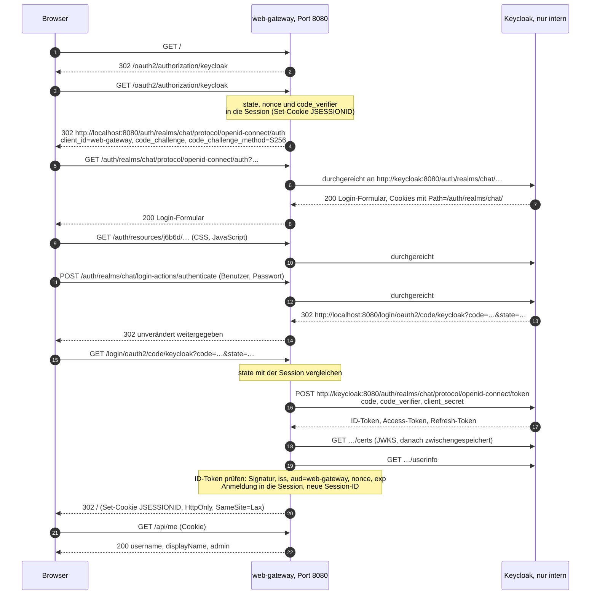
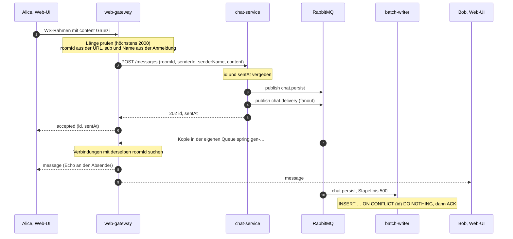

# web-gateway, Keycloak und Web-UI — Spezifikation

**Modul M321 · Klasse IT3c · Baustein 1 · Omer Hamdiu · Stand 02.10.2026**

Baustein 1 macht die Chat-App im Browser benutzbar. Der `web-gateway` ist der einzige Container mit
offenem Port (`127.0.0.1:8080`). Er reicht die Login-Seiten von Keycloak unter `/auth` durch und
meldet die Benutzer als OIDC-Client an (Authorization Code mit PKCE). Die Anmeldung liegt in einer
Server-Session, der Browser bekommt nur ein Session-Cookie und **nie** ein Token. Nachrichten kommen
über eine WebSocket-Verbindung herein und gehen per REST an den `chat-service`; zugestellt wird über
eine eigene Queue am Fanout-Exchange `chat.delivery`, nur an Verbindungen im Raum der Nachricht.
Für den Desktop-Client und die Abnahme prüft das Gateway zusätzlich Bearer-JWTs.

Grundlagen: [`PLANUNG.md`](../PLANUNG.md) (Abschnitte 1, 3.1 bis 3.5, 6 und 7), [`CLAUDE.md`](../CLAUDE.md),
der Stand mit Tag `bewertung-1` (`chat-service` und `batch-writer`, siehe
[`spec-batch-writer.md`](spec-batch-writer.md)) und die Experimente E1 bis E6 vom 02.10.2026 (2.7).

---

## 1. Zweck und Abgrenzung

### 1.1 Warum es diese drei Teile gibt

Seit Bewertung 1 nehmen `chat-service` und `batch-writer` Nachrichten an und speichern sie. Benutzen
kann das aber niemand: `POST /messages` ist nur im Docker-Netz erreichbar, es gibt kein Login, und am
Exchange `chat.delivery` hängt keine einzige Queue. Was der `chat-service` dorthin legt, verwirft
RabbitMQ (E5).

Drei Vorgaben aus PLANUNG.md 1 bestimmen, wie das zu lösen ist:

| Vorgabe (PLANUNG.md 1) | Folge für Baustein 1 |
|---|---|
| «Keycloak als Login-Dienst»: «Kein selbstgebautes Login, kein eigenes Passwort-Handling» | Keycloak ist ein eigener Container mit dem Realm `chat` |
| «**Nur die Web-App über localhost**»: «Genau **ein** Port-Mapping im ganzen `docker-compose.yml`» | Nur das Gateway hat einen Port. Keycloak und die Web-UI erreicht der Browser über das Gateway |
| «Internes Docker-Netzwerk»: «Dienste sprechen sich über Service-Namen an, nicht über `localhost`» | Das Gateway ruft `http://keycloak:8080` und `http://chat-service:8080` auf |

Beim Login leitet Keycloak den **Browser** um, und der Browser erreicht das interne Netz nicht.
PLANUNG.md 3.2 wählt deshalb Weg 2: «Keycloak vom Gateway durchreichen lassen unter
`localhost:8080/auth` — ein Port, echter Authorization Code Flow mit PKCE.»

PLANUNG.md 6 legt die Reihenfolge fest. Baustein 1 umfasst Schritt 2 («Keycloak-Realm, Gateway mit
Proxy und JWT-Prüfung, React zeigt den Benutzernamen») und Schritt 3 («Nachricht vom Browser bis zum
zweiten Browser, ohne Datenbank»). Dazu PLANUNG.md: «Schritt 3 ist der wichtigste Meilenstein.» Die
Datenbank läuft anders als dort geplant schon mit, denn den `batch-writer` gibt es seit Bewertung 1.

### 1.2 Was Keycloak, web-gateway und Web-UI tun

**Keycloak** (`quay.io/keycloak/keycloak:26.7.3`, Container `keycloak`, kein Port nach aussen)

1. verwaltet Benutzer, Passwörter und Rollen im Realm `chat`. Der Realm kommt beim ersten Start aus
   einer JSON-Datei im Repo. Secret und Passwörter stehen darin nur als Platzhalter für
   Umgebungsvariablen (E1);
2. zeigt das Login-Formular, stellt Authorization Codes und signierte Tokens (RS256) aus und
   veröffentlicht seine öffentlichen Schlüssel (JWKS);
3. hält seine Daten in der eingebauten Datei-Datenbank im Container. PLANUNG.md 3.1: «Keycloak bringt
   seine eigene Datenhaltung mit und benutzt unsere `chat`-Datenbank nicht.» Ein Ausfall von
   PostgreSQL stört den Login also nicht.

**web-gateway** (Spring Boot 3.5, Container `web-gateway`, einziger Port `127.0.0.1:8080`)

4. reicht `/auth/realms/chat/**` und `/auth/resources/**` an `http://keycloak:8080` durch, sonst
   nichts unter `/auth`;
5. meldet Browser-Benutzer als OIDC-Client an (`oauth2Login`, Authorization Code, PKCE mit `S256`)
   und hält die Anmeldung in einer Server-Session;
6. prüft zusätzlich Bearer-JWTs als OAuth2 Resource Server, für den Desktop-Client (Baustein 5) und
   die Abnahme;
7. liefert die Dateien der Web-UI und `GET /api/me` aus;
8. nimmt über die WebSocket-Verbindung `/ws/chat?roomId=…` Nachrichten an, ergänzt Raum und Absender
   und reicht sie per `POST /messages` an den `chat-service` weiter. Dem Absender meldet es
   `accepted` oder `error` zurück;
9. hängt eine eigene, exklusive Queue an `chat.delivery` und stellt jede Nachricht allen
   Verbindungen im Raum der Nachricht zu, auch dem Absender.

**Web-UI** (React 19, TypeScript, Vite; gebaut im Image des Gateways)

10. zeigt «Angemeldet als …», einen Knopf «Abmelden» und den Chat im Raum «Lobby» (feste UUID als
    Konstante in der Web-UI), höchstens
    200 Nachrichten;
11. entfernt doppelte Nachrichten nach `id` und sortiert nach (`sentAt`, `id`);
12. macht Fehler sichtbar: Bei `error` zeigt sie «Nachricht nicht gesendet» und stellt den Text zurück
    ins Eingabefeld. Bei getrennter Verbindung zeigt sie «Verbindung getrennt» und versucht es nach
    3 s erneut.

### 1.3 Was sie bewusst nicht tun

| Nicht Teil von Baustein 1 | Warum |
|---|---|
| Räume anlegen und auflisten, Mitgliedschaften, Verlauf beim Öffnen eines Raums | Baustein 2 (PLANUNG.md 6, Schritt 4: «Historie beim Öffnen eines Raums»). Baustein 1 kennt nur die Lobby mit der festen UUID `00000000-0000-0000-0000-000000000001`. Jede gültige UUID ist als `roomId` erlaubt, eine Raumtabelle gibt es nicht |
| Queue-Tiefe in der Oberfläche, Rechte nach Rolle, `load-generator` | Baustein 3 (PLANUNG.md 6, Schritt 5; offener Punkt 6). Die Rollen `user` und `admin` stehen schon im Token und in `/api/me`, aber noch kein Endpunkt verlangt eine Rolle |
| Messreihe, `--scale` | Baustein 4 (PLANUNG.md 6, Schritt 6) |
| Desktop-Fenster (JavaFX) | Baustein 5 (PLANUNG.md 6, Schritt 7). Der Keycloak-Client `desktop-client` und die Prüfung von Bearer-JWTs entstehen aber schon jetzt, sonst liesse sich diese Prüfung nicht testen |
| Gateway skalieren | Offener Punkt 1: «Eine WebSocket-Verbindung klebt an einer Instanz», und der Port wäre «mehrfach vergeben». Es läuft genau eine Instanz |
| Token im Browser | Abweichung von PLANUNG.md 3.3, Entscheid vom 02.10.2026 (Abschnitt 5). Der WebSocket im Browser kann keinen `Authorization`-Header setzen, und ein Token im JavaScript ist bei XSS lesbar |
| Eigene Benutzerverwaltung (Registrieren, Passwort ändern) | PLANUNG.md 1: «Kein selbstgebautes Login, kein eigenes Passwort-Handling». Die Benutzer kommen aus dem Realm-Import |
| Admin-Konsole von Keycloak | Offener Punkt 5: «Nicht erreichbar, das ist so gewollt». Das Gateway reicht `/auth/admin/**` nicht durch (404), und es gibt keinen Bootstrap-Admin |
| Puffer auf dem Sendeweg | Offener Punkt 9: Ist der `chat-service` unten, «schlägt das Senden sofort fehl». Das Gateway wiederholt nicht und speichert nichts zwischen (3.4, F3) |
| Exactly-once | Zustellung höchstens einmal, Speicherung mindestens einmal (3.3) |
| Auf RabbitMQ veröffentlichen | PLANUNG.md 3.4: «Das Gateway ist also **Consumer, aber kein Producer**.» |
| Änderungen am `chat-service` | Er bleibt im Stand `bewertung-1`, auch mit seiner Schwäche bei einer Teilveröffentlichung (3.4, F6) |

---

## 2. Vertrag

### 2.1 URL-Fläche hinter `127.0.0.1:8080`

Das Port-Mapping lautet `127.0.0.1:8080:8080`, nur der eigene Rechner erreicht das Gateway. Die
öffentliche Adresse ist **`http://localhost:8080`**. Auf sie lauten der Issuer (E3), die
Redirect-URI (2.6) und das Ziel des Login-Formulars (E4). `http://127.0.0.1:8080` wird nicht
unterstützt: Für den Browser ist das ein anderer Host mit eigenem Session-Cookie, und die Rückkehr
von Keycloak auf `localhost` fände die gespeicherte Login-Anfrage nicht.

| Pfad | Wer antwortet | Anmeldung nötig | Ohne Anmeldung | Zweck |
|---|---|---|---|---|
| `/` | Gateway (`index.html` der Web-UI) | ja, Session | 302 auf `/oauth2/authorization/keycloak` | Einstieg |
| statische Dateien (`/assets/**` und die übrigen Dateien aus `vite build`) | Gateway | ja, Session | 302 wie `/` | JavaScript, CSS und Bilder der Web-UI |
| `GET /api/me` | Gateway | ja, Session **oder** Bearer-JWT | 401 | Wer bin ich? (2.2) |
| `/ws/chat?roomId=<uuid>` | Gateway | ja, Session **oder** Bearer-JWT | 401 beim Handshake | Senden und Empfangen (2.3) |
| `/oauth2/authorization/keycloak` | Gateway (Spring Security) | nein | 302 zu Keycloak, mit `code_challenge_method=S256` | Login starten (3.1) |
| `/login/oauth2/code/keycloak` | Gateway (Spring Security) | nein, aber `state` muss zur Session passen | tauscht den Code gegen Tokens, dann 302 auf `/` | Rückkehr von Keycloak (Redirect-URI) |
| `GET /logout` | Gateway | ja, Session | 302 auf `/` | Abmelden beim Gateway und bei Keycloak (3.1) |
| `/auth/realms/chat/**` | Keycloak, durchgereicht an `http://keycloak:8080` | nein | Antwort von Keycloak | Login-Formular, Token, JWKS, Userinfo, Logout |
| `/auth/resources/**` | Keycloak, durchgereicht | nein | Antwort von Keycloak | CSS, JavaScript und Bilder der Login-Seite (E4) |
| alles andere unter `/auth` | Gateway | nein | 404 | sperrt Admin-Konsole, Realm `master` und Willkommensseite (E4) |
| `/error` | Gateway (Spring Boot) | nein | Fehlerantwort | Eine Fehlerseite führt nicht selbst zum Login |
| alle übrigen Pfade | Gateway | ja | `/api/**` und `/ws/**`: 401, sonst 302 wie `/` | |

Regeln dazu:
- **401 statt Umleitung für `/api/**` und `/ws/**`.** Ein `fetch` oder ein WebSocket kann einer
  Umleitung auf eine Login-Seite nicht sinnvoll folgen. Mit 401 weiss die Web-UI, dass sie die Seite
  neu laden muss (3.4, F7). Die Antwort trägt den Header `WWW-Authenticate: Bearer`.
- **Bearer-JWT nur für `/api/**` und `/ws/**`.** Seiten und Login laufen immer über die Session.
- **Keine CSRF-Prüfung unter `/auth/**`.** Das Login-Formular schickt ein `POST` an
  `/auth/realms/chat/login-actions/authenticate` (E4). Ein CSRF-Token des Gateways kennt Keycloak
  nicht. Keycloak schützt sein Formular selbst (`session_code`, `tab_id` und eigene Cookies, E4).
- **`GET /logout` ohne CSRF-Token**, damit die Web-UI einen einfachen Link nehmen kann. Eine fremde
  Seite kann damit höchstens abmelden, der Schaden ist ein neuer Login.
- **Session-Cookie** `JSESSIONID`: `HttpOnly`, `SameSite=Lax`, `Path=/`, ohne `Secure`, weil das
  System nur HTTP spricht. Die Session liegt im Speicher des Gateways.
- **Konto-Seite von Keycloak** (`/auth/realms/chat/account`): Sie liegt unter dem durchgereichten
  Präfix, gehört aber nicht zu Baustein 1. Die Web-UI verlinkt sie nicht.
- **`X-Forwarded-*`-Header wertet Keycloak nicht aus**, denn `KC_PROXY_HEADERS` ist nicht gesetzt
  (Abschnitt 5). Alle öffentlichen Adressen kommen aus `KC_HOSTNAME` (E3). Ob der Proxy solche
  Header vom Browser weiterreicht, wird per Test geprüft (P10 in 6.5).

### 2.2 `GET /api/me`

Antwort `200` mit `Content-Type: application/json`:

| Feld | JSON-Typ | Quelle | Beispiel |
|---|---|---|---|
| `username` | string | Claim `preferred_username` | `"alice"` |
| `displayName` | string | Claim `name`; fehlt er, `username` | `"Alice Muster"` |
| `admin` | boolean | `true`, wenn der Claim `roles` den Wert `admin` enthält | `false` |

```http
GET /api/me HTTP/1.1
Cookie: JSESSIONID=…

HTTP/1.1 200
Content-Type: application/json

{"username":"alice","displayName":"Alice Muster","admin":false}
```

- Die Antwort ist für beide Anmeldearten gleich. Bei der Session stammen die Claims aus ID-Token und
  Userinfo des Logins, beim Bearer-JWT aus dem Access-Token. Beide enthalten `preferred_username`
  und `name` (E3) sowie `roles` (Mapper, 2.6).
- `displayName` ist auch der `senderName` beim Senden (2.4). Jede Nachricht trägt also denselben
  Namen, den die Web-UI unter «Angemeldet als …» zeigt.

| Status | Wann |
|---|---|
| `200` | gültige Session oder gültiges Bearer-JWT |
| `401` | keine Session oder Session abgelaufen; Bearer-JWT falsch signiert, abgelaufen, mit fremdem Issuer oder mit einem `azp` ausser `desktop-client` (2.6). Body leer, Header `WWW-Authenticate: Bearer …` |

### 2.3 WebSocket `/ws/chat`

**Adresse:** `ws://localhost:8080/ws/chat?roomId=<uuid>`. Reines WebSocket mit Textrahmen und JSON,
**kein** STOMP und kein Subprotokoll. Eine Verbindung gehört zu genau einem Raum. Wer den Raum
wechselt, baut eine neue Verbindung auf.

**Handshake.** Das Gateway prüft in dieser Reihenfolge:

| # | Prüfung | Verletzt → | Warum |
|---|---|---|---|
| 1 | Anmeldung: Session-Cookie oder `Authorization: Bearer <JWT>` | `401`, kein Upgrade | Ohne Anmeldung gibt es keinen Absender. Der Browser schickt das Cookie mit, `java.net.http.WebSocket` kann den Header setzen (E6) |
| 2 | Header `Origin`: fehlt, oder ist genau `http://localhost:8080` | `403`, kein Upgrade | Schutz gegen fremde Seiten, die mit dem Cookie des Benutzers eine Verbindung öffnen (Cross-Site WebSocket Hijacking). `SameSite=Lax` allein reicht nicht: Eine Seite auf `http://localhost:5173` gilt als «same site», der Port zählt dabei nicht. Ein Browser schickt `Origin` immer mit. Fehlt der Header, kommt die Anfrage von einem Programm, das seine Anmeldung selbst mitbringt |
| 3 | Parameter `roomId`: vorhanden und eine UUID in der Form 8-4-4-4-12 | Handshake gelingt (`101`), danach sofort Schliessen mit `1008` (`CloseStatus.POLICY_VIOLATION`) | Den Status eines abgelehnten Handshakes sieht ein Browser nicht, er meldet nur `1006`. Einen Schliesscode mit Grund sieht er. `1007` passt nicht: RFC 6455 (Abschnitt 7.4.1) meint damit falsch kodierte Daten |

Die Anmeldung gilt für die ganze Dauer der Verbindung. Läuft danach die Session oder das Bearer-JWT
ab, bleibt die offene Verbindung bestehen (3.4, F7).

**Client → Server.** Nur Textrahmen mit einem JSON-Objekt:

```json
{"content":"Grüezi Lobby"}
```

- `content` ist ein Text mit höchstens **2000 Zeichen**, gezählt wie `String.length()` in Java
  (UTF-16-Einheiten, gleich wie `length` in JavaScript). Das Gateway prüft nur die Länge. Ob der Text
  leer ist, prüft der `chat-service` (`@NotBlank`, `SendMessageRequest.java:24`). Er hat selbst
  keine Höchstlänge (`SendMessageRequest.java:20-24`, kein `@Size`).
- Weitere Felder ignoriert das Gateway. Raum und Absender bestimmt **nie** der Client: Der Raum kommt
  aus der URL, der Absender aus der Anmeldung.
- Das Gateway setzt die Puffergrenze für einen Textrahmen auf **16'384 Zeichen** (Vorgabe von
  Tomcat: 8192). Darüber schliesst Tomcat die Verbindung mit `1009`, bevor das Gateway den Rahmen
  sieht. 2000 Zeichen passen immer: Im ungünstigsten Fall schreibt `JSON.stringify` jedes Zeichen als
  `\u001f` (6 Zeichen), mit der Hülle `{"content":""}` sind das 12'014 Zeichen. Mit 8192 würde ein
  erlaubter Text abgewiesen. Dass Tomcat Zeichen zählt und mit `1009` schliesst, wird per Test
  geprüft (P1 in 6.5).
- Ein Binärrahmen schliesst die Verbindung mit `1003` (so reagiert `TextWebSocketHandler`).

**Server → Client.** Jedes Ereignis ist ein Textrahmen mit `type` und `payload`:

| `type` | An wen | `payload` | Wann |
|---|---|---|---|
| `message` | alle Verbindungen im Raum der Nachricht, auch die des Absenders | die Nachricht aus `chat.delivery`, alle sechs Felder unverändert (2.5) | sobald die Kopie aus RabbitMQ da ist |
| `accepted` | nur die sendende Verbindung | Body der `202`-Antwort: `id`, `sentAt` | Der `chat-service` hat angenommen (2.4) |
| `error` | nur die sendende Verbindung | `reason`, `content` | Die Nachricht ist nicht oder nicht sicher angenommen (2.4) |

```json
{"type":"message","payload":{"id":"4540758d-7829-4471-954b-ebcda55e389b","roomId":"00000000-0000-0000-0000-000000000001","senderId":"c76ac19a-3aaa-4a31-97f3-bbb370477279","senderName":"Alice Muster","content":"Grüezi Lobby","sentAt":"2026-10-02T09:24:42.222080578Z"}}
{"type":"accepted","payload":{"id":"4540758d-7829-4471-954b-ebcda55e389b","sentAt":"2026-10-02T09:24:42.222080578Z"}}
{"type":"error","payload":{"reason":"nicht gesendet","content":"Grüezi Lobby"}}
```

| `reason` | Bedeutung |
|---|---|
| `zu lang` | `content` hat mehr als 2000 Zeichen. Das Gateway reicht nichts weiter |
| `ungültig` | Der Rahmen ist kein JSON-Objekt mit einem Text in `content`. Nichts weitergereicht, `content` ist `null` |
| `abgelehnt` | Der `chat-service` antwortete `400` |
| `nicht gesendet` | `503`, ein anderer Status, keine Verbindung oder Zeitüberschreitung (2.4) |

- `content` im `error` ist der Text, wie er ankam. Die Web-UI stellt ihn ins Eingabefeld zurück.
- **`accepted` und `error` kommen je Verbindung in der Reihenfolge der gesendeten Rahmen.** Das
  Gateway bearbeitet die Rahmen einer Verbindung nacheinander und antwortet, bevor es den nächsten
  liest. Das wird per Test geprüft (P8 in 6.5).
- Zwischen `accepted` und der eigenen `message` gibt es **keine** feste Reihenfolge. Die Kopie aus
  RabbitMQ kann vor der `202`-Antwort beim Gateway sein. Die Web-UI ordnet beide über `id` zu.
- Für `message` gilt keine Reihenfolge. Die Web-UI sortiert nach (`sentAt`, `id`), so wie es
  PLANUNG.md 7, offener Punkt 3, vorschlägt: «im Client nach `sent_at` sortieren».
- Ein unbekanntes `type` ignoriert der Client. So können spätere Bausteine Ereignisse ergänzen.

**Schliesscodes:**

| Code | Von | Bedeutung | Web-UI |
|---|---|---|---|
| `1000` | Client | normales Ende: Seite verlassen, Abmelden | — |
| `1001` | Gateway (Tomcat) | Das Gateway fährt herunter (P13 in 6.5) | «Verbindung getrennt», neuer Versuch nach 3 s |
| `1003` | Gateway | Binärrahmen erhalten | kommt nicht vor, die Web-UI sendet nur Text |
| `1006` | nie gesendet | Der Browser meldet so eine abgerissene Verbindung oder einen abgelehnten Handshake (`401`, `403`) | wie `1001`; vor dem neuen Versuch `GET /api/me`, bei `401` die Seite neu laden (F7) |
| `1008` | Gateway | `roomId` fehlt oder ist keine UUID (`CloseStatus.POLICY_VIOLATION`) | kommt nicht vor, die Lobby-UUID ist fest |
| `1009` | Gateway (Tomcat) | Rahmen über der Puffergrenze | kommt nicht vor, das Eingabefeld begrenzt auf 2000 Zeichen |
| `1011` | Gateway | unerwarteter Fehler im Gateway | wie `1001` |
| `4500` | Gateway | Client zu langsam (`CloseStatus.SESSION_NOT_RELIABLE`, F11). Der Client sieht meist nur `1006` | wie `1001` |

Neue Versuche macht die Web-UI höchstens alle 3 s, auch wenn jeder Versuch sofort scheitert.

### 2.4 REST an den `chat-service`

Für jeden gültigen Rahmen baut das Gateway genau **eine** Anfrage:

```http
POST http://chat-service:8080/messages
Content-Type: application/json

{"roomId":"00000000-0000-0000-0000-000000000001","senderId":"c76ac19a-3aaa-4a31-97f3-bbb370477279","senderName":"Alice Muster","content":"Grüezi Lobby"}
```

| Feld | Herkunft im Gateway |
|---|---|
| `roomId` | Parameter `roomId` der WebSocket-URL, beim Handshake geprüft (2.3) |
| `senderId` | Claim `sub` der Anmeldung, die Keycloak-ID des Benutzers. Sie ist im ID-Token und im Access-Token gleich |
| `senderName` | `displayName` wie in `/api/me`: Claim `name`, sonst `preferred_username` |
| `content` | Feld `content` des Rahmens, unverändert (nicht gekürzt, nicht getrimmt) |

`id` und `sentAt` schickt das Gateway nicht, beides vergibt der `chat-service`
(`MessageService.java:38-39`). Der Kommentar in `SendMessageRequest.java:11-13` sagt warum: «Ein
Client, der sich seine eigene Nachrichten-ID ausdenken darf, kann fremde Nachrichten überschreiben.»

Das Gateway ruft mit dem `RestClient` von Spring auf. Zeitgrenzen: Verbindungsaufbau **2 s**, Antwort
**5 s**. Jede Antwort ergibt genau ein Ereignis:

| Antwort des `chat-service` | Ereignis an den Absender | Beleg |
|---|---|---|
| `202` mit `{"id":"…","sentAt":"…"}` | `accepted` mit genau diesem Body | `MessageController.java:33-36`, `AcceptedResponse.java:15`, E5 |
| `400`: `roomId` fehlt, ein Text ist leer oder nur Leerzeichen, oder das JSON ist unlesbar | `error` mit `abgelehnt` | `@Valid` in `MessageController.java:34`, Regeln in `SendMessageRequest.java:20-24` |
| `503` mit dem Text «Nachricht nicht gesendet: der Broker ist nicht erreichbar.» | `error` mit `nicht gesendet` | `MessageExceptionHandler.java:21-26` |
| ein anderer Status, z. B. `500` | `error` mit `nicht gesendet` | — |
| keine Verbindung innert 2 s, keine Antwort innert 5 s, Name nicht auflösbar | `error` mit `nicht gesendet` | — |

- **Das Gateway wiederholt nie von sich aus.** Jeder Aufruf erzeugt beim `chat-service` eine neue
  `id` (`MessageService.java:38`). Ein zweiter Versuch nach einer Zeitüberschreitung könnte dieselbe
  Nachricht zweimal in den Chat bringen.
- **`202` heisst «an RabbitMQ übergeben», nicht «gespeichert».** So steht es im `chat-service`
  selbst (`MessageService.java:31-32`): «Der Rückgabewert bedeutet ausdrücklich NICHT "gespeichert"».
  Publisher Confirms sind dort nicht eingeschaltet, `chat-service/src/main/resources/application.yml`
  enthält kein `publisher-confirm-type`.
- **`nicht gesendet` ist nicht immer sicher.** Bei einer Zeitüberschreitung weiss das Gateway nicht,
  ob der `chat-service` die Nachricht schon veröffentlicht hat (F3). Bei `503` kann sie schon in
  `chat.persist` liegen (F6).

### 2.5 Zustellweg über RabbitMQ

**Exchange `chat.delivery`**, beobachtet in E5 und deklariert in `RabbitConfig.java:46-49`:

| Eigenschaft | Wert |
|---|---|
| Typ | `fanout` |
| `durable` / `auto_delete` / `internal` | ja / nein / nein |
| Argumente | keine |
| vhost | `/` |
| Wer veröffentlicht | nur der `chat-service`, mit leerem Routing-Key (`MessagePublisher.java:23` und `:36`) |

Das Gateway deklariert den Exchange selbst, mit **genau denselben** Eigenschaften. Wer zuerst
startet, legt ihn an. Eine abweichende Deklaration lehnt RabbitMQ mit `406 PRECONDITION_FAILED` ab,
wie beim `batch-writer` (spec-batch-writer.md 2.1).

**Eigene Queue des Gateways:**

| Eigenschaft | Wert | Warum |
|---|---|---|
| Name | zufällig, von Spring erzeugt (`AnonymousQueue`, `spring.gen-…`) | Jede Instanz braucht ihre eigene Queue |
| `exclusive` | ja | Nur die Verbindung dieses Gateways darf sie lesen |
| `auto_delete` | ja | Endet der Verbraucher, verschwindet die Queue. Für ein Gateway, das nicht mehr läuft, staut sich nichts |
| `durable` | nein | Nach einem Neustart sind die WebSocket-Verbindungen ohnehin weg, ein Rückstau wäre veraltet |
| Argumente | keine | |
| Bindung | an `chat.delivery`, Routing-Key leer | Fanout: Jede gebundene Queue bekommt eine Kopie (`RabbitConfig.java:40-45`) |

PLANUNG.md 3.5: «Jede `web-gateway`-Instanz bindet eine **eigene, exklusive** Queue an
`chat.delivery`. Grund: eine WebSocket-Verbindung hängt an genau einer Instanz, also muss jede
Instanz jede Nachricht sehen und selbst entscheiden, ob einer ihrer verbundenen Clients sie braucht.»

**Die Nachricht**, wörtlich aus E5 (Ausgabe von `rabbitmqadmin get`, gekürzt auf die relevanten
Felder):

```json
{
  "exchange": "chat.delivery",
  "routing_key": "",
  "payload_bytes": 206,
  "properties": {
    "content_encoding": "UTF-8",
    "content_type": "application/json",
    "delivery_mode": 2,
    "headers": { "__TypeId__": "ch.benedict.m321.chatservice.dto.ChatMessage" },
    "priority": 0
  },
  "payload": "{\"id\":\"4540758d-7829-4471-954b-ebcda55e389b\",\"roomId\":\"00000000-0000-0000-0000-000000000001\",\"senderId\":\"exp-sub\",\"senderName\":\"Exp Sender\",\"content\":\"Grüezi Exp\",\"sentAt\":\"2026-10-02T09:24:42.222080578Z\"}"
}
```

Was das Gateway davon liest:
- **Nur den Body**, wie der `batch-writer` (spec-batch-writer.md 2.3). Header und Properties wertet es
  nicht aus. `__TypeId__` nennt eine Klasse des `chat-service`, die es im Gateway nicht gibt.
- **Alle sechs Felder** (`id`, `roomId`, `senderId`, `senderName`, `content`, `sentAt`) sind Pflicht.
  Mit `roomId` findet das Gateway die Verbindungen im Raum. Die sechs Werte gibt es als `payload` von
  `message` unverändert weiter, `sentAt` also mit allen 9 Nachkommastellen.
- **Unbekannte Felder ignoriert es** und gibt sie nicht weiter. So bricht die Zustellung nicht, wenn
  der `chat-service` später ein Feld ergänzt.
- **Unlesbare Nachrichten** (kein JSON, ein Pflichtfeld fehlt, `roomId` ist keine UUID) protokolliert
  es als Warnung und verwirft sie ohne requeue (F13).
- `delivery_mode = 2` (persistent) wirkt auf diesem Weg nicht, weil die Queue nicht `durable` ist.
  Es stört aber auch nicht.

### 2.6 Keycloak-Realm `chat`

Der Realm steht als JSON-Datei im Repo und wird beim ersten Start des Containers importiert (3.5).
Was nicht ins Repo gehört, steht darin als Platzhalter. Keycloak ersetzt ihn beim Import durch die
Umgebungsvariable (E1). CLAUDE.md verlangt: «Passwörter und Secrets nur in `.env` […], im Repo nur
Beispielwerte für die Schulung.»

| Platzhalter | Wo | Wert |
|---|---|---|
| `${KEYCLOAK_CLIENT_SECRET}` | Secret des Clients `web-gateway` | aus `.env`, ohne Vorgabe. Das Gateway bekommt dasselbe Secret |
| `${PUBLIC_URL}` | Redirect-URI und Post-Logout-URI von `web-gateway` | `http://localhost:8080`. In der Redirect-URI belegt E1 die Ersetzung, in der Post-Logout-URI ein Test (P3 in 6.5) |
| `${DEMO_PASSWORD_ALICE:alice-demo}`, `${DEMO_PASSWORD_BOB:bob-demo}`, `${DEMO_PASSWORD_ADMIN:admin-demo}` | Passwörter der Demo-Benutzer | aus `.env`; fehlt die Variable, gilt der Beispielwert nach dem Doppelpunkt (E1) |

**Clients:**

| | `web-gateway` | `desktop-client` |
|---|---|---|
| Art | vertraulich (`publicClient: false`), Secret `${KEYCLOAK_CLIENT_SECRET}` | öffentlich (`publicClient: true`), kein Secret |
| Wer ihn benutzt | das Gateway, für den Login im Browser | Desktop-Client (Baustein 5) und Abnahme (W7) |
| Authorization Code (`standardFlowEnabled`) | ja | ja |
| PKCE | Pflicht, `S256` (Attribut `pkce.code.challenge.method`) | Pflicht, `S256` |
| Password-Grant (`directAccessGrantsEnabled`) | nein | nein |
| Service-Account, Implicit Flow | nein | nein |
| Redirect-URI | genau `${PUBLIC_URL}/login/oauth2/code/keycloak` | `http://127.0.0.1/callback` (Loopback, RFC 8252) |
| Post-Logout-Redirect-URI | `${PUBLIC_URL}/` | keine |
| Mapper `roles` | ja | ja |

- **Kein Password-Grant.** PLANUNG.md 3.2 hat ihn verworfen: «dafür müsste unsere Anwendung das
  Passwort des Benutzers entgegennehmen. Genau das soll ein IDP verhindern.» In E1 und E3 diente er
  nur als Messwerkzeug.
- **Redirect-URI ohne `*`.** Keycloak lässt nur registrierte Adressen zu, eine andere scheitert mit
  «Invalid parameter: redirect_uri» (E1).
- **Loopback beim `desktop-client`:** Der Client öffnet einen zufälligen Port auf `127.0.0.1`
  (PLANUNG.md 7, offener Punkt 4). Ob Keycloak den Port bei Loopback-Adressen ignoriert, wie es
  RFC 8252 (Abschnitt 7.3) verlangt, wird per Test geprüft (P2 in 6.5). Sonst nimmt der Client
  einen festen Port.

**Rollen:** die Realm-Rollen `user` und `admin`, ohne Verschachtelung. Jedem Benutzer werden sie
ausdrücklich zugewiesen (`realmRoles`). Von selbst bekommt ein importierter Benutzer keine Rolle,
nicht einmal `default-roles-chat` (E3b).

**Mapper `roles`** (Typ `oidc-usermodel-realm-role-mapper`, mehrwertig): schreibt die Realm-Rollen
als Liste in den Claim `roles`, ins ID-Token, ins Access-Token und in die Userinfo. So lesen Session
und Bearer-JWT die Rollen aus derselben Quelle (2.2).

**`aud` prüft das Gateway nicht, aber `azp`.** Ein Bearer-JWT gilt nur, wenn alle vier Prüfungen
bestehen:

| Prüfung | Bedingung | Warum |
|---|---|---|
| Signatur | passt zu einem Schlüssel aus dem JWKS von Keycloak | nur Keycloak kann Tokens ausstellen |
| Issuer (`iss`) | genau `http://localhost:8080/auth/realms/chat` (E3) | kein Token aus einem anderen Realm, z. B. `master` |
| Ablauf (`exp`, `nbf`) | jetzt gültig | ein altes Token ist wertlos |
| `azp` | genau `desktop-client` | nur Tokens unseres Desktop-Clients |

- *Warum nicht `aud`:* Unsere Benutzer haben ohne `default-roles-chat` gar kein `aud` im Access-Token
  (E3: alice `aud=undefined`). Mit dieser Rolle stünde dort `account` (E3b), also auch nicht unser
  Gateway. Ein Audience-Mapper wäre nötig, nur damit es etwas zu prüfen gibt. `azp` («authorized
  party») stand dagegen in beiden Tokens aus E3, mit und ohne Benutzer: Es nennt den Client, für den
  das Token ausgestellt wurde (`azp=web-gateway`).
- *Warum `azp`:* Keycloak legt in jedem Realm auch eigene Clients an, zum Beispiel `admin-cli`, laut
  Keycloak-Standard mit Password-Grant (in E1–E6 nicht geprüft, P7 in 6.5). Ein Token aus einem
  solchen Client trägt ein anderes `azp` und ist damit beim Gateway wertlos, egal wie Keycloak den
  Client voreinstellt. So bleibt der Password-Grant für unsere Anwendung ausgeschlossen
  (PLANUNG.md 3.2).
- Die Tokens des Clients `web-gateway` verlassen das Gateway nie (3.1). Als Bearer-JWT kommen sie
  deshalb nicht vor und würden wegen `azp` auch abgelehnt.

**Benutzer** (alle mit `enabled`, `emailVerified: true`, Passwort mit `temporary: false`, keine
`requiredActions`):

| Benutzer | Name (Claim `name`) | E-Mail | Rollen | Passwort |
|---|---|---|---|---|
| `alice` | Alice Muster | `alice@example.org` | `user` | `${DEMO_PASSWORD_ALICE:alice-demo}` |
| `bob` | Bob Muster | `bob@example.org` | `user` | `${DEMO_PASSWORD_BOB:bob-demo}` |
| `admin` | Ada Admin | `admin@example.org` | `user`, `admin` | `${DEMO_PASSWORD_ADMIN:admin-demo}` |

- **Jeder Benutzer braucht E-Mail, Vor- und Nachname.** Ohne `email` lehnt Keycloak die Anmeldung ab:
  «Account is not fully set up» (E1, Benutzer carol). Den Claim `name` setzt Keycloak aus Vor- und
  Nachname zusammen (E3: «Alice Exp»).
- `example.org` ist für Beispiele reserviert (RFC 2606). Es geht keine Post irgendwohin.
- `admin` ist ein Chat-Benutzer mit der Rolle `admin`, **kein** Administrator von Keycloak. Einen
  solchen gibt es nicht (offener Punkt 5).
- Lebensdauer: Access-Token 300 s (E3, `exp - iat`), SSO-Session 30 min ohne Aktivität
  (`refresh_expires_in: 1800` in E1). Beides sind Vorgaben von Keycloak, der Realm ändert sie nicht.

### 2.7 Woher wir das wissen

**1. Aus dem Code des `chat-service`** (Stand `bewertung-1`, Pfade ab
`chat-service/src/main/java/ch/benedict/m321/chatservice/`):

| Stelle | Was sie belegt |
|---|---|
| `controller/MessageController.java:33-36` | `POST /messages` mit `@Valid @RequestBody`, Antwort `202` mit `AcceptedResponse` |
| `controller/MessageExceptionHandler.java:21-26` | `AmqpException` → `503` mit Text «Nachricht nicht gesendet: der Broker ist nicht erreichbar.» |
| `dto/SendMessageRequest.java:20-24` | vier Felder, `@NotNull` für `roomId`, `@NotBlank` für die drei Texte, keine Höchstlänge |
| `dto/AcceptedResponse.java:15` | Antwort mit `id` (`UUID`) und `sentAt` (`Instant`) |
| `dto/ChatMessage.java:14-20` | die sechs Felder der Nachricht auf `chat.delivery` |
| `service/MessageService.java:38-39` | `UUID.randomUUID()` und `Instant.now()`: ID und Zeit vergibt der Server |
| `service/MessagePublisher.java:34-36` | erst `chat.persist`, dann `chat.delivery` mit leerem Routing-Key, zwei getrennte Aufrufe (F6) |
| `config/RabbitConfig.java:46-49` | `new FanoutExchange(QueueNames.DELIVERY_EXCHANGE, true, false)`: durable, nicht auto-delete |
| `config/RabbitConfig.java:59-62` | `Jackson2JsonMessageConverter`: JSON-Body und Header `__TypeId__` |
| `config/QueueNames.java:16` | der Name `chat.delivery` |

**2. Aus Experimenten vom 02.10.2026** (Windows 11, Git Bash, Docker Engine 29.3.1, Compose v5.1.1).
Keycloak lief als eigener Container `exp-kc` im Netz `chat-net`, der Stack von Bewertung 1 blieb
unverändert:

```bash
docker run -d --name exp-kc --network chat-net \
  --mount type=bind,source="$W/realm-exp.json",target=/opt/keycloak/data/import/realm-chat.json,readonly \
  -e EXP_CLIENT_SECRET=geheim-aus-env -e EXP_PUBLIC_URL=http://localhost:8080 -e EXP_DEMO_PASSWORD=pw-aus-env \
  -e KC_HTTP_RELATIVE_PATH=/auth -e KC_HOSTNAME=http://localhost:8080/auth \
  -e KC_HEALTH_ENABLED=true -e KC_PROXY_HEADERS=xforwarded \
  quay.io/keycloak/keycloak:26.7.3 start-dev --import-realm
```

`C` steht für `docker run --rm --network chat-net curlimages/curl`, `$TOK` für
`http://exp-kc:8080/auth/realms/chat/protocol/openid-connect/token`. Befehle und Ausgaben sind
gekürzt (`…`), aber nicht verändert. Die Rohdaten liegen in `docs/belege/2026-10-02-experimente/`
(`$W` im Befehl oben ist dieser Ordner; Tokens sind dort entfernt). `KC_PROXY_HEADERS=xforwarded`
war in E1 bis E3 gesetzt, aber keine Anfrage trug einen `X-Forwarded-*`-Header. Die Einstellung hat
also nichts bewirkt, und das System verzichtet auf sie (Abschnitt 5).

**E1 – Platzhalter im Realm-Import.** Die Realm-Datei enthielt `"secret": "${EXP_CLIENT_SECRET}"`,
`"redirectUris": ["${EXP_PUBLIC_URL}/login/oauth2/code/keycloak"]`, für alice das Passwort
`${EXP_DEMO_PASSWORD}`, für bob `${EXP_UNSET:bob-vorgabe}` und einen Benutzer carol ohne `email`.

```
C … -d grant_type=client_credentials -d client_id=web-gateway --data-urlencode client_secret=geheim-aus-env  → HTTP 200
C … --data-urlencode 'client_secret=${EXP_CLIENT_SECRET}'
  {"error":"unauthorized_client","error_description":"Invalid client or Invalid client credentials"}        HTTP 401
C … -d grant_type=password … -d username=alice --data-urlencode password=pw-aus-env                         → HTTP 200
C … -d grant_type=password … -d username=alice --data-urlencode 'password=${EXP_DEMO_PASSWORD}'
  {"error":"invalid_grant","error_description":"Invalid user credentials"}                                  HTTP 400
C … -d grant_type=password … -d username=bob --data-urlencode password=bob-vorgabe                          → HTTP 200
C … -d grant_type=password … -d username=carol --data-urlencode password=pw-aus-env
  {"error":"invalid_grant","error_description":"Account is not fully set up"}                               HTTP 400
C -s -i '…/openid-connect/auth?client_id=web-gateway&response_type=code&scope=openid&redirect_uri=http%3A%2F%2Flocalhost%3A8080%2Flogin%2Foauth2%2Fcode%2Fkeycloak'
  HTTP/1.1 200 OK   (Login-Formular id="kc-form-login")
… gleiche Anfrage mit localhost%3A9999
  HTTP/1.1 400 Bad Request   Invalid parameter: redirect_uri
Warten auf die Discovery: Versuch 10 nach 32 s: HTTP 200
```

*Befund:* Keycloak 26.7.3 ersetzt `${VAR}` beim Import im Client-Secret, in der Redirect-URI und im
Passwort. `${VAR:vorgabe}` liefert die Vorgabe, wenn die Variable fehlt. Ohne `email` scheitert die
Anmeldung. Ein falsches Passwort ergibt `400`, nicht `401`. Die erste Antwort `200` kam rund 32 s nach
`docker run` (Image lag lokal).

**E2 – Health-Endpunkt und Healthcheck ohne curl.**

```
C -s -i http://exp-kc:9000/auth/health/ready     → HTTP/1.1 200 OK  {"status": "UP", …}
C -s -i http://exp-kc:9000/health/ready          → HTTP/1.1 404 Not Found
C … http://exp-kc:8080/auth/health/ready         → HTTP 404
docker exec exp-kc bash -c 'command -v curl'     → exit=1   (wget ebenso; bash: GNU bash 5.1.8)
docker exec exp-kc bash -c 'exec 3<>/dev/tcp/localhost/9000 && printf "GET /auth/health/ready HTTP/1.0\r\nHost: localhost\r\n\r\n" >&3 && read -r status <&3 && [[ "$status" == *" 200 "* ]]'
  → exit=0;  mit /falsch/health/ready → exit=1;  mit Port 9001 ohne Listener → exit=1
erste Zeile der Antwort, mit printf %q:  $'HTTP/1.0 200 OK\r'
```

*Befund:* `health/ready` gibt es nur auf dem Management-Port 9000, und zwar unter dem relativen Pfad
`/auth/health/ready`. Im Image fehlen `curl` und `wget`, aber `bash` ist da. Der `/dev/tcp`-Befehl
ist ein brauchbarer Healthcheck: Exit 0 nur, wenn Keycloak bereit ist.

**E3 – Issuer, Endpunkte und Inhalt des Tokens.**

```
C -s http://exp-kc:8080/auth/realms/chat/.well-known/openid-configuration
  issuer: http://localhost:8080/auth/realms/chat
  authorization_endpoint: http://localhost:8080/auth/realms/chat/protocol/openid-connect/auth
  token_endpoint:         http://localhost:8080/auth/realms/chat/protocol/openid-connect/token
  userinfo_endpoint:      http://localhost:8080/auth/realms/chat/protocol/openid-connect/userinfo
  jwks_uri:               http://localhost:8080/auth/realms/chat/protocol/openid-connect/certs
  end_session_endpoint:   http://localhost:8080/auth/realms/chat/protocol/openid-connect/logout
  Vorkommen von "exp-kc": 0;   21 http://localhost:8080
Access-Token alice (Password-Grant), dekodiert:
  header: {"alg":"RS256","typ":"JWT","kid":"JFtdxiakSF-…"}
  "iss": "http://localhost:8080/auth/realms/chat", "sub": "c76ac19a-…", "azp": "web-gateway",
  "name": "Alice Exp", "preferred_username": "alice", "email": "alice@example.org", …
  => aud=undefined | exp-iat=300 s      (kein realm_access, keine Rollen)
```

*Befund:* Wegen `KC_HOSTNAME` stehen alle URLs auf `http://localhost:8080/auth/realms/chat/…`, auch
wenn das Gateway über den internen Namen fragt. Das Token trägt diesen Issuer, `azp=web-gateway`,
`preferred_username` und `name` und lebt 300 s. Ohne zugewiesene Rollen fehlen `aud` und Rollen.

**E3b – Warum fehlt `aud`?** Zweiter Start mit einem Benutzer dave, sonst gleich wie alice, aber mit
`"realmRoles": ["default-roles-chat"]`:

```
alice  aud=undefined | realm_access=undefined | resource_access=undefined
dave   aud="account" | realm_access={"roles":["default-roles-chat","offline_access","uma_authorization"]} | …
Versuch 9 nach 31 s: HTTP 200
```

*Befund:* Importierte Benutzer bekommen keine Rolle von selbst. Erst mit `realmRoles` stehen Rollen
und `aud` im Token, und `aud` ist dann `account`, nicht unser Gateway.

**E4 – Pfade der Login-Seite, Admin-Konsole, Realm `master`.** Ausgewertet wurde die Login-Seite aus E1:

```
href="/auth/resources/j6b6d/login/keycloak.v2/css/styles.css"   (5× href/src, alle unter /auth/resources/j6b6d/)
action="http://localhost:8080/auth/realms/chat/login-actions/authenticate?session_code=…&client_id=web-gateway&tab_id=…"
"/auth/realms/chat/login-actions/restart?…"                     (im Skript)
Set-Cookie: AUTH_SESSION_ID=…;Version=1;Path=/auth/realms/chat/;HttpOnly;SameSite=Lax
GET /auth/admin/                                         → 302 Location: http://localhost:8080/auth/admin/master/console/
GET /auth/admin/master/console/                          → 200 <title>Keycloak Administration Console</title>
GET /auth/realms/master/.well-known/openid-configuration → 200  issuer: http://localhost:8080/auth/realms/master
GET /auth/                                               → 200 «Local access required»
GET /auth                                                → 303 Location: http://exp-kc:8080/auth/
```

*Befund:* Die Login-Seite braucht nur `/auth/resources/…` und `/auth/realms/chat/…`. Das Ziel des
Formulars ist absolut und zeigt auf `http://localhost:8080`. Alle Cookies von Keycloak gelten nur für
`/auth/realms/chat/`. Den Realm `master` und die Admin-Konsole gibt es auch ohne Bootstrap-Admin. Das
Gateway muss sie also aktiv sperren.

**E5 – Die Nachricht auf `chat.delivery`.** Eine Test-Queue `exp.delivery` an den Exchange gebunden,
eine Nachricht über `POST /messages` geschickt und aus der Queue gelesen:

```
rabbitmqctl list_exchanges …   chat.delivery  fanout  true  false  false  []
rabbitmqctl list_bindings …    (vor dem Test keine Bindung mit Quelle chat.delivery)
POST http://chat-service:8080/messages → HTTP/1.1 202
  {"id":"4540758d-7829-4471-954b-ebcda55e389b","sentAt":"2026-10-02T09:24:42.222080578Z"}
rabbitmqadmin get queue=exp.delivery … → Nachricht wie in 2.5
```

*Befund:* `chat.delivery` ist ein dauerhafter Fanout-Exchange ohne Argumente, an dem bisher keine
Queue hing. Die Nachricht ist die `ChatMessage` als JSON mit den Properties aus 2.5, `sentAt` mit
Nanosekunden. Der `batch-writer` hat sie zusätzlich gespeichert (`sent_at` auf Mikrosekunden).

**E6 – Header beim WebSocket-Handshake aus Java (JDK 21).** Ein Mini-Server (`HttpServer` aus dem
JDK) gab die Header jedes Handshakes aus und antwortete `403`. Der Client war `java.net.http.WebSocket`
mit `header("Cookie", …)`, `header("Origin", …)` und `header("Authorization", …)`:

```
Server sah: Origin = [http://evil.example]
Server sah: Cookie = [JSESSIONID=abc]
Server sah: Authorization = [Bearer xyz]
Server sah: User-agent = [Java-http-client/21.0.11]
Client: CompletionException: java.net.http.WebSocketHandshakeException      (wegen 403, erwartet)
Gegenprobe header("Sec-WebSocket-Key", "x"):
Client: CompletionException: java.lang.IllegalArgumentException: Illegal header: Sec-WebSocket-Key
```

*Befund:* Der Java-Client kann `Authorization`, `Cookie` und `Origin` selbst setzen, nur die
Protokoll-Header nicht. Der Desktop-Client kann sich also mit einem Bearer-JWT verbinden, und die
Abnahme kann einen fremden `Origin` vortäuschen (W9).

---

## 3. Verhalten

### 3.1 Login

Die öffentlichen Adressen (`http://localhost:8080/…`) benutzt nur der Browser. Das Gateway spricht
Keycloak intern unter `http://keycloak:8080/auth/…` an. Deshalb trägt das Gateway die Adressen von
Hand ein und holt sie nicht aus der Discovery (`issuer-uri`): Die Discovery nennt nur öffentliche
Adressen (E3), und `localhost` ist im Container das Gateway selbst.



1. **PKCE.** Spring Security erzeugt den `code_verifier` und schickt Keycloak nur dessen Hash
   (`S256`). Keycloak verlangt PKCE für beide Clients (2.6). Eine Anfrage ohne `code_challenge` lehnt
   es ab (W7).
2. **Öffentlich oder intern.** Öffentlich sind nur die Adressen, die der Browser aufruft: die
   Login-Anfrage (Schritte 4 und 5) und das Abmelden (Punkt 6). Token, JWKS und Userinfo holt das Gateway
   intern. Den Issuer vergleicht es mit dem öffentlichen Wert `http://localhost:8080/auth/realms/chat`,
   denn diesen trägt jedes Token (E3).
3. **Kein Token im Browser.** ID-, Access- und Refresh-Token bleiben in der Session des Gateways, der
   Browser sieht nur `JSESSIONID`. Das Access-Token braucht das Gateway nach dem Login nicht mehr. Es
   läuft nach 300 s ab, ohne Folgen. Beim Anmelden wechselt Spring Security die Session-ID, damit eine
   vorher untergeschobene Session-ID nichts nützt (Session Fixation). Warum dieser Weg und nicht der
   aus PLANUNG.md 3.3: Abschnitt 5.
4. **Getrennte Cookies.** Die Cookies von Keycloak gelten nur für `/auth/realms/chat/` (E4),
   `JSESSIONID` gilt für `/`. Das Gateway reicht Cookies unverändert durch und wertet die von Keycloak
   nicht aus.
5. **Desktop-Client und Abnahme (Bearer).** Gleicher Ablauf mit dem Client `desktop-client`, aber:
   - Keycloak leitet auf `http://127.0.0.1:<Port>/callback` zurück, dort wartet der Client selbst;
   - der Client tauscht den Code selbst ein, über das Gateway unter
     `http://localhost:8080/auth/realms/chat/protocol/openid-connect/token`;
   - danach schickt er `Authorization: Bearer <Access-Token>` an `/api/me` und beim Handshake von
     `/ws/chat` (E6). Das Gateway prüft Signatur, Issuer, Ablauf und `azp = desktop-client` (2.6)
     im Speicher. PLANUNG.md 3.3: «Das
     passiert lokal im Speicher — kein Netzwerkaufruf pro Anfrage.» Nur den JWKS holt es einmal und
     dann wieder, wenn ein unbekannter Schlüssel auftaucht.
6. **Abmelden** (`GET /logout`): Das Gateway beendet die Session und schickt den Browser an
   `http://localhost:8080/auth/realms/chat/protocol/openid-connect/logout`, mit `id_token_hint` und
   `post_logout_redirect_uri=http://localhost:8080/`. Keycloak beendet seine SSO-Session und leitet
   auf `/` zurück, von dort geht es wieder zum Login-Formular (W10). Diese Adresse kennt das Gateway
   aus seiner Konfiguration, nicht aus der Discovery (Abschnitt 4). Das ID-Token im `id_token_hint`
   ist nach 300 s abgelaufen. Ob Keycloak es trotzdem annimmt, wird per Test geprüft (P5 in 6.5).

### 3.2 Senden und Zustellen



1. **Senden.** Das Gateway bearbeitet die Rahmen einer Verbindung nacheinander. Es ruft den
   `chat-service` auf, wartet auf die Antwort (höchstens 2 s + 5 s) und meldet `accepted` oder `error`
   nur an diese Verbindung (2.4). Erst dann liest es den nächsten Rahmen.
2. **Zustellen.** Ein Verbraucher liest die eigene Queue (2.5). Für jede Kopie sucht das Gateway in
   seinem Speicher alle offenen Verbindungen mit derselben `roomId` und schickt ihnen `message`. Dazu
   gehört die Verbindung des Absenders: Sein Echo zeigt ihm, dass die Nachricht im Raum angekommen
   ist. Hat dieselbe Person mehrere Tabs offen, bekommt jeder Tab die Nachricht.
3. **Kein Raum, keine Zustellung.** Hat keine Verbindung diese `roomId`, verwirft das Gateway die
   Kopie. Andere Räume sehen die Nachricht nie (W4).
4. **Langsame Clients bremsen niemanden.** Jede Verbindung steckt in einem
   `ConcurrentWebSocketSessionDecorator` mit höchstens 5 s Sendezeit und 512 KB Puffer. Er erlaubt
   Senden aus mehreren Threads: Einer schreibt, die anderen legen ihre Nachricht in den Puffer und
   kehren sofort zurück. Damit das wirkt, schreibt der Verbraucher von RabbitMQ nie selbst in einen
   Socket. Er gibt jede Zustellung an einen eigenen virtuellen Thread ab. *Für Lernende:* Ein
   virtueller Thread ist ein sehr leichter Java-Thread (seit Java 21), Tausende davon kosten kaum
   Speicher; hängt ein Client, wartet nur dessen Thread, und der Verbraucher liest schon die nächste
   Nachricht. Wer die Grenzen überschreitet, wird getrennt (F11).
5. **Folge von Punkt 4:** Zwei Nachrichten an dieselbe Verbindung können sich überholen. Das ist
   kein neues Problem, denn schon bei mehreren `chat-service`-Instanzen ist die Reihenfolge nicht
   garantiert (offener Punkt 3). Die Web-UI sortiert deshalb immer selbst.

### 3.3 Garantien

| Weg | Garantie | Warum |
|---|---|---|
| Zustellung an verbundene Clients | **höchstens einmal** | Das Gateway liest seine Queue im Bestätigungsmodus `NONE`: RabbitMQ gilt eine Kopie als erledigt, sobald es sie ausgeliefert hat. Nichts wird wiederholt. Fällt das Gateway oder seine Verbindung zu RabbitMQ aus, sind die Queue und ihr Inhalt weg. Eine getrennte WebSocket-Verbindung bekommt Verpasstes nicht nachgeliefert |
| Speicherung in `message` | **mindestens einmal** | `batch-writer` (spec-batch-writer.md 3.2). Doppelte Lieferungen verwirft der Primärschlüssel |
| Senden (`accepted`) | Die Nachricht ist auf beiden Wegen an RabbitMQ übergeben | `MessagePublisher.java:34-36`. Ohne Publisher Confirms (2.4) bestätigt der Broker das nicht einzeln |

- **Verpasst heisst nicht verloren.** Was ein Client nicht live bekommt, steht trotzdem in der
  Tabelle `message`. Sichtbar wird es mit dem Verlauf in Baustein 2.
- **Warum nicht mehr?** Eine dauerhafte Queue je Gateway überlebte einen Neustart, aber die
  Verbindungen, für die sie gefüllt wurde, nicht. Nachholen ist Aufgabe des Verlaufs (Baustein 2),
  nicht der Live-Zustellung.
- **Duplikate und Reihenfolge löst der Client.** Er entfernt doppelte Nachrichten nach `id` und
  sortiert nach (`sentAt`, `id`). `id` macht die Sortierung eindeutig, falls zwei Nachrichten
  dieselbe Zeit haben. In Baustein 1 kommen Duplikate kaum vor, ab Baustein 2 überlappen Verlauf und
  Live-Zustellung. Die Regel gilt schon jetzt, damit die Web-UI dann nicht umgebaut werden muss.
- **Exactly-once** behaupten wir nirgends (wie spec-batch-writer.md 3.2).

### 3.4 Fehlerfälle

Jeder Fehler trifft einen von drei Wegen: Login, Senden oder Zustellen. Die Kürzel W1 bis W12
verweisen auf die Szenarien der Abnahme (Abschnitt 6); «—» heisst, dass kein Szenario den Fall prüft.

**F1 – Keycloak ist noch nicht bereit** (W1)
- *Was passiert:* Beim Start von `docker compose up` öffnet das Gateway seinen Port erst, wenn der
  Healthcheck von Keycloak «gesund» meldet (3.5). Wird nur Keycloak neu gestartet, kann das Gateway
  `/auth/realms/chat/**` eine Zeit lang nicht durchreichen und antwortet mit einem Fehler (5xx).
  Wer nicht angemeldet ist, kommt nicht zum Login-Formular. Welcher Status genau, wird per Test
  geprüft (P11 in 6.5). Wer schon angemeldet ist, merkt nichts (F2).
- *Warum so:* Das Gateway selbst braucht Keycloak beim Start nicht. Die Adressen sind von Hand
  eingetragen (3.1), den JWKS holt es erst beim ersten Bearer-JWT. Das Warten auf den Healthcheck
  sorgt nur dafür, dass der Login funktioniert, sobald der Port offen ist.

**F2 – Keycloak fällt nach dem Login aus** (—)
- *Angemeldete Browser arbeiten weiter.* Die Anmeldung liegt in der Session des Gateways. `/api/me`,
  WebSocket, Senden und Zustellen brauchen Keycloak nicht.
- *Neue Logins scheitern* wie in F1. Abmelden beendet die Session im Gateway, aber die Umleitung zu
  Keycloak scheitert. Die SSO-Session bei Keycloak bleibt dann bestehen, bis sie abläuft.
- *Bearer-JWTs* lassen sich prüfen, solange der JWKS im Zwischenspeicher liegt. Einen neuen Schlüssel
  kann das Gateway nicht holen.
- *Warum so:* Das Gateway prüft lokal (PLANUNG.md 3.3). Ein Ausfall von Keycloak trifft nur, wer sich
  gerade anmelden will.

**F3 – Der `chat-service` ist nicht erreichbar** (W5)
- *Was passiert:* Ist der Container gestoppt, lässt sich der Name nicht auflösen oder die Verbindung
  wird abgelehnt. Antwortet er nicht innert 5 s, bricht das Gateway ab. In allen Fällen bekommt der
  Absender `error` mit `nicht gesendet`. Die Web-UI zeigt «Nachricht nicht gesendet» und stellt den
  Text zurück ins Eingabefeld. Die anderen Benutzer merken nichts.
- *Warum so:* PLANUNG.md 7, offener Punkt 9: «Der Client muss das sichtbar machen („Nachricht nicht
  gesendet") statt sie stillschweigend zu verlieren.» Das Gateway wiederholt nicht (2.4).
- *Grenze:* Bei einer Zeitüberschreitung kann der `chat-service` die Nachricht trotzdem veröffentlicht
  haben. Dann kommt nach dem `error` noch die eigene `message`, und der Benutzer sieht seine Nachricht
  im Chat, obwohl «nicht gesendet» dastand. Schickt er sie erneut, steht sie zweimal da, mit zwei
  verschiedenen `id`. Diese seltene Folge nehmen wir in Kauf.

**F4 – Der `chat-service` lehnt ab** (—)
- *Was passiert:* Ein Text aus lauter Leerzeichen verletzt `@NotBlank` (`SendMessageRequest.java:24`),
  der `chat-service` antwortet `400`. Der Absender bekommt `error` mit `abgelehnt`, die Web-UI zeigt
  «Nachricht nicht gesendet» und stellt den Text zurück. Die Web-UI selbst schickt leere Texte gar
  nicht ab, der Fall trifft also vor allem andere Clients.
- *Warum so:* PLANUNG.md 3.4 will «genau **eine** Stelle im System, die Nachrichten annimmt und die
  Regeln kennt». Das Gateway prüft nur die Länge, weil der `chat-service` keine Grenze kennt und
  unverändert bleibt (1.3).

**F5 – RabbitMQ ist nicht erreichbar** (—)
- *Senden:* Der `chat-service` bekommt eine `AmqpException` und antwortet `503`
  (`MessageExceptionHandler.java:21-26`). Der Absender bekommt `error` mit `nicht gesendet`.
- *Zustellen:* Die Verbindung des Gateways bricht ab, und mit ihr verschwindet die exklusive Queue.
  Spring AMQP versucht alle 5 s, neu zu verbinden. Gelingt es, deklariert es Exchange, Queue (mit
  demselben Namen) und Bindung neu. Die WebSocket-Verbindungen bleiben offen. Was in der Lücke
  veröffentlicht wurde, kommt nicht live an (3.3), steht aber in der Datenbank.
- *Warum so:* Die Zustellung ist höchstens einmal (3.3). Das Gateway stürzt nicht ab und muss nicht
  neu gestartet werden.

**F6 – Teilveröffentlichung: `chat.persist` gelingt, `chat.delivery` scheitert** (—)
- *Was passiert:* Der `chat-service` veröffentlicht in zwei getrennten Aufrufen, erst auf
  `chat.persist`, dann auf `chat.delivery` (`MessagePublisher.java:35-36`). Wirft der zweite Aufruf
  eine `AmqpException`, liegt die Nachricht schon in `chat.persist`. Der `chat-service` antwortet
  trotzdem `503`, das Gateway meldet `error` mit `nicht gesendet`. Der `batch-writer` speichert die
  Nachricht, live sieht sie niemand. Schickt der Benutzer sie erneut, vergibt der `chat-service` eine
  neue `id` (`MessageService.java:38`): In der Tabelle stehen dann zwei Zeilen mit demselben Text.
  Die Duplikat-Regel des Clients hilft nicht, denn die `id` sind verschieden.
- *Der Kommentar im Code* (`MessagePublisher.java:30-32`) verspricht nur: «Schlägt das Senden fehl,
  ist die Nachricht dann noch nirgends zugestellt worden». Das stimmt für die Zustellung, nicht für
  die Speicherung.
- *Warum bewusst nicht geändert:* Der `chat-service` gehört nicht zu diesem Baustein (1.3). Das
  Zeitfenster liegt zwischen zwei Aufrufen im selben Thread und ist sehr klein. Die Folge ist eine
  doppelte, keine verlorene Nachricht. Eine Lösung gehört in den `chat-service`.

**F7 – Session abgelaufen oder abgemeldet** (W10)
- *Was passiert:* Die Session des Gateways läuft nach 30 min ohne HTTP-Anfrage ab (Vorgabe von Spring
  Boot). WebSocket-Rahmen zählen dabei nach unserem Verständnis nicht als Anfrage; das wird per Test
  geprüft (P6 in 6.5). Die offene Verbindung bleibt bestehen (2.3). Erst der nächste Handshake scheitert
  mit `401`, der Browser meldet `1006`. Die Web-UI ruft dann `GET /api/me` auf, bekommt `401` und
  lädt die Seite neu. Ist die SSO-Session von Keycloak noch gültig (30 min, 2.6), ist der Benutzer
  ohne Passwort zurück, sonst erscheint das Login-Formular.
- *Abmelden in einem Tab:* Die Verbindungen anderer Tabs bleiben offen, bis sie getrennt oder neu
  geladen werden. Danach gilt dasselbe wie oben.
- *Bearer-JWT:* Es lebt 300 s. Eine offene Verbindung bleibt auch danach bestehen, ein neuer Handshake
  mit dem abgelaufenen Token scheitert mit `401`. Ein neues Token holt der Desktop-Client selbst
  (Baustein 5).
- *Warum so:* Angemeldet wird beim Handshake, wie bei WebSocket üblich. Jeden Rahmen neu zu prüfen
  hiesse, Tokens während der Verbindung zu erneuern. Die Grenze ist offengelegt.

**F8 – `roomId` fehlt oder ist ungültig** (W9)
- *Was passiert:* Der Handshake gelingt (`101`), danach schliesst das Gateway sofort mit `1008`
  (`CloseStatus.POLICY_VIOLATION`) und dem Grund «roomId fehlt oder ist keine UUID». An den
  `chat-service` geht nichts.
- *Warum so:* Einen abgelehnten Handshake sieht der Browser nur als `1006` (2.3). `1008` sagt «gegen
  eine Regel verstossen»; `1007` meint nach RFC 6455 (Abschnitt 7.4.1) falsch kodierte Daten und
  passt deshalb nicht. Jede gültige UUID ist erlaubt, denn eine Raumtabelle gibt es noch nicht (1.3).

**F9 – Fremder `Origin`** (W9)
- *Was passiert:* `403` beim Handshake, es entsteht keine Verbindung. Ohne Anmeldung kommt zuerst
  `401` (Reihenfolge in 2.3). Der Browser meldet in beiden Fällen nur `1006`.
- *Warum so:* Schutz gegen Cross-Site WebSocket Hijacking. `SameSite=Lax` trennt nicht nach Port (2.3).

**F10 – Nachricht zu gross** (—)
- *Mehr als 2000 Zeichen:* `error` mit `zu lang`, der Text kommt zurück. An den `chat-service` geht
  nichts. Das Eingabefeld der Web-UI lässt höchstens 2000 Zeichen zu.
- *Rahmen über der Puffergrenze:* Das Gateway setzt sie auf 16'384 Zeichen (2.3). Darüber schliesst
  Tomcat mit `1009`, bevor das Gateway den Rahmen sieht (P1 in 6.5). Der Text ist für diesen Client
  verloren, er verbindet sich neu.
- *Warum so:* Der `chat-service` kennt keine Höchstlänge (`SendMessageRequest.java:20-24`). Die
  Grenze im Gateway hält riesige Nachrichten von Datenbank und anderen Clients fern. Die Puffergrenze
  schützt den Speicher des Gateways.

**F11 – Langsamer Client** (—)
- *Was passiert:* Ein Client, der nicht mehr liest (eingefrorener Tab, schlechtes Netz), füllt seinen
  Puffer im `ConcurrentWebSocketSessionDecorator`. Dauert ein Senden länger als 5 s oder wächst der
  Puffer über 512 KB, wirft der Decorator eine `SessionLimitExceededException`. Das Gateway schliesst
  die Verbindung mit `4500` (`CloseStatus.SESSION_NOT_RELIABLE`) und nimmt sie aus dem Raum. Der
  Client sieht meist nur `1006` und verbindet sich nach 3 s neu. Was er verpasst hat, bringt der
  Verlauf in Baustein 2.
- *Die anderen merken nichts*, weil jede Zustellung in einem eigenen virtuellen Thread läuft (3.2,
  Punkt 4).
- *Warum so:* Ein einzelner langsamer Client darf weder den Raum bremsen noch den Speicher des
  Gateways füllen. Die Grenzen werden per Test geprüft (P12 in 6.5).

**F12 – Das Gateway startet neu** (—)
- *Was passiert:* Alle WebSocket-Verbindungen enden, beim geordneten Stopp mit `1001` (P13), sonst mit
  `1006`. Die Sessions lagen im Speicher und sind weg. Die exklusive Queue verschwindet mit der
  Verbindung zu RabbitMQ, beim Start entsteht eine neue mit neuem Namen. Was dazwischen veröffentlicht
  wird, kommt nicht live an, steht aber in der Datenbank.
- *In der Web-UI:* «Verbindung getrennt», neue Versuche alle 3 s. Der erste Handshake nach dem
  Neustart scheitert mit `401`, `GET /api/me` ebenso, die Web-UI lädt neu. Meist ist die SSO-Session
  von Keycloak noch gültig, dann geht es ohne Passwort weiter.
- *Warum so:* Sessions im Speicher sind die einfachste Lösung, und es läuft genau eine Instanz
  (offener Punkt 1). Sessions in einer Datenbank zu halten, ist nicht Teil dieses Bausteins.

**F13 – Unlesbare Nachricht auf `chat.delivery`** (—)
- *Was passiert:* kein JSON, ein Pflichtfeld fehlt oder `roomId` ist keine UUID (2.5). Das Gateway
  schreibt eine Warnung ins Protokoll und verwirft die Kopie. Die nächsten Nachrichten kommen normal an.
- *Warum so:* Im Bestätigungsmodus `NONE` wird nichts wiederholt (3.3), eine kaputte Nachricht kann
  die Zustellung also nicht blockieren. Ihre Kopie in `chat.persist` behandelt der `batch-writer`
  nach seinen eigenen Regeln (spec-batch-writer.md 3.3, F8).

**F14 – Ungültiges Bearer-JWT** (W7)
- *Was passiert:* falsche Signatur, fremder Issuer (z. B. ein Token aus dem Realm `master`),
  abgelaufen oder ein `azp` ausser `desktop-client` (z. B. ein Token aus `admin-cli`): `401` auf
  `/api/me` und beim Handshake von `/ws/chat`, mit `WWW-Authenticate: Bearer error="invalid_token", …`.
- *Warum so:* Signatur, Issuer, Ablauf und `azp` sind genau die vier Prüfungen aus 2.6.

**F15 – Zugriff auf Admin-Konsole oder Realm `master`** (W8)
- *Was passiert:* `/auth/admin/…`, `/auth/realms/master/…`, `/auth/` und `/auth` beantwortet das
  Gateway selbst mit `404`. Bei Keycloak kommt nichts an.
- *Warum so:* Keycloak liefert Admin-Konsole und Realm `master` auch ohne Bootstrap-Admin aus (E4).
  Offener Punkt 5 will die Admin-Oberfläche nicht erreichbar haben. Das Gateway sperrt deshalb alles,
  was es nicht ausdrücklich durchreicht.

### 3.5 Start und Stopp

**Startreihenfolge.** Keycloak hängt von keinem anderen Dienst ab, denn es hat seine eigene
Datenhaltung (1.2). Das Gateway wartet mit `depends_on` auf drei Dienste (Einstellungen in
Abschnitt 4):

| Gateway wartet auf | Bedingung | Warum |
|---|---|---|
| `keycloak` | `service_healthy`: Healthcheck per bash `/dev/tcp` auf `localhost:9000/auth/health/ready`, Exit 0 nur bei `200` (E2) | Der Login soll funktionieren, sobald der Port offen ist (F1) |
| `rabbitmq` | `service_healthy` (bestehender Healthcheck) | Sonst beginnt das Gateway mit neuen Verbindungsversuchen alle 5 s (F5) |
| `chat-service` | `service_started` | Ohne ihn startet das Gateway trotzdem. Senden scheitert dann sichtbar (F3) |

- **Keycloak braucht rund 32 s** bis zur ersten Antwort (E1: «Versuch 10 nach 32 s: HTTP 200»,
  E3b: 31 s; das Image lag lokal). Der Healthcheck muss so lange Geduld haben. Muss das Image erst
  heruntergeladen werden, dauert es länger.
- **Den Realm importiert Keycloak nur, wenn es ihn noch nicht gibt.** Das Protokoll aus E1 sagt:
  «Full model import requested. Strategy: IGNORE_EXISTING». Die Daten liegen im Container, ohne
  Volume. Daraus folgt:
  - `docker compose stop`, `start` oder `restart keycloak`: gleicher Container, der Realm bleibt.
    Änderungen an der Realm-Datei oder an Passwörtern in `.env` wirken **nicht**;
  - `docker compose down` und danach `up`: neuer Container, neuer Import mit den aktuellen Werten aus
    `.env`. Alle SSO-Sessions sind weg.
- **Feste Benutzer-IDs.** Ohne Vorgabe vergibt Keycloak bei jedem Import neue IDs, also neue
  `sub`-Werte. Alte Zeilen in der Tabelle `message` trügen dann eine `senderId`, die niemandem mehr
  gehört. Deshalb bekommt jeder Benutzer in der Realm-Datei eine feste `id` (Abschnitt 4). Dass
  Keycloak sie übernimmt, wird per Test geprüft (P4 in 6.5).
- **Stopp des Gateways:** Tomcat schliesst die WebSocket-Verbindungen (`1001`, P13 in 6.5), Spring AMQP beendet
  den Verbraucher, RabbitMQ löscht die exklusive Queue. Die Sessions im Speicher sind weg (F12).
- **Stopp von Keycloak:** Wer angemeldet ist, arbeitet weiter, nur neue Logins scheitern (F2).

---

## 4. Datenmodell und Konfiguration

Ein neues Datenmodell gibt es nicht. Die Tabelle `message` bleibt, wie sie ist
(spec-batch-writer.md 4.1). Das Gateway liest und schreibt keine Datenbank. Dieser Abschnitt
beschreibt deshalb nur die Konfiguration.

### 4.1 Umgebungsvariablen

Die echten Werte stehen in `.env` (in `.gitignore`), im Repository steht nur `.env.example`.

| Variable | gesetzt in | gelesen von | Wert in `.env.example` | Vorgabe | Bedeutung |
|---|---|---|---|---|---|
| `KEYCLOAK_CLIENT_SECRET` | `.env` | keycloak (Realm-Import), web-gateway | `bitte-lokal-aendern` | keine: `docker-compose.yml` schreibt `${KEYCLOAK_CLIENT_SECRET:?KEYCLOAK_CLIENT_SECRET fehlt in .env}` | Secret des Clients `web-gateway` (2.6) |
| `DEMO_PASSWORD_ALICE` | `.env` | keycloak (Realm-Import) | `alice-demo` | `alice-demo`, in Compose als `${DEMO_PASSWORD_ALICE:-alice-demo}` | Passwort von alice |
| `DEMO_PASSWORD_BOB` | `.env` | keycloak (Realm-Import) | `bob-demo` | `bob-demo`, ebenso | Passwort von bob |
| `DEMO_PASSWORD_ADMIN` | `.env` | keycloak (Realm-Import) | `admin-demo` | `admin-demo`, ebenso | Passwort von admin |
| `PUBLIC_URL` | `docker-compose.yml`, fest | keycloak (Realm-Import), web-gateway | — | keine | `http://localhost:8080`. Daraus bildet das Gateway den Issuer `${PUBLIC_URL}/auth/realms/chat`, die Login- und Abmelde-Adresse für den Browser und den erlaubten `Origin` |
| `KEYCLOAK_INTERNAL_URL` | `docker-compose.yml` | web-gateway | — | keine | `http://keycloak:8080/auth`: Ziel des Proxys und Basis für Token, JWKS und Userinfo (4.6) |
| `CHAT_SERVICE_URL` | `docker-compose.yml` | web-gateway | — | keine | `http://chat-service:8080` (2.4) |
| `RABBITMQ_HOST` | `docker-compose.yml` | chat-service, batch-writer, web-gateway | — | `localhost` | wie bisher, neu auch für das Gateway |
| `RABBITMQ_USER`, `RABBITMQ_PASSWORD` | `.env` | rabbitmq, chat-service, batch-writer, web-gateway | `chat`, `bitte-lokal-aendern` | `guest` | wie bisher, neu auch für das Gateway |
| `KC_HTTP_RELATIVE_PATH` | `docker-compose.yml` | keycloak | — | — | `/auth`: Keycloak läuft unter diesem Pfad (PLANUNG.md 3.2) |
| `KC_HOSTNAME` | `docker-compose.yml` | keycloak | — | — | `http://localhost:8080/auth`, also `PUBLIC_URL` + `/auth`. Daraus baut Keycloak alle öffentlichen Adressen (E3). Die beiden Werte müssen zusammenpassen |
| `KC_HEALTH_ENABLED` | `docker-compose.yml` | keycloak | — | — | `true`: `/auth/health/ready` auf Port 9000 (E2) |

- **Warum `:?` beim Secret.** Fehlt das Secret, scheitert der Login erst beim Einlösen des Codes,
  und die Ursache ist schwer zu finden. Mit `:?` bricht schon `docker compose` mit dieser Meldung ab.
- **Folge für eine bestehende `.env`:** Compose setzt die Variablen in der ganzen Datei ein, auch für
  Dienste, die gar nicht starten. Fehlt `KEYCLOAK_CLIENT_SECRET`, scheitert deshalb **jeder**
  `docker compose`-Befehl, auch `down`. Die Zeile aus `.env.example` muss in jede ältere `.env` (6.3).
- **Warum `:-` bei den Passwörtern.** E1 hat nur geprüft, was bei einer **nicht gesetzten** Variablen
  passiert. Eine gesetzte, aber leere Variable sähe Keycloak vielleicht als leeres Passwort. `:-`
  ersetzt in Compose auch einen leeren Wert durch die Vorgabe, Keycloak sieht also nie einen leeren
  Wert. Die zweite Vorgabe in der Realm-Datei (`${DEMO_PASSWORD_ALICE:alice-demo}`) greift, wenn die
  Datei ohne Compose importiert wird, zum Beispiel im Test (6.4).
- **Keine Variable für die öffentliche Keycloak-Adresse:** Sie ist immer `PUBLIC_URL` + `/auth`.
  Eine zweite Variable könnte vom Issuer abweichen, und dann scheiterte jede Token-Prüfung.
- `KC_PROXY_HEADERS` und die Bootstrap-Variablen `KC_BOOTSTRAP_ADMIN_*` werden **nicht** gesetzt
  (Abschnitt 5, offener Punkt 5).

### 4.2 Realm-Datei `keycloak/realm-chat.json`

Die Datei wird schreibgeschützt nach `/opt/keycloak/data/import/realm-chat.json` eingebunden, an
dieselbe Stelle wie in E1. Sie enthält genau das, was 2.6 beschreibt:

| Teil | Inhalt |
|---|---|
| Realm | `"realm": "chat"`, `"enabled": true`. Lebensdauer von Token und Session: Vorgaben von Keycloak |
| Rollen | `"roles": {"realm": [{"name": "user"}, {"name": "admin"}]}` |
| Client `web-gateway` | `publicClient: false`, `secret: "${KEYCLOAK_CLIENT_SECRET}"`, `standardFlowEnabled: true`, `directAccessGrantsEnabled`, `implicitFlowEnabled` und `serviceAccountsEnabled` je `false`, `redirectUris: ["${PUBLIC_URL}/login/oauth2/code/keycloak"]`, Attribute `pkce.code.challenge.method: "S256"` und `post.logout.redirect.uris: "${PUBLIC_URL}/"`, Mapper `roles` |
| Client `desktop-client` | `publicClient: true`, sonst wie `web-gateway`, aber `redirectUris: ["http://127.0.0.1/callback"]` und ohne Post-Logout-Adresse |
| Mapper `roles` | in beiden Clients unter `protocolMappers`, siehe Auszug unten |
| Benutzer | `alice`, `bob`, `admin` mit fester `id`, E-Mail, Vor- und Nachname, Passwort-Platzhalter und `realmRoles` (Tabelle in 2.6) |

**Feste IDs** (3.5). Sie sind gültige UUIDs und lassen in der Tabelle `message` erkennen, wer
geschrieben hat:

| Benutzer | `id` = `sub` = `senderId` |
|---|---|
| `alice` | `a11ce000-0000-4000-8000-000000000001` |
| `bob` | `b0b00000-0000-4000-8000-000000000002` |
| `admin` | `ad000000-0000-4000-8000-000000000003` |

**Auszug** (Mapper und ein Benutzer, so steht es in der Datei):

```json
{
  "name": "roles",
  "protocol": "openid-connect",
  "protocolMapper": "oidc-usermodel-realm-role-mapper",
  "config": {
    "claim.name": "roles",
    "multivalued": "true",
    "jsonType.label": "String",
    "id.token.claim": "true",
    "access.token.claim": "true",
    "userinfo.token.claim": "true"
  }
}
```

```json
{
  "id": "a11ce000-0000-4000-8000-000000000001",
  "username": "alice",
  "enabled": true,
  "email": "alice@example.org",
  "emailVerified": true,
  "firstName": "Alice",
  "lastName": "Muster",
  "credentials": [{ "type": "password", "value": "${DEMO_PASSWORD_ALICE:alice-demo}", "temporary": false }],
  "realmRoles": ["user"]
}
```

**Wann Änderungen wirken.** Keycloak importiert nur, wenn es den Realm noch nicht gibt (3.5). Eine
geänderte Realm-Datei oder ein neues Passwort in `.env` wirkt erst in einem neuen Container:
- `docker compose up -d --force-recreate keycloak` erstellt nur Keycloak neu. Das ist der richtige
  Weg, die Datenbank des Chats bleibt.
- `docker compose down -v` wirkt auch, löscht aber zusätzlich das Volume `chat-history` mit allen
  Nachrichten.

`docker compose restart keycloak` genügt **nicht**: Der Container bleibt derselbe und mit ihm der
alte Realm.

### 4.3 docker-compose

**`keycloak`** (neu):

```yaml
  keycloak:
    image: quay.io/keycloak/keycloak:26.7.3
    command: ["start-dev", "--import-realm"]
    environment:
      KC_HTTP_RELATIVE_PATH: /auth
      KC_HOSTNAME: http://localhost:8080/auth
      KC_HEALTH_ENABLED: "true"
      PUBLIC_URL: http://localhost:8080
      KEYCLOAK_CLIENT_SECRET: ${KEYCLOAK_CLIENT_SECRET:?KEYCLOAK_CLIENT_SECRET fehlt in .env}
      DEMO_PASSWORD_ALICE: ${DEMO_PASSWORD_ALICE:-alice-demo}
      DEMO_PASSWORD_BOB: ${DEMO_PASSWORD_BOB:-bob-demo}
      DEMO_PASSWORD_ADMIN: ${DEMO_PASSWORD_ADMIN:-admin-demo}
    volumes:
      - ./keycloak/realm-chat.json:/opt/keycloak/data/import/realm-chat.json:ro
    networks:
      - chat-net
    healthcheck:
      test: ["CMD", "bash", "-c", "exec 3<>/dev/tcp/localhost/9000 && printf 'GET /auth/health/ready HTTP/1.0\r\nHost: localhost\r\n\r\n' >&3 && read -r status <&3 && [[ \"$$status\" == *' 200 '* ]]"]
      interval: 5s
      timeout: 5s
      retries: 12
      start_period: 90s
```

- `start-dev`: Entwicklungsmodus ohne TLS-Zwang, mit der eingebauten Datei-Datenbank im Container
  (1.2). Kein Volume: Der Realm kommt jedes Mal aus der Datei (4.2).
- Healthcheck: der Befehl aus E2, Exit 0 nur bei `200`. `$$` ist in Compose ein einzelnes `$`.
- `start_period: 90s`: In E1 kam die erste Antwort nach 32 s, auf einem schnellen Rechner und mit
  lokalem Image. Ein Runner in GitHub Actions ist langsamer. Fehlschläge in dieser Zeit zählen nicht,
  ein Erfolg macht den Dienst sofort «gesund». Danach hat Keycloak noch 12 × 5 s.
- **Kein** `ports:`, **kein** `depends_on` auf `postgres` (eigene Datenhaltung), **kein**
  Bootstrap-Admin.

**`web-gateway`** (neu):

```yaml
  web-gateway:
    build:
      context: .
      dockerfile: web-gateway/Dockerfile
    environment:
      PUBLIC_URL: http://localhost:8080
      KEYCLOAK_INTERNAL_URL: http://keycloak:8080/auth
      KEYCLOAK_CLIENT_SECRET: ${KEYCLOAK_CLIENT_SECRET:?KEYCLOAK_CLIENT_SECRET fehlt in .env}
      CHAT_SERVICE_URL: http://chat-service:8080
      RABBITMQ_HOST: rabbitmq
      RABBITMQ_USER: ${RABBITMQ_USER}
      RABBITMQ_PASSWORD: ${RABBITMQ_PASSWORD}
    ports:
      # Der EINZIGE ports:-Eintrag der Datei. 127.0.0.1: nur vom eigenen Rechner erreichbar.
      - "127.0.0.1:8080:8080"
    depends_on:
      keycloak:
        condition: service_healthy
      rabbitmq:
        condition: service_healthy
      chat-service:
        condition: service_started
    restart: unless-stopped
    networks:
      - chat-net
```

- `depends_on` wie in 3.5 begründet. `restart: unless-stopped` ist wie beim `batch-writer` nur ein
  Sicherheitsnetz, keiner der Fehlerfälle F1 bis F15 lässt das Gateway abstürzen.
- **Kein** `container_name`, wie bei allen Diensten.

**`rabbitmq`** (geändert): Der Healthcheck wird
`["CMD", "rabbitmq-diagnostics", "-q", "check_port_connectivity"]`, die Zeiten bleiben. Grund:
`ping` meldet «gesund», bevor Port 5672 Verbindungen annimmt (spec-batch-writer.md 3.3, F7). Bisher
fing ein erneuter Versuch das auf. Jetzt warten drei Dienste auf «gesund», und das soll heissen:
Der Port nimmt Verbindungen an.

**Sonst:** `chat-service`, `postgres`, `batch-writer` und das Netz `chat-net` bleiben unverändert.
Die Kommentare am Anfang und am Ende der Datei («Keycloak und web-gateway kommen in späteren
Schritten dazu», «KEIN ports:-Eintrag in dieser Datei») werden an den neuen Stand angepasst.

### 4.4 Maven, Docker-Build und Web-UI

**Maven.**
- Das Eltern-POM bekommt das Modul `web-gateway` und einen Block `dependencyManagement` mit der
  Stückliste (BOM) von Spring Cloud `2025.0.3` (`spring-cloud-dependencies`, `type pom`,
  `scope import`). Nur das Gateway benutzt Spring Cloud.
- `web-gateway/pom.xml`, Betrieb: `spring-boot-starter-web`, `spring-boot-starter-security`,
  `spring-boot-starter-oauth2-client`, `spring-boot-starter-oauth2-resource-server`,
  `spring-boot-starter-websocket`, `spring-boot-starter-amqp`,
  `spring-cloud-starter-gateway-server-webmvc` (Proxy für `/auth`), `lombok`.
- Tests: `spring-boot-starter-test`, `spring-security-test` (z. B. `jwt()` für ein Token mit fremdem
  `azp`), `spring-boot-testcontainers` und die Testcontainers-Module `junit-jupiter` und `rabbitmq`.
  Keycloak läuft im Test als `GenericContainer` mit demselben Image und derselben Realm-Datei, ohne
  Zusatzbibliothek. Den `chat-service` spielt im Test ein Mini-Server aus dem JDK
  (`com.sun.net.httpserver.HttpServer`, wie in E6). So lassen sich auch Zeitüberschreitungen echt
  prüfen.

**Docker.**
- **Alle drei Dockerfiles kopieren alle Modul-POMs** (`chat-service`, `batch-writer`,
  `web-gateway`). Maven liest beim Bauen alle Module aus dem Eltern-POM und bricht ab, wenn eines
  fehlt (spec-batch-writer.md 4.7). Die Dockerfiles von `chat-service` und `batch-writer` bekommen
  deshalb je eine Zeile `COPY web-gateway/pom.xml web-gateway/pom.xml`.
- `web-gateway/Dockerfile` hat drei Stufen:

| Stufe | Image | Was passiert |
|---|---|---|
| 1. Web-UI bauen | `node:22-alpine` | `package.json` und `package-lock.json` aus `web-gateway/ui/` kopieren, `npm ci`, dann den Rest kopieren und `npm run build`. Das Skript `build` ist `tsc --noEmit && vite build`: erst die Typen prüfen, dann bauen. Ergebnis: `dist/` |
| 2. Gateway bauen | `maven:3.9-eclipse-temurin-21` | POMs und `web-gateway/src` kopieren, `dist/` aus Stufe 1 nach `web-gateway/src/main/resources/static`, dann `mvn -q -pl web-gateway -am package -DskipTests` (Tests laufen vorher mit `mvn test`, wie bei den anderen Diensten) |
| 3. Laufen | `eclipse-temurin:21-jre` | nur das JAR, `EXPOSE 8080`, `ENTRYPOINT ["java", "-jar", "app.jar"]` |

  Erst `package.json` und `npm ci`, dann der Quelltext: So nimmt Docker die installierten Pakete aus
  dem Zwischenspeicher, solange sich nur Quelltext ändert.

**Web-UI** (Ordner `web-gateway/ui/`, `node_modules/` steht schon in `.gitignore`):

| Werkzeug | Version | Wofür | Warum |
|---|---|---|---|
| React | 19 | Oberfläche | PLANUNG.md 2.2 |
| TypeScript | 5.9 | Typen für Ereignisse und Zustand | Ein Tippfehler in `type` oder `payload` fällt beim Bauen auf, nicht im Browser |
| Vite | 7 | Entwicklungsserver und Build | PLANUNG.md 2.2; baut in Sekunden |
| Vitest | passend zu Vite 7 | Unit-Tests für den Reducer (Duplikate, Sortierung, höchstens 200) | nutzt die Konfiguration von Vite, läuft ohne Browser |
| Playwright | aktuelle Version | W12: zwei echte Browser gegen das laufende System | prüft, was ein Mensch sieht, auch Login und Abmelden |

`package-lock.json` liegt im Repository. `npm ci` installiert genau diese Versionen, und der Build
ist auf jedem Rechner gleich.

### 4.5 Feste Einstellungen

Diese Werte ändern sich nicht pro Umgebung. Deshalb sind sie keine Umgebungsvariablen.

| Einstellung | Wert | Ort | Warum |
|---|---|---|---|
| Höchstlänge von `content` | 2000 Zeichen | WebSocket-Handler | Der `chat-service` hat keine Grenze (2.3, F10) |
| Puffergrenze für Textrahmen | 16'384 Zeichen (Vorgabe von Tomcat: 8192) | `ServletServerContainerFactoryBean` | 2000 Zeichen brauchen im ungünstigsten Fall 12'014 Zeichen (2.3, P1) |
| Decorator: Sendezeit / Puffer | 5'000 ms / 512 KB | WebSocket-Handler | Ein langsamer Client wird getrennt, bevor er Speicher frisst (F11, P12) |
| `RestClient`: Verbindungsaufbau / Antwort | 2 s / 5 s | Aufruf des `chat-service` | Normal antwortet er in Millisekunden. 5 s sind die Grenze, die ein Mensch vor «Nachricht nicht gesendet» noch abwartet (2.4) |
| Bestätigung der Gateway-Queue | `NONE` | Listener-Konfiguration | höchstens einmal, nichts wird wiederholt (3.3). Spring AMQP setzt bei `NONE` kein `prefetch` (`basicQos`); die Grenze bildet der interne Puffer des Verbrauchers. Das wird per Test geprüft (P9 in 6.5) |
| Verbraucher an der Gateway-Queue | 1 | Listener-Konfiguration | Parallel wird erst beim Senden an die Sockets, über virtuelle Threads (3.2) |
| Virtuelle Threads | `spring.threads.virtual.enabled: true` | `application.yml` | Tomcat bearbeitet Anfragen und Rahmen in virtuellen Threads. Das Warten auf den `chat-service` (bis 7 s) blockiert so keinen knappen Thread |
| Erlaubter `Origin` | `PUBLIC_URL` | WebSocket-Konfiguration | 2.3, F9 |
| Durchgereichte Pfade | `/auth/realms/chat/**`, `/auth/resources/**` | Route des Proxys | 2.1, E4 |
| Session-Cookie | `JSESSIONID`, `HttpOnly`, `SameSite=Lax` | `server.servlet.session.cookie.*` | `Lax` schützt gegen Anfragen fremder Seiten im Hintergrund, Links von aussen funktionieren weiter. Den Rest erledigt die Prüfung von `Origin` (2.3) |
| Session-Timeout | 30 min (Vorgabe von Spring Boot) | — | bekannte Grenze in F7 |
| Healthcheck Keycloak | alle 5 s, Timeout 5 s, 12 Versuche, `start_period` 90 s | `docker-compose.yml` | 4.3, E1 |
| Healthcheck RabbitMQ | `check_port_connectivity`, Zeiten wie bisher | `docker-compose.yml` | 4.3 |
| Web-UI: neuer Versuch | nach 3 s, höchstens alle 3 s | Web-UI | 1.2, 2.3 |
| Web-UI: angezeigte Nachrichten | höchstens 200 | Web-UI | Speicher und Übersicht. Älteres zeigt der Verlauf in Baustein 2 |
| Raum der Web-UI | `00000000-0000-0000-0000-000000000001` («Lobby») | Konstante in der Web-UI | 1.3 |

### 4.6 Clientregistrierung und Prüfung der Tokens

Das Gateway trägt die Adressen von Keycloak von Hand ein (3.1). Öffentlich ist, was der Browser
aufruft, intern alles andere:

| Eintrag | Wert | |
|---|---|---|
| `registrationId` / `clientId` | `keycloak` / `web-gateway` | |
| `clientSecret` | `KEYCLOAK_CLIENT_SECRET` | |
| Scopes | `openid`, `profile`, `email` | |
| `authorizationUri` | `${PUBLIC_URL}/auth/realms/chat/protocol/openid-connect/auth` | öffentlich |
| `tokenUri` | `${KEYCLOAK_INTERNAL_URL}/realms/chat/protocol/openid-connect/token` | intern |
| `jwkSetUri` | `${KEYCLOAK_INTERNAL_URL}/realms/chat/protocol/openid-connect/certs` | intern |
| `userInfoUri` | `${KEYCLOAK_INTERNAL_URL}/realms/chat/protocol/openid-connect/userinfo` | intern |
| `issuerUri` | `${PUBLIC_URL}/auth/realms/chat` | Vergleichswert für `iss` |
| `end_session_endpoint` | `${PUBLIC_URL}/auth/realms/chat/protocol/openid-connect/logout` | öffentlich |
| `userNameAttribute` | `preferred_username` | |
| PKCE | verlangt, `S256` | |

- **Ohne `issuerUri` prüfte Spring `iss` im ID-Token nicht.** Deshalb steht er da, obwohl ihn keine
  Anfrage braucht.
- **`end_session_endpoint`** muss in den Metadaten der Registrierung stehen. Ohne Discovery kennt
  Spring die Abmelde-Adresse sonst nicht, und `GET /logout` endete nur beim Gateway (3.1, Punkt 6).
- **PKCE beim vertraulichen Client:** Spring verlangt PKCE von sich aus nur bei öffentlichen Clients.
  Für `web-gateway` wird es ausdrücklich eingeschaltet. Ob das wirkt, zeigen W2 und W7: In der
  Umleitung zu Keycloak steht `code_challenge_method=S256`, und Keycloak lehnt eine Anfrage ohne ab.
- **Bearer-JWTs:** `NimbusJwtDecoder` mit der internen `jwkSetUri`. Dazu die Prüfungen von Spring für
  Issuer und Ablauf und eine für `azp = desktop-client` (2.6).

---

## 5. Abweichungen von PLANUNG.md

| Stelle in PLANUNG.md | Dort steht | Wir machen | Warum |
|---|---|---|---|
| 3.3 Login-Ablauf | Das Gateway gibt dem Browser das Access-Token: «Jeder weitere Aufruf trägt Authorization: Bearer <JWT>» | Der Browser bekommt **nur** ein Session-Cookie. Bearer-JWTs gelten nur für `/api/**` und `/ws/**` und nur mit `azp = desktop-client` | Der WebSocket im Browser kann keinen `Authorization`-Header setzen. Ein Token im JavaScript ist bei XSS lesbar, ein `HttpOnly`-Cookie nicht. Entscheid vom 02.10.2026 (3.1, 2.6) |
| 3.2 Keycloak hinter dem Gateway | «das Gateway leitet `/auth/**` intern weiter» | nur `/auth/realms/chat/**` und `/auth/resources/**`, alles andere unter `/auth` → 404 | Mehr braucht die Login-Seite nicht (E4). Der Rest wären Admin-Konsole, Realm `master` und Willkommensseite (E4, offener Punkt 5) |
| 3.2 Keycloak hinter dem Gateway | «`KC_PROXY_HEADERS=xforwarded`» | weggelassen | `KC_HOSTNAME` legt alle öffentlichen Adressen fest (E3). E1 bis E3 liefen zwar mit `KC_PROXY_HEADERS=xforwarded`, aber ohne einen einzigen `X-Forwarded-*`-Header, die Einstellung hat dort nichts bewirkt. Würde Keycloak solchen Headern vertrauen, könnte ein Browser sie fälschen, falls der Proxy sie ungefiltert weiterreicht (P10) |
| 3.7 Datenmodell | Tabellen `ROOM` und `ROOM_MEMBER`, `MESSAGE.room_id` als Fremdschlüssel | noch keine Räume: nur die feste Lobby-UUID, jede gültige UUID ist als `roomId` erlaubt | Räume und Verlauf sind Baustein 2 (PLANUNG.md 6, Schritt 4). Wie im `batch-writer` gibt es keinen Fremdschlüssel (spec-batch-writer.md 5) |
| 2.1 Stack, 3.1 | «Keycloak 26», «Realm wird als JSON importiert», «eigene Datenhaltung» | *Ergänzung, keine Abweichung:* Keycloak 26.7.3 im Entwicklungsmodus (`start-dev`) mit der eingebauten Datei-Datenbank im Container, ohne Volume | PLANUNG.md nennt keinen Modus. `start-dev` braucht kein TLS, und die Daten müssen nicht überleben, weil der Realm jedes Mal aus der Datei kommt (4.2). Ein Ausfall von PostgreSQL stört den Login nicht |
| 2.2 Clients | «Beide Clients sprechen **dieselbe** REST- und WebSocket-Schnittstelle des Gateways. Es gibt keine Client-spezifische Sonderlogik im Backend.» | *Ergänzung, keine Abweichung:* gleiche URLs (`/api/me`, `/ws/chat`), gleiche Ereignisse (2.3), gleiche Antworten (2.2). Verschieden ist nur, wie sich ein Client ausweist: Session-Cookie oder Bearer-JWT | Hinter der Anmeldung läuft für beide derselbe Code. Die Anmeldung muss sich unterscheiden, weil ein Browser-WebSocket keinen Header setzen kann (erste Zeile) |
| 3.3 | «Das Gateway prüft den JWT als **OAuth2 Resource Server** gegen den öffentlichen Schlüssel von Keycloak (JWKS)» | gilt weiter, aber nur für Bearer-JWTs. Dazu prüft das Gateway `azp` | 2.6 |

---

## 6. Abnahmekriterien

### 6.1 Vorbedingungen und Hilfsbefehle

Alle Befehle laufen in `bash` im Wurzelverzeichnis (unter Windows Git Bash mit
`MSYS_NO_PATHCONV=1`). Voraussetzungen: Java 21, Maven, Docker mit Compose v2, Node 22 (nur für
W12), `curl` und `openssl`. **Kein `jq`**, kein Python: JSON wird mit `grep` und `sed` gelesen.
`.env` ist eine Kopie von `.env.example`. Zwischendateien landen in `target/abnahme-system/`
(`target/` steht in `.gitignore`). Auch Antworten, die niemand liest, schreibt `curl` dorthin und
nicht ins Null-Gerät: Natives `curl` unter Git Bash mit `MSYS_NO_PATHCONV=1` kann `/dev/null` nicht
öffnen und bricht mit Exit-Code 23 ab. Zeitangaben sind Obergrenzen.

```bash
# .env laden wie scripts/abnahme.sh (Z. 28-37): Zeile für Zeile, ein Windows-Zeilenende (CR)
# wird abgeschnitten, leere Zeilen und Kommentare werden übersprungen
while IFS= read -r line; do
  line=${line%$'\r'}
  case "$line" in
    '' | '#'*) continue ;;
  esac
  export "$line"
done < .env
G=http://localhost:8080
T=target/abnahme-system; mkdir -p "$T"
LOBBY=00000000-0000-0000-0000-000000000001
M=$(date +%s)                                   # Marke, macht Texte je Lauf eindeutig
PW_ALICE=${DEMO_PASSWORD_ALICE:-alice-demo}; PW_BOB=${DEMO_PASSWORD_BOB:-bob-demo}
PW_ADMIN=${DEMO_PASSWORD_ADMIN:-admin-demo}
# wait_until SEKUNDEN BEFEHL...: wie scripts/abnahme.sh (Z. 87-97), prüft alle 2 s.
# chat_service_answers übernimmt abnahme-system.sh unverändert aus scripts/abnahme.sh (Z. 120-125).
wait_until() {
  local deadline=$((SECONDS + $1))
  shift
  while [ "$SECONDS" -lt "$deadline" ]; do
    if "$@"; then
      return 0
    fi
    sleep 2
  done
  return 1
}
sql() { docker compose exec -T postgres psql -U "$POSTGRES_USER" -d "$POSTGRES_DB" -tAc "$1"; }
# status PFAD [CURL-OPTIONEN]: Status und Ziel einer Umleitung, ohne ihr zu folgen
status() { local p=$1; shift; curl -s -o "$T/status.txt" -w '%{http_code} %{redirect_url}\n' "$@" "$G$p"; }
# login BENUTZER PASSWORT: Login über das Formular von Keycloak, Cookies in $T/BENUTZER.jar.
# Erwartete Ausgabe: "200 http://localhost:8080/"
login() {
  local jar="$T/$1.jar" action
  rm -f "$jar"
  action=$(curl -s -L -c "$jar" -b "$jar" "$G/oauth2/authorization/keycloak" \
    | grep -o 'action="[^"]*"' | head -1 | sed -e 's/^action="//' -e 's/"$//' -e 's/&amp;/\&/g')
  curl -s -L -c "$jar" -b "$jar" -o "$T/login.html" -w '%{http_code} %{url_effective}\n' \
    --data-urlencode "username=$1" --data-urlencode "password=$2" "$action"
}
# me BENUTZER: GET /api/me mit der Session dieses Benutzers, dahinter der Status
me() { curl -s -b "$T/$1.jar" -w ' %{http_code}\n' "$G/api/me"; }
# pkce_token BENUTZER PASSWORT: Access-Token über desktop-client, Authorization Code mit PKCE,
# so wie es der Desktop-Client macht. Auf Port 53682 lauscht niemand, curl folgt nicht.
ENC=http%3A%2F%2F127.0.0.1%3A53682%2Fcallback
pkce_token() {
  local jar="$T/pkce.jar" verifier challenge action location code
  rm -f "$jar"
  verifier=$(openssl rand -hex 32)
  challenge=$(printf '%s' "$verifier" | openssl dgst -sha256 -binary | openssl base64 -A | tr '+/' '-_' | tr -d '=')
  action=$(curl -s -c "$jar" -b "$jar" "$G/auth/realms/chat/protocol/openid-connect/auth?client_id=desktop-client&response_type=code&scope=openid&redirect_uri=$ENC&code_challenge=$challenge&code_challenge_method=S256" \
    | grep -o 'action="[^"]*"' | head -1 | sed -e 's/^action="//' -e 's/"$//' -e 's/&amp;/\&/g')
  location=$(curl -s -c "$jar" -b "$jar" -o "$T/pkce.html" -w '%{redirect_url}' \
    --data-urlencode "username=$1" --data-urlencode "password=$2" "$action")
  code=$(printf '%s' "$location" | sed -n 's/.*[?&]code=\([^&]*\).*/\1/p')
  curl -s -X POST "$G/auth/realms/chat/protocol/openid-connect/token" -d grant_type=authorization_code \
    -d client_id=desktop-client -d "redirect_uri=$ENC" --data-urlencode "code=$code" -d "code_verifier=$verifier" \
    | sed -n 's/.*"access_token":"\([^"]*\)".*/\1/p'
}
probe() { java scripts/WebSocketProbe.java "$@"; }
# Bedingungen für wait_until: alle sechs Dienste laufen, keycloak und rabbitmq sind gesund (W1);
# genau eine Zeile mit diesem Text in der Tabelle message (W6)
system_up() {
  [ "$(docker compose ps --status running --services | sort | tr '\n' ' ')" = \
    "batch-writer chat-service keycloak postgres rabbitmq web-gateway " ] &&
  [ "$(docker compose ps --format '{{.Service}} {{.Health}}' | grep -cE '^(keycloak|rabbitmq) healthy$')" = "2" ]
}
stored_once() { [ "$(sql "SELECT count(*) FROM message WHERE content = '$1'")" = "1" ]; }
# ms DATEI MUSTER: Zeitstempel (ms) der ersten Zeile von probe, die MUSTER enthält
ms() { grep -m1 -- "$2" "$1" | cut -d' ' -f1; }
```

**`scripts/WebSocketProbe.java`** ist das Werkzeug für alle WebSocket-Kriterien. Es läuft ohne
Build als Einzeldatei (`java Datei.java`) und benutzt `java.net.http.WebSocket`, denn E6 zeigt, dass
dieser Client `Cookie`, `Origin` und `Authorization` setzen kann.

| Option | Bedeutung |
|---|---|
| `--jar DATEI` | nimmt `JSESSIONID` aus der Cookie-Datei von `login` |
| `--bearer TOKEN` | schickt `Authorization: Bearer TOKEN` |
| `--origin URL` | Header `Origin`, Vorgabe `http://localhost:8080` wie ein Browser; `--origin ''` lässt ihn weg wie der Desktop-Client |
| `--room UUID` | hängt `?roomId=UUID` an; ohne diese Option fehlt der Parameter |
| `--send TEXT` | schickt nach dem Öffnen `{"content":"TEXT"}`, mehrfach möglich |
| `--wait SEKUNDEN` | so lange zuhören, dann mit `1000` schliessen (Vorgabe 5) |

Ausgabe: eine Zeile je Ereignis, vorne die Zeit in Millisekunden seit 1970, damit sich Zeiten aus
zwei Prozessen vergleichen lassen: `HANDSHAKE <Status>` (abgelehnt), `OPEN`, `SENT <Text>`,
`EVENT <JSON>`, `CLOSE <Code> <Grund>`. Text mit Anführungszeichen wird korrekt als JSON kodiert.

### 6.2 Kriterien

Die Reihenfolge ist die des Skripts `scripts/abnahme-system.sh`. Es läuft auf demselben Stack ohne
Aufräumen dazwischen und gibt wie `scripts/abnahme.sh` eine Tabelle «gemessen / erwartet» aus.
- *Startpunkt der Zeit in W1:* das Ende von `docker compose up -d --build`. Das Bauen zählt nicht
  mit, wie bei S2.
- *Eine Ausnahme in der Reihenfolge:* W6 prüft das Skript direkt nach W4. W6 zählt die Nachricht
  aus W4, und seine 60 s laufen ab ihrem Senden.

| Nr | Kriterium (messbar) | Befehl, der es misst |
|---|---|---|
| W1 | Höchstens 180 s nach `up`: 6 Dienste `running` (batch-writer, chat-service, keycloak, postgres, rabbitmq, web-gateway), `keycloak` und `rabbitmq` `healthy`. **Genau eine** Zeile mit `->`, und zwar `web-gateway 127.0.0.1:8080->8080/tcp` | `docker compose down -v --remove-orphans`; `docker compose up -d --build`; `wait_until 180 system_up` (Exit-Code 0); zur Anzeige `docker compose ps --status running --services \| sort` und `docker compose ps --format '{{.Service}} {{.Health}}'`; `docker compose ps --format '{{.Service}} {{.Ports}}' \| grep -- '->'` → genau diese eine Zeile |
| W2 | Ohne Anmeldung: `/` → `302 http://localhost:8080/oauth2/authorization/keycloak`; diese → `302` auf `http://localhost:8080/auth/realms/chat/protocol/openid-connect/auth?…` mit `code_challenge_method=S256`; `/api/me` → `401`; Discovery → `"issuer":"http://localhost:8080/auth/realms/chat"` | `status /`; `status /oauth2/authorization/keycloak`; `status /api/me`; `curl -s $G/auth/realms/chat/.well-known/openid-configuration \| grep -o '"issuer":"[^"]*"'` |
| W3 | Login: `login` gibt `200 http://localhost:8080/` aus. `/api/me` → `{"username":"alice","displayName":"Alice Muster","admin":false} 200`, für admin `{"username":"admin","displayName":"Ada Admin","admin":true} 200`. Für den Pfad `/` steht im Cookie-Jar nur `JSESSIONID`; keine Antwort des Gateways auf `/` oder `/api/me` enthält `eyJ` (so beginnt jedes JWT) | `login alice "$PW_ALICE"`; `me alice`; `login admin "$PW_ADMIN"`; `me admin`; `awk '$3 == "/" {print $6}' $T/alice.jar` → `JSESSIONID`; `curl -s -b $T/alice.jar $G/ $G/api/me \| grep -c eyJ` → `0` |
| W4 | bob in der Lobby bekommt die Nachricht von alice höchstens **5 s** nach `SENT` (`"senderName":"Alice Muster"`, `"content":"W4 <Marke>"`). alice bekommt `accepted` und ihr Echo. bob in einem anderen Raum bekommt **keine** `message` | `login bob "$PW_BOB"`; `probe --jar $T/bob.jar --room $LOBBY --wait 25 > $T/w4-bob.txt &`; `probe --jar $T/bob.jar --room 00000000-0000-0000-0000-000000000002 --wait 25 > $T/w4-anderer.txt &`; erst wenn beide offen sind, sendet alice: `wait_until 20 grep -q OPEN $T/w4-bob.txt`, `wait_until 20 grep -q OPEN $T/w4-anderer.txt`; `probe --jar $T/alice.jar --room $LOBBY --send "W4 $M" --wait 5 > $T/w4-alice.txt`; `wait`; je Datei `grep -c '"type":"message".*"content":"W4 '"$M"'"'` → bob `1`, anderer Raum `0`, alice `1` (ihr Echo; die Zeile `SENT` zählt so nicht mit); `grep -c '"type":"accepted"' $T/w4-alice.txt` → `1`; `echo $(( $(ms $T/w4-bob.txt '"type":"message"') - $(ms $T/w4-alice.txt ' SENT ') ))` → höchstens `5000` |
| W5 | `chat-service` gestoppt: alice bekommt höchstens 10 s nach `SENT` ein `error` mit `"reason":"nicht gesendet"` und `"content":"W5 <Marke>"`, ohne `CLOSE` vor dem Ende von `--wait`. Nach dem Start kommt wieder `accepted` | `docker compose stop chat-service`; `probe --jar $T/alice.jar --room $LOBBY --send "W5 $M" --wait 10`; `docker compose start chat-service`; `wait_until 120 chat_service_answers` (wie S6 in `abnahme.sh`); `probe --jar $T/alice.jar --room $LOBBY --send "W5b $M" --wait 5` → `"type":"accepted"` |
| W6 | Höchstens 60 s nach dem `SENT` von W4 (das Skript prüft W6 direkt nach W4): die Nachricht genau **einmal** in `message`, mit `sender_id` = `a11ce000-0000-4000-8000-000000000001` und `sender_name` = `Alice Muster`; `chat.persist` leer | `wait_until 60 stored_once "W4 $M"` (Exit-Code 0); `sql "SELECT count(*), min(sender_id), min(sender_name) FROM message WHERE content = 'W4 $M'"` → `1\|a11ce000-0000-4000-8000-000000000001\|Alice Muster`; `docker compose exec -T rabbitmq rabbitmqctl list_queues -q name messages` → `chat.persist 0` |
| W7 | (a) Token aus `desktop-client` mit PKCE: `/api/me` → `200` mit `"username":"alice"`, ein WebSocket mit diesem Token bekommt `accepted`. (b) `Bearer kaputt` → `401`. (c) Password-Grant über `admin-cli`: **bestanden**, wenn Keycloak kein `access_token` herausgibt **oder** `/api/me` mit diesem Token `401` liefert; festgehalten wird, welcher Fall eintrat (P7). (d) Login-Anfrage für `desktop-client` **ohne** `code_challenge`: Keycloak lehnt ab, also `302` mit `error=invalid_request` im Ziel oder Status `400`, und kein Login-Formular | (a) `AT=$(pkce_token alice "$PW_ALICE")`; `curl -s -H "Authorization: Bearer $AT" -w ' %{http_code}' $G/api/me`; `probe --origin '' --bearer "$AT" --room $LOBBY --send "W7 $M"`; (b) `curl -s -o "$T/w7b.txt" -w '%{http_code}' -H 'Authorization: Bearer kaputt' $G/api/me` → `401`; (c) `curl -s -o "$T/w7c.json" -X POST $G/auth/realms/chat/protocol/openid-connect/token -d grant_type=password -d client_id=admin-cli -d username=alice --data-urlencode "password=$PW_ALICE"`; enthält `$T/w7c.json` ein `access_token`, dann damit `curl -s -o "$T/w7c-me.txt" -w '%{http_code}' -H "Authorization: Bearer <Token>" $G/api/me` → `401`; (d) `curl -s -o "$T/w7d.txt" -w '%{http_code} %{redirect_url}' "$G/auth/realms/chat/protocol/openid-connect/auth?client_id=desktop-client&response_type=code&scope=openid&redirect_uri=$ENC"` → `302 …error=invalid_request…` oder `400 `; `grep -c kc-form-login "$T/w7d.txt"` → `0` |
| W8 | `/auth/admin/`, `/auth/admin/master/console/`, `/auth/realms/master/.well-known/openid-configuration`, `/auth/` und `/auth` → je `404`, ohne und mit Anmeldung (10 × `404`) | `for p in /auth/admin/ /auth/admin/master/console/ /auth/realms/master/.well-known/openid-configuration /auth/ /auth; do status "$p"; status "$p" -b $T/admin.jar; done` |
| W9 | Ohne Anmeldung → `HANDSHAKE 401`. alice mit `Origin: http://evil.example` → `HANDSHAKE 403`. alice ohne `roomId` → `OPEN`, dann `CLOSE 1008`. alice mit `roomId=keine-uuid` → `CLOSE 1008`. alice richtig → `OPEN`, nach 2 s `CLOSE 1000` | `probe --room $LOBBY`; `probe --jar $T/alice.jar --origin http://evil.example --room $LOBBY`; `probe --jar $T/alice.jar`; `probe --jar $T/alice.jar --room keine-uuid`; `probe --jar $T/alice.jar --room $LOBBY --wait 2` |
| W10 | Frisch angemeldet, dann **ein einziger** Aufruf von `GET /logout`, der allen Umleitungen folgt: Die erste Umleitung geht auf `http://localhost:8080/auth/realms/chat/protocol/openid-connect/logout?…` mit `post_logout_redirect_uri`, und die Kette endet beim Login-Formular (`kc-form-login`), also **ohne** stilles Wiederanmelden. Danach `/api/me` mit dem alten Cookie → `401` | `login alice "$PW_ALICE"`; `cp $T/alice.jar $T/alt.jar`; `curl -s -L -D "$T/w10-kopf.txt" -b $T/alice.jar -c $T/alice.jar -o "$T/w10-seite.html" $G/logout`; `grep -i -m1 '^location:' "$T/w10-kopf.txt"` → `…/openid-connect/logout?…post_logout_redirect_uri=…`; `grep -c kc-form-login "$T/w10-seite.html"` → mindestens `1`; `curl -s -o "$T/w10-me.txt" -w '%{http_code}' -b $T/alt.jar $G/api/me` → `401`. *Warum ein Aufruf:* Ein erster Aufruf ohne `-L` meldete nur beim Gateway ab; die SSO-Session bei Keycloak bliebe, und Keycloak meldete danach still wieder an |
| W11 | Kein «stream» im Gateway, in der Web-UI und im Abnahmewerkzeug (CLAUDE.md: lieber eine `for`-Schleife). Ausgenommen sind nur `target/` (Build-Ordner), `node_modules/` (fremde Pakete) und `dist/` (gebaute Web-UI); das ist kein eigener Quelltext. Kommentar über jeder Java-Klasse und -Methode, auch in `scripts/WebSocketProbe.java`. In der Realm-Datei nur Platzhalter als Secret und Passwörter. `.env` nie im Repository | `grep -rin --exclude-dir=target --exclude-dir=node_modules --exclude-dir=dist stream web-gateway/ web-ui/ scripts/WebSocketProbe.java` (keine Ausgabe, wie S8); `bash scripts/kommentare.sh web-gateway/src` und `bash scripts/kommentare.sh scripts` (je Exit-Code 0); `grep -o '"secret": "[^"]*"' keycloak/realm-chat.json` → nur `${KEYCLOAK_CLIENT_SECRET}`; `grep -c '"value": "\${DEMO_PASSWORD_' keycloak/realm-chat.json` → `3`; `git ls-files .env` und `git log --all --format=%h -- .env` (beide ohne Ausgabe) |
| W12 | Zwei echte Browser: alice und bob melden sich über das Formular an und sehen «Angemeldet als Alice Muster» bzw. «… Bob Muster». alice sendet, bob sieht den Text höchstens 5 s später. Ist der `chat-service` gestoppt, zeigt die Web-UI von alice «Nachricht nicht gesendet», und der Text steht wieder im Eingabefeld. «Abmelden» führt zum Login-Formular | `cd web-ui && npm ci && npx playwright install --with-deps chromium && npx playwright test` → Exit-Code 0, eine Zeile «N passed» und keine Zeile «failed». Der Test stoppt und startet den `chat-service` selbst mit `docker compose` |

### 6.3 Auswirkung auf Bewertung 1

Ab diesem Baustein hat `docker-compose.yml` sechs Dienste und einen Port. S2 in
`scripts/abnahme.sh` verlangt aber «4 Dienste laufen, 0 veröffentlichte Ports»
(`services_are_running` und die Zählung der `->`-Zeilen). Deshalb startet das Skript ab jetzt nur
noch die vier Dienste von Bewertung 1. Das Gesamtsystem prüft `scripts/abnahme-system.sh` (6.2).

Genaue Änderungen an `scripts/abnahme.sh`:

| Stelle | Bisher | Neu |
|---|---|---|
| oben, nach `cd` | — | `SERVICES="rabbitmq chat-service postgres batch-writer"` mit dem Kommentar «die vier Dienste von Bewertung 1; Keycloak und Gateway prüft abnahme-system.sh» |
| S2 | `docker compose up -d --build` | `docker compose up -d --build $SERVICES` |
| S6 | `docker compose up -d --scale batch-writer=2` | `docker compose up -d --scale batch-writer=2 batch-writer` |

- `docker compose down -v --remove-orphans` am Anfang von S2 bleibt. Es stoppt auch Keycloak und
  das Gateway, falls sie laufen.
- Eine `.env` ohne `KEYCLOAK_CLIENT_SECRET` lässt **jeden** `docker compose`-Befehl scheitern (4.1).
  Das Skript kopiert `.env.example` nur, wenn `.env` fehlt. Eine ältere `.env` braucht die Zeile
  von Hand.
- In `docs/spec-batch-writer.md`, Abschnitt 6, kommt ein datierter Nachtrag: «Nachtrag vom
  <Datum>: Seit Baustein 1 startet `scripts/abnahme.sh` nur die vier Dienste von Bewertung 1
  (`SERVICES`), siehe spec-web-gateway.md 6.3. Die Kriterien S1 bis S8 bleiben gleich.»
- **Bewertet bleibt der Tag `bewertung-1`.** Dort gibt es weder Keycloak noch Gateway. Die Änderung
  sorgt nur dafür, dass das Skript auch auf neueren Ständen läuft. Der Job in GitHub Actions
  (`.github/workflows/build.yml`, Job `abnahme`) bleibt; `abnahme-system.sh` kommt als eigener Job
  dazu (Umsetzungsplan).

### 6.4 Tests, die Kriterien schon beim Bauen belegen

Alle Tests laufen mit `mvn clean test` (Java) bzw. `npm test` (Vitest). Playwright braucht das
laufende System und gehört deshalb zur Abnahme (W12).

| Testklasse | Was sie prüft | Belegt |
|---|---|---|
| `RealmImportIntegrationTest` | Keycloak-Container mit `keycloak/realm-chat.json`: Import, `sub` = feste `id`, Claim `roles` im ID- und Access-Token, `name` und E-Mail, PKCE Pflicht, Redirect-URI exakt, Loopback-Port, Platzhalter in der Post-Logout-URI, Password-Grant über `admin-cli` | W3, W7, P2, P3, P4, P7 |
| `KeycloakProxyIntegrationTest` | Gateway mit einem Mini-Server als Keycloak: nur zwei Präfixe werden durchgereicht, alles andere unter `/auth` gibt `404`; Cookies und `Set-Cookie` unverändert; was mit `X-Forwarded-*` geschieht; Status, wenn Keycloak nicht antwortet | W8, P10, P11 |
| `SecurityConfigTest` | MockMvc: `/` → `302`, `/api/**` und `/ws/**` → `401`, `/auth/**` ohne CSRF, `/error` frei, `GET /logout`, Attribute des Session-Cookies | W2, W10 |
| `LoginIntegrationTest` | ganzer Login mit dem echten Formular von Keycloak (Container), `/api/me`, Abmelden mit OIDC-Logout. Für P5 setzt der Test die Token-Lebensdauer über die Admin-API auf 10 s. Den Bootstrap-Admin dafür gibt es **nur** im Test-Container | W3, W10, P5 |
| `BearerTokenTest` | mit `jwt()` aus spring-security-test: `azp` ausser `desktop-client` → `401`; fremder Issuer → `401`; abgelaufen → `401`; gültig → `200` mit denselben Feldern wie bei der Session | W7, F14 |
| `ChatServiceClientTest` | Mini-Server als `chat-service`: `202` → `accepted`; `400` → `abgelehnt`; `503`, `500`, Antwort nach 6 s und keine Verbindung → `nicht gesendet`; Felder der Anfrage wie 2.4 | W5, 2.4 |
| `ChatSocketIntegrationTest` | Gateway auf zufälligem Port: Handshake (`401`, `403`, `1008`), 2000 und 2001 Zeichen, Puffergrenze und `1009`, Binärrahmen → `1003`, Reihenfolge `accepted`/`error`, Session-Ablauf trotz Rahmen, `1001` beim Stopp | W9, P1, P6, P8, P13 |
| `DeliveryIntegrationTest` | RabbitMQ-Container: Eigenschaften der Gateway-Queue (2.5), Zustellung nur im Raum und an den Absender, unlesbare Nachricht verworfen (F13), Verhalten bei `NONE`, langsamer Client wird getrennt, die anderen bekommen ihre Nachrichten weiter | W4, P9, P12 |
| `chatReducer.test.ts` (Vitest) | Duplikate nach `id` entfernt, Sortierung nach (`sentAt`, `id`), höchstens 200, bei `error` kommt der Text zurück | W12 |
| `chat.spec.ts` (Playwright) | W12 im echten Browser | W12 |

### 6.5 Offene Prüfungen

Diese Punkte sind weder durch E1 bis E6 noch durch den Code des `chat-service` belegt. Die
Abschnitte 2 bis 4 verweisen an den betroffenen Stellen auf sie. Jede entscheidet eine Testklasse
aus 6.4.

| Nr | Prüfung | Testklasse, die sie entscheidet | Was gilt, wenn sie fehlschlägt |
|---|---|---|---|
| P1 | Ein Textrahmen über der Puffergrenze von 16'384 Zeichen schliesst die Verbindung mit `1009`; ein Rahmen mit 12'014 Zeichen geht durch (2.3, F10) | `ChatSocketIntegrationTest` | Schliesst Tomcat mit einem anderen Code, werden 2.3 und F10 angepasst. Die Web-UI behandelt jeden Code gleich. Die Grenze reicht auch, falls Tomcat Bytes statt Zeichen zählt: Der ungünstigste Fall besteht aus ASCII-Zeichen |
| P2 | Keycloak akzeptiert für `desktop-client` jeden Port bei `http://127.0.0.1/callback` (RFC 8252, 7.3) | `RealmImportIntegrationTest` | Der Desktop-Client nimmt den festen Port 53682, und die Realm-Datei registriert genau `http://127.0.0.1:53682/callback` |
| P3 | Der Platzhalter `${PUBLIC_URL}` wird auch in der Post-Logout-URI ersetzt (2.6) | `RealmImportIntegrationTest` | Die Realm-Datei schreibt `http://localhost:8080/` fest hinein. `PUBLIC_URL` ist ohnehin fest |
| P4 | Keycloak übernimmt die feste `id` aus der Realm-Datei als `sub` (3.5, 4.2) | `RealmImportIntegrationTest` | Nach einem neuen Import trägt `message` alte `senderId`, die niemandem mehr gehören. Das wird in 3.5 als Grenze festgehalten; der gespeicherte `sender_name` bleibt lesbar. W6 prüft dann nur `sender_name`, nicht `sender_id` |
| P5 | Keycloak meldet auch mit einem abgelaufenen `id_token_hint` ab und leitet auf `post_logout_redirect_uri` zurück (3.1) | `LoginIntegrationTest` | Das Gateway schickt nach Ablauf `client_id` statt `id_token_hint`. Keycloak fragt dann auf einer eigenen Seite nach; das wird in 3.1 beschrieben |
| P6 | WebSocket-Rahmen verlängern die HTTP-Session nicht (F7) | `ChatSocketIntegrationTest` (Session-Timeout im Test 1 min) | Die Grenze in F7 wird milder: Die Session bleibt, solange gechattet wird. F7 wird angepasst |
| P7 | Ob Keycloak über `admin-cli` einen Password-Grant erlaubt (2.6) | `RealmImportIntegrationTest` | Kein Fehler im eigentlichen Sinn: Erlaubt Keycloak den Grant, wird das festgehalten. Das Token ist dank `azp` wertlos (`BearerTokenTest`, W7) |
| P8 | `accepted` und `error` kommen je Verbindung in der Reihenfolge der gesendeten Rahmen (2.3) | `ChatSocketIntegrationTest` (erste Antwort des Mini-Servers langsam, zweite schnell) | Der Vertrag bekommt ein Feld `ref`: Der Client schickt es mit, `accepted` und `error` geben es zurück |
| P9 | Spring AMQP setzt bei `NONE` kein `prefetch`; der interne Puffer des Verbrauchers begrenzt, wie viele Nachrichten im Gateway warten (4.5) | `DeliveryIntegrationTest` (Prefetch des Verbrauchers über die Management-API) | Das Gateway setzt den Puffer ausdrücklich, oder es wechselt zu `AUTO` ohne requeue. 3.3 wird angepasst |
| P10 | Was der Proxy mit `X-Forwarded-*`-Headern aus dem Browser macht (2.1, 5) | `KeycloakProxyIntegrationTest` | Reicht er gefälschte Header durch, bleibt das harmlos, solange `KC_PROXY_HEADERS` fehlt. Ein Filter entfernt sie dann trotzdem, bevor weitergereicht wird, und 5 hält fest: `KC_PROXY_HEADERS` nie ohne diesen Filter setzen |
| P11 | Ist Keycloak nicht erreichbar, antwortet der Proxy innert 5 s mit einem Status `5xx` (F1) | `KeycloakProxyIntegrationTest` | Der Proxy bekommt ausdrückliche Zeitgrenzen für Verbindung und Antwort |
| P12 | Ein Client, der nicht liest, wird nach 5 s bzw. 512 KB getrennt, die anderen bekommen ihre Nachrichten weiter rechtzeitig (3.2, F11) | `DeliveryIntegrationTest` (Client ohne `request(n)` in `java.net.http.WebSocket`) | Die Grenzen werden angepasst, oder jede Verbindung bekommt eine eigene Warteschlange mit einem Thread |
| P13 | Beim geordneten Stopp schliesst das Gateway offene Verbindungen mit `1001` (2.3, F12) | `ChatSocketIntegrationTest` (Kontext schliessen) | 2.3 und F12 werden korrigiert. Die Web-UI behandelt jeden Code gleich, am Verhalten ändert sich nichts |

### 6.6 Abnahmeprotokoll

Folgt nach der Umsetzung, im Format von spec-batch-writer.md 6: Lauf in GitHub Actions, dann je
Kriterium W1 bis W12 und je offene Prüfung P1 bis P13 «bestanden» oder «nicht bestanden» mit dem
gemessenen Wert.

---

## 7. Verlauf

*Hält fest, wie diese Spezifikation entstanden ist, auch wo die KI danebenlag.*

**Vorarbeit vom 23.09.2026.** Ein Gateway mit Keycloak, Web-UI und Desktop-Client gab es schon
einmal, gebaut mit Claude (KI) vor der Ausgabe von Bewertung 1 und ohne Spezifikation. Der Stand
liegt im Branch
[`archiv/vorarbeit-2026-09-23`](https://github.com/omerhamdiu17-web/it3c-m321/tree/archiv/vorarbeit-2026-09-23)
(spec-batch-writer.md 7). Verglichen mit diesem Stand ändert die Spezifikation:

| Thema | Vorarbeit (23.09.) | Jetzt | Grund |
|---|---|---|---|
| Umfang | Räume, Verlauf, Queue-Tiefe, `load-generator` und Desktop-Client in einem Stand | Baustein 1: Login, Gateway, Web-UI, nur die Lobby | Fahrplan: ein Baustein nach dem anderen, jeder mit eigener Abnahme |
| Datenhaltung von Keycloak | PostgreSQL (`KC_DB: postgres`, eigene Datenbank `keycloak`), `depends_on` auf `postgres` | eingebaute Datei-Datenbank im Container | PLANUNG.md 3.1 «eigene Datenhaltung»; ein Ausfall von PostgreSQL bricht den Login nicht (1.2, 5) |
| Bootstrap-Admin | `KC_BOOTSTRAP_ADMIN_USERNAME: admin`, Passwort aus `.env` | keiner | Offener Punkt 5. E4 zeigt, dass die Admin-Konsole sonst ausgeliefert wird |
| Umfang des Proxys | alles unter `/auth/**` | nur `/auth/realms/chat/**` und `/auth/resources/**`, sonst `404` | E4, 2.1, 5 |
| `KC_PROXY_HEADERS` | `xforwarded` («Das Gateway schickt X-Forwarded-*-Header mit; Keycloak soll sie lesen.») | weggelassen | 5, P10 |
| Redirect-URIs | `http://localhost:8080/*` und `webOrigins`; Desktop `http://127.0.0.1/*` | genau `${PUBLIC_URL}/login/oauth2/code/keycloak`; Desktop `http://127.0.0.1/callback` | Mit `*` dürfte Keycloak einen Code an jede Seite unter `localhost:8080` schicken. Genau eine Adresse schliesst das aus (2.6) |
| Secret im JSON | `"secret": "dev-only-gateway-secret"` wörtlich im Repository | Platzhalter `${KEYCLOAK_CLIENT_SECRET}`, Wert aus `.env` | CLAUDE.md «Keine Geheimnisse im Repository»; E1 zeigt, dass der Platzhalter wirkt |
| Benutzer | Passwort = Benutzername, wörtlich; E-Mail `…@example.local`; Rollen über `realmRoles`; zufällige IDs | Passwörter über Platzhalter mit Beispielwert; E-Mail `…@example.org`; Rollen wie bisher; feste `id` | CLAUDE.md; `example.org` ist für Beispiele reserviert (RFC 2606), `.local` dagegen für mDNS (RFC 6762); `sub` bleibt über Neuimporte gleich (3.5) |
| Einstiegspunkt ohne Anmeldung | `LoginUrlAuthenticationEntryPoint` für alle Pfade, auch `/api` und `/ws` werden umgeleitet | `401` für `/api/**` und `/ws/**`, sonst Umleitung | `fetch` und WebSocket können einer Umleitung auf eine Login-Seite nicht folgen (2.1) |
| Prüfung von Bearer-JWTs | `JwtValidators.createDefaultWithIssuer`: Issuer und Ablauf | zusätzlich `azp = desktop-client` | 2.6 |
| Healthchecks | Keycloak ohne («ein Umweg über /dev/tcp wäre ein Trick, den man nicht in zwei Sätzen erklären kann»); RabbitMQ `ping` | Keycloak `/dev/tcp` auf `/auth/health/ready` (E2); RabbitMQ `check_port_connectivity` | E2 zeigt: eine Zeile, Exit 0 nur bei «bereit». `ping` meldet «gesund» zu früh (4.3) |
| Abnahme | `scripts/smoke-test.py` (Python) | `scripts/abnahme-system.sh` (bash) mit `WebSocketProbe.java` | Auf dem Rechner gibt es kein Python, Java aber schon (E6) |

**KI-Vorschläge, die korrigiert wurden** (jeweils mit Beleg):
1. *Health-Pfad:* vermutet auf dem Hauptport unter `/auth/health/ready`. E2 zeigt: Port 8080 gibt
   `404`, nur der Management-Port 9000 antwortet, und zwar unter `/auth/health/ready`
   (`:9000/health/ready` → `404`).
2. *Ziel des Login-Formulars:* vermutet relativ, das Gateway hätte Pfade umschreiben müssen. E4
   zeigt: Das `action` ist absolut `http://localhost:8080/auth/realms/chat/login-actions/…`, gebaut
   aus `KC_HOSTNAME`. Umschreiben ist unnötig, aber `KC_HOSTNAME` muss die öffentliche Adresse sein.
3. *Standardrollen:* vermutet, importierte Benutzer bekämen `default-roles-chat`. E3 und E3b zeigen
   das Gegenteil. Rollen werden jetzt ausdrücklich zugewiesen (2.6).
4. *Kein Healthcheck für Keycloak (Vorarbeit):* Der Weg über `/dev/tcp` galt als «Trick». E2 zeigt:
   Exit 0 nur bei «bereit», Exit 1 bei falschem Pfad und bei geschlossenem Port (4.3).
5. *Schliesscode für eine fehlende `roomId`:* Der erste Entwurf dieser Spezifikation nahm `1007`.
   RFC 6455 (Abschnitt 7.4.1) meint damit Daten, die nicht zum Typ der Nachricht passen, etwa kein
   gültiges UTF-8. Jetzt `1008`, «gegen eine Regel verstossen» (`CloseStatus.POLICY_VIOLATION`).
6. *Prüfung der Bearer-JWTs:* Die Vorarbeit prüfte nur Issuer und Ablauf. Der erste Entwurf dieser
   Spezifikation liess `aud` bewusst weg und prüfte sonst nichts zusätzlich. Ein Token aus einem
   fremden Client des Realms, etwa `admin-cli`, wäre gültig gewesen. Jetzt `azp = desktop-client`
   (2.6).
7. *`KC_PROXY_HEADERS`:* aus PLANUNG.md 3.2 ungeprüft übernommen, in der Vorarbeit und in den
   Experimenten. E1 bis E3 liefen ohne einen einzigen `X-Forwarded-*`-Header, die Einstellung hat
   nichts bewirkt. Jetzt weggelassen (5).
8. *Puffergrenze:* Der Auftrag für den ersten Entwurf nannte nur «die Tomcat-Grenze». Deren Vorgabe
   von 8192 Zeichen wiese einen erlaubten Text im ungünstigsten Fall ab (12'014 Zeichen). Jetzt setzt
   das Gateway 16'384 (2.3, P1).
9. *Name der Gateway-Queue:* Der Auftrag für den ersten Entwurf verlangte `AnonymousQueue` und zugleich
   einen «vom Server erzeugten» Namen. `AnonymousQueue` erzeugt den Namen in Spring (`spring.gen-…`).
   Korrigiert in 2.5.

**Von mir entschieden** (02.10.2026):
- Das Gateway meldet Browser als OIDC-Client an und hält die Anmeldung in einer Server-Session. Der
  Browser bekommt nie ein Token. Zusätzlich prüft das Gateway Bearer-JWTs für Desktop-Client und
  Abnahme. Das weicht bewusst von PLANUNG.md 3.3 ab (5).
- Den Desktop-Client baue ich erst in Baustein 5. Den Keycloak-Client `desktop-client` lege ich aber
  schon jetzt an, sonst lässt sich die Prüfung der Bearer-JWTs nicht testen.
- Die Abnahme wird getrennt: `scripts/abnahme.sh` startet nur noch die vier Dienste von
  Bewertung 1, das Gesamtsystem prüft `scripts/abnahme-system.sh` (6.3).
- Baustein 1 kennt nur den Raum «Lobby» mit fester UUID. Räume und Verlauf kommen in Baustein 2.

**Von Claude (KI) vorgeschlagen, im Rahmen dieser Entscheide:** Schliesscode `1008`, `azp` statt
`aud`, kein `KC_PROXY_HEADERS`, Bestätigungsmodus `NONE`, Zustellung über virtuelle Threads,
Puffergrenze 16'384, feste Benutzer-IDs und die Rohdaten der Experimente im Repository
(`docs/belege/2026-10-02-experimente/`). Die Begründung steht jeweils an der Stelle im Text.

**Offen gesagt:**
- Dreizehn Punkte sind nur begründet, nicht belegt (P1 bis P13 in 6.5). Erst die Tests entscheiden
  sie. Bis dahin gilt die Spalte «Was gilt, wenn sie fehlschlägt».
- Die Experimente E1 bis E6 liefen an einem Tag auf einem Rechner, die Images lagen lokal. Die 32 s
  bis zur ersten Antwort von Keycloak sind zwei Einzelmessungen (E1, E3b), kein Mittelwert.
- Die Vorarbeit hatte schon Server-Session und Bearer-JWTs nebeneinander. Neu ist nicht der Weg,
  sondern dass er jetzt begründet, gegen PLANUNG.md 3.3 abgegrenzt und mit Kriterien versehen ist.

Analyse, Belege, Entwurf und Text dieser Spezifikation entstanden mit Claude (KI). Die
Entscheidungen oben habe ich getroffen.
